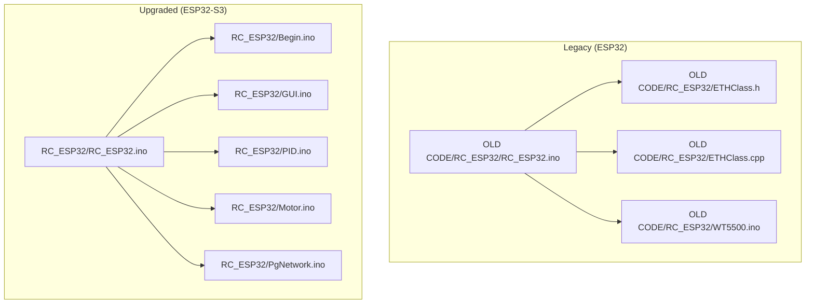
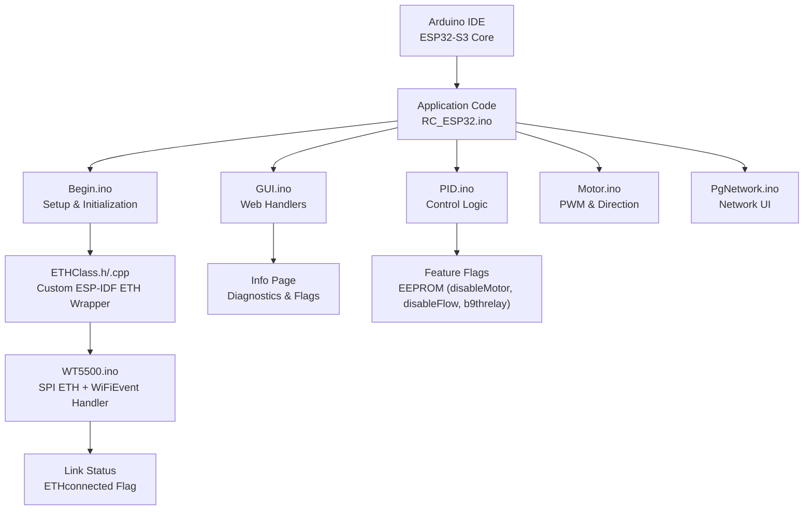
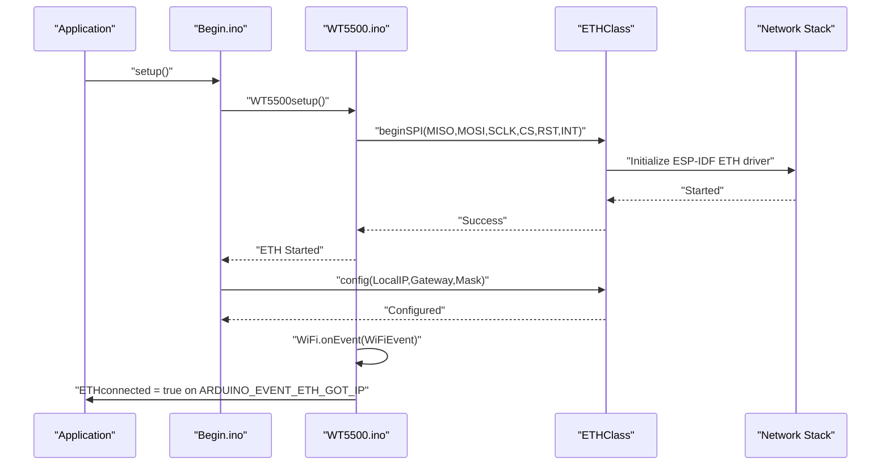
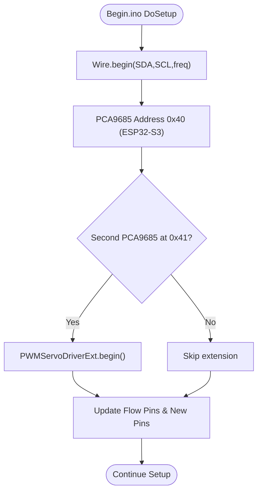
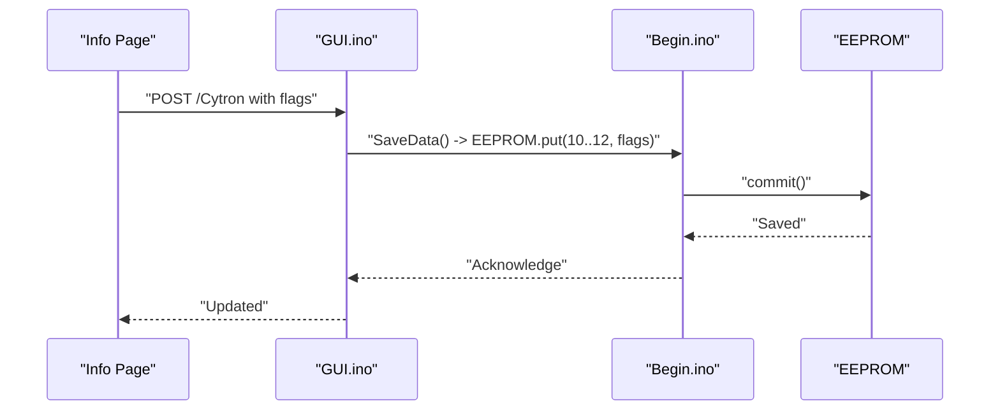
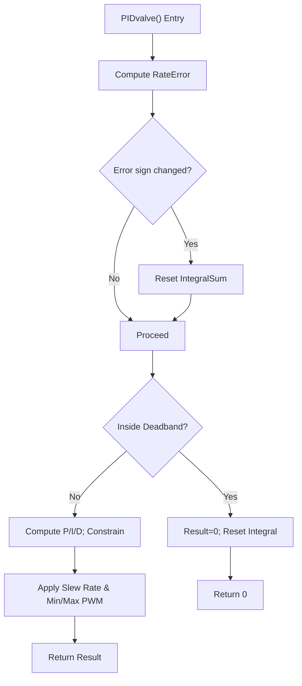
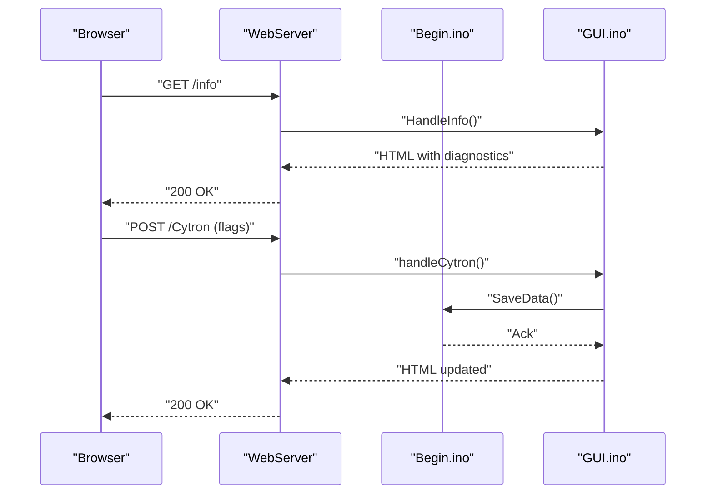
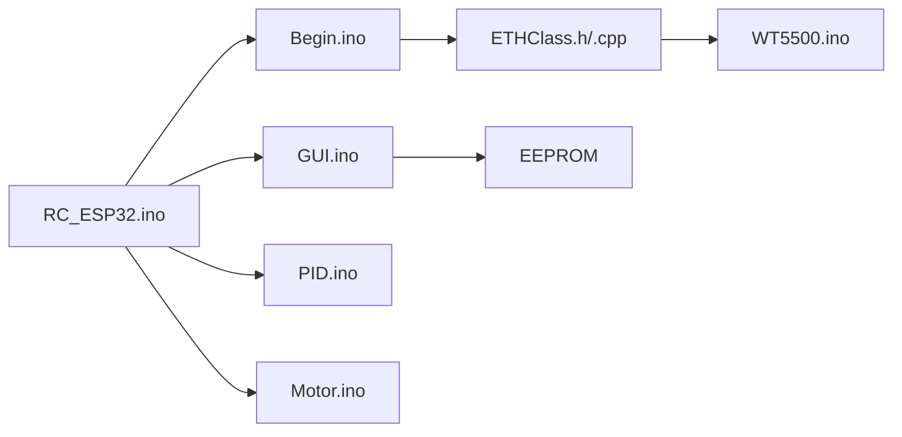

# Upgrade Procedures and Migration Guide

<cite>
**Referenced Files in This Document**
- [FORK_CHANGES.md](file://FORK_CHANGES.md)
- [Notes.txt](file://Notes.txt)
- [OLD CODE\RC_ESP32\RC_ESP32.ino](file://OLD CODE/RC_ESP32/RC_ESP32.ino)
- [OLD CODE\RC_ESP32\ETHClass.h](file://OLD CODE/RC_ESP32/ETHClass.h)
- [OLD CODE\RC_ESP32\ETHClass.cpp](file://OLD CODE/RC_ESP32/ETHClass.cpp)
- [OLD CODE\RC_ESP32\WT5500.ino](file://OLD CODE/RC_ESP32/WT5500.ino)
- [RC_ESP32\RC_ESP32.ino](file://RC_ESP32/RC_ESP32.ino)
- [RC_ESP32\Begin.ino](file://RC_ESP32/Begin.ino)
- [RC_ESP32\GUI.ino](file://RC_ESP32/GUI.ino)
- [RC_ESP32\PID.ino](file://RC_ESP32/PID.ino)
- [RC_ESP32\Motor.ino](file://RC_ESP32/Motor.ino)
- [RC_ESP32\PgNetwork.ino](file://RC_ESP32/PgNetwork.ino)
</cite>

## Table of Contents
1. [Introduction](#introduction)
2. [Project Structure](#project-structure)
3. [Core Components](#core-components)
4. [Architecture Overview](#architecture-overview)
5. [Detailed Component Analysis](#detailed-component-analysis)
6. [Dependency Analysis](#dependency-analysis)
7. [Performance Considerations](#performance-considerations)
8. [Troubleshooting Guide](#troubleshooting-guide)
9. [Conclusion](#conclusion)
10. [Appendices](#appendices)

## Introduction
This document provides a comprehensive upgrade and migration guide to transition existing ESP32 installations to the ESP32-S3 platform. It consolidates the fork changes documentation into actionable steps for hardware preparation, software updates, configuration changes, and validation. The guide covers Arduino IDE setup, ESP32-S3 core installation, board variant selection, pin mapping updates, library changes, Ethernet migration from W5500 to WT5500 via a custom ETHClass, and feature flag updates. It also includes rollback procedures, compatibility verification, and testing/validation recommendations.

## Project Structure
The repository contains:
- OLD CODE\RC_ESP32: Legacy ESP32-based implementation using W5500 Ethernet and Arduino Ethernet library
- RC_ESP32: Upgraded ESP32-S3 implementation using WT5500 SPI Ethernet with a custom ETHClass and event-driven link status
- FORK_CHANGES.md: Detailed migration notes and checklist
- Notes.txt: Operational guidance for AP connectivity and client fallback behavior

**Diagram sources**
- [OLD CODE\RC_ESP32\RC_ESP32.ino:1-334](file://OLD CODE/RC_ESP32/RC_ESP32.ino#L1-L334)
- [OLD CODE\RC_ESP32\ETHClass.h:1-118](file://OLD CODE/RC_ESP32/ETHClass.h#L1-L118)
- [OLD CODE\RC_ESP32\ETHClass.cpp:1-775](file://OLD CODE/RC_ESP32/ETHClass.cpp#L1-L775)
- [OLD CODE\RC_ESP32\WT5500.ino:1-99](file://OLD CODE/RC_ESP32/WT5500.ino#L1-L99)
- [RC_ESP32\RC_ESP32.ino:1-418](file://RC_ESP32/RC_ESP32.ino#L1-L418)
- [RC_ESP32\Begin.ino:1-769](file://RC_ESP32/Begin.ino#L1-L769)
- [RC_ESP32\GUI.ino:1-104](file://RC_ESP32/GUI.ino#L1-L104)
- [RC_ESP32\PID.ino:1-232](file://RC_ESP32/PID.ino#L1-L232)
- [RC_ESP32\Motor.ino:1-76](file://RC_ESP32/Motor.ino#L1-L76)
- [RC_ESP32\PgNetwork.ino:1-155](file://RC_ESP32/PgNetwork.ino#L1-L155)

**Section sources**
- [FORK_CHANGES.md:8-16](file://FORK_CHANGES.md#L8-L16)
- [Notes.txt:1-8](file://Notes.txt#L1-L8)

## Core Components
Key components affected by the migration:
- Ethernet subsystem: W5500 (legacy) migrated to WT5500 via custom ETHClass with event-driven link status
- I2C pin mapping: SDA/SCL updated for ESP32-S3
- PCA9685 address and extended support for dual PCA9685 boards
- Feature flags persisted in EEPROM (disableMotor, disableFlow, b9threlay)
- PID tuning improvements and motor control logic updates
- Web UI enhancements and new Info page for diagnostics

**Section sources**
- [FORK_CHANGES.md:18-28](file://FORK_CHANGES.md#L18-L28)
- [FORK_CHANGES.md:31-72](file://FORK_CHANGES.md#L31-L72)
- [FORK_CHANGES.md:74-113](file://FORK_CHANGES.md#L74-L113)
- [FORK_CHANGES.md:115-122](file://FORK_CHANGES.md#L115-L122)
- [FORK_CHANGES.md:124-164](file://FORK_CHANGES.md#L124-L164)
- [FORK_CHANGES.md:166-198](file://FORK_CHANGES.md#L166-L198)
- [FORK_CHANGES.md:200-225](file://FORK_CHANGES.md#L200-L225)
- [FORK_CHANGES.md:228-258](file://FORK_CHANGES.md#L228-L258)
- [FORK_CHANGES.md:260-289](file://FORK_CHANGES.md#L260-L289)
- [FORK_CHANGES.md:291-309](file://FORK_CHANGES.md#L291-L309)
- [FORK_CHANGES.md:311-332](file://FORK_CHANGES.md#L311-L332)
- [FORK_CHANGES.md:334-368](file://FORK_CHANGES.md#L334-L368)

## Architecture Overview
The ESP32-S3 implementation replaces the Arduino Ethernet library with a custom ETHClass built on ESP-IDF’s esp_eth. WT5500 SPI pins are mapped to ESP32-S3 GPIOs, and link status is managed via WiFi event callbacks. The system maintains AP-only operation by default and introduces new feature flags persisted in EEPROM.

**Diagram sources**
- [RC_ESP32\RC_ESP32.ino:1-418](file://RC_ESP32/RC_ESP32.ino#L1-L418)
- [RC_ESP32\Begin.ino:1-769](file://RC_ESP32/Begin.ino#L1-L769)
- [RC_ESP32\GUI.ino:1-104](file://RC_ESP32/GUI.ino#L1-L104)
- [RC_ESP32\PID.ino:1-232](file://RC_ESP32/PID.ino#L1-L232)
- [RC_ESP32\Motor.ino:1-76](file://RC_ESP32/Motor.ino#L1-L76)
- [RC_ESP32\PgNetwork.ino:1-155](file://RC_ESP32/PgNetwork.ino#L1-L155)
- [OLD CODE\RC_ESP32\ETHClass.h:60-113](file://OLD CODE/RC_ESP32/ETHClass.h#L60-L113)
- [OLD CODE\RC_ESP32\ETHClass.cpp:232-369](file://OLD CODE/RC_ESP32/ETHClass.cpp#L232-L369)
- [OLD CODE\RC_ESP32\WT5500.ino:9-78](file://OLD CODE/RC_ESP32/WT5500.ino#L9-L78)

## Detailed Component Analysis

### Ethernet Migration: W5500 to WT5500 via Custom ETHClass
- Replace Arduino Ethernet library with custom ETHClass based on ESP-IDF’s esp_eth
- SPI pin definitions for WT5500 mapped to ESP32-S3 GPIOs
- Event-driven link status via WiFiEvent handler updates a global ETHconnected flag
- Initialization sequence replaces legacy Ethernet.begin with WT5500setup() and ETH.config()

**Diagram sources**
- [RC_ESP32\Begin.ino:87-122](file://RC_ESP32/Begin.ino#L87-L122)
- [OLD CODE\RC_ESP32\WT5500.ino:9-17](file://OLD CODE/RC_ESP32/WT5500.ino#L9-L17)
- [OLD CODE\RC_ESP32\ETHClass.h:79-85](file://OLD CODE/RC_ESP32/ETHClass.h#L79-L85)
- [OLD CODE\RC_ESP32\ETHClass.cpp:232-369](file://OLD CODE/RC_ESP32/ETHClass.cpp#L232-L369)
- [OLD CODE\RC_ESP32\WT5500.ino:20-78](file://OLD CODE/RC_ESP32/WT5500.ino#L20-L78)

**Section sources**
- [FORK_CHANGES.md:31-72](file://FORK_CHANGES.md#L31-L72)
- [FORK_CHANGES.md:44-68](file://FORK_CHANGES.md#L44-L68)
- [OLD CODE\RC_ESP32\WT5500.ino:1-99](file://OLD CODE/RC_ESP32/WT5500.ino#L1-L99)
- [OLD CODE\RC_ESP32\ETHClass.h:1-118](file://OLD CODE/RC_ESP32/ETHClass.h#L1-L118)
- [OLD CODE\RC_ESP32\ETHClass.cpp:1-775](file://OLD CODE/RC_ESP32/ETHClass.cpp#L1-L775)

### I2C and PCA9685 Pin Mapping Updates
- I2C pins updated to ESP32-S3 GPIOs (SDA/SCL)
- PCA9685 address changed; extended support for second PCA9685 at 0x41
- Flow sensor default pins updated; new pins for current sensing and Cytron enable

**Diagram sources**
- [RC_ESP32\Begin.ino:54-56](file://RC_ESP32/Begin.ino#L54-L56)
- [FORK_CHANGES.md:76-113](file://FORK_CHANGES.md#L76-L113)

**Section sources**
- [FORK_CHANGES.md:74-113](file://FORK_CHANGES.md#L74-L113)
- [RC_ESP32\Begin.ino:54-56](file://RC_ESP32/Begin.ino#L54-L56)

### Feature Flags and EEPROM Persistence
- Three new boolean flags persisted in EEPROM (disableMotor, disableFlow, b9threlay)
- Load/Save routines in Begin.ino manage flag persistence
- Web UI exposes toggles to update flags and trigger save

**Diagram sources**
- [FORK_CHANGES.md:200-225](file://FORK_CHANGES.md#L200-L225)
- [FORK_CHANGES.md:210-221](file://FORK_CHANGES.md#L210-L221)
- [RC_ESP32\GUI.ino:25-79](file://RC_ESP32/GUI.ino#L25-L79)
- [RC_ESP32\Begin.ino:550-562](file://RC_ESP32/Begin.ino#L550-L562)

**Section sources**
- [FORK_CHANGES.md:200-225](file://FORK_CHANGES.md#L200-L225)
- [RC_ESP32\GUI.ino:25-79](file://RC_ESP32/GUI.ino#L25-L79)
- [RC_ESP32\Begin.ino:550-562](file://RC_ESP32/Begin.ino#L550-L562)

### PID Logic and Motor Control Enhancements
- PIDvalve improvements: anti-windup with direction detection, capped integral, deadband resets integral, PWM direction based on error
- Motor control logic inverted direction mapping and explicit PWM=0 when flow disabled
- b9threlay guard prevents flow control when master relay is off

**Diagram sources**
- [FORK_CHANGES.md:124-164](file://FORK_CHANGES.md#L124-L164)
- [RC_ESP32\PID.ino:69-126](file://RC_ESP32/PID.ino#L69-L126)

**Section sources**
- [FORK_CHANGES.md:124-164](file://FORK_CHANGES.md#L124-L164)
- [RC_ESP32\PID.ino:69-126](file://RC_ESP32/PID.ino#L69-L126)
- [RC_ESP32\Motor.ino:31-60](file://RC_ESP32/Motor.ino#L31-L60)

### Web UI and Info Page
- Shared HTML head extracted into HtmlGetHead()
- New Info page (/info) displays diagnostics and feature toggles
- Web routes registered in Begin.ino

**Diagram sources**
- [FORK_CHANGES.md:166-198](file://FORK_CHANGES.md#L166-L198)
- [FORK_CHANGES.md:186-190](file://FORK_CHANGES.md#L186-L190)
- [RC_ESP32\Begin.ino:219-236](file://RC_ESP32/Begin.ino#L219-L236)
- [RC_ESP32\GUI.ino:1-104](file://RC_ESP32/GUI.ino#L1-L104)

**Section sources**
- [FORK_CHANGES.md:166-198](file://FORK_CHANGES.md#L166-L198)
- [RC_ESP32\Begin.ino:219-236](file://RC_ESP32/Begin.ino#L219-L236)
- [RC_ESP32\GUI.ino:1-104](file://RC_ESP32/GUI.ino#L1-L104)

## Dependency Analysis
- Application code depends on custom ETHClass for Ethernet abstraction
- WT5500.ino registers WiFiEvent handlers to manage link state
- Begin.ino orchestrates initialization, EEPROM load/save, and web server routing
- GUI.ino handles web requests and persists feature flags
- PID.ino and Motor.ino implement control logic dependent on updated pin mappings and flags

**Diagram sources**
- [RC_ESP32\RC_ESP32.ino:1-418](file://RC_ESP32/RC_ESP32.ino#L1-L418)
- [RC_ESP32\Begin.ino:1-769](file://RC_ESP32/Begin.ino#L1-L769)
- [RC_ESP32\GUI.ino:1-104](file://RC_ESP32/GUI.ino#L1-L104)
- [RC_ESP32\PID.ino:1-232](file://RC_ESP32/PID.ino#L1-L232)
- [RC_ESP32\Motor.ino:1-76](file://RC_ESP32/Motor.ino#L1-L76)
- [OLD CODE\RC_ESP32\ETHClass.h:1-118](file://OLD CODE/RC_ESP32/ETHClass.h#L1-L118)
- [OLD CODE\RC_ESP32\ETHClass.cpp:1-775](file://OLD CODE/RC_ESP32/ETHClass.cpp#L1-L775)
- [OLD CODE\RC_ESP32\WT5500.ino:1-99](file://OLD CODE/RC_ESP32/WT5500.ino#L1-L99)

**Section sources**
- [RC_ESP32\RC_ESP32.ino:1-418](file://RC_ESP32/RC_ESP32.ino#L1-L418)
- [RC_ESP32\Begin.ino:1-769](file://RC_ESP32/Begin.ino#L1-L769)
- [RC_ESP32\GUI.ino:1-104](file://RC_ESP32/GUI.ino#L1-L104)
- [RC_ESP32\PID.ino:1-232](file://RC_ESP32/PID.ino#L1-L232)
- [RC_ESP32\Motor.ino:1-76](file://RC_ESP32/Motor.ino#L1-L76)

## Performance Considerations
- ESP32-S3 core supports higher CPU frequencies and improved peripherals compared to ESP32
- Custom ETHClass leverages ESP-IDF for efficient networking; ensure proper SPI bus configuration for WT5500
- PID tuning improvements reduce oscillation and improve stability; validate tuning parameters post-migration
- Motor control logic changes optimize PWM direction mapping and reduce unnecessary switching

[No sources needed since this section provides general guidance]

## Troubleshooting Guide
Common migration issues and resolutions:
- Compilation errors due to library renames or removed includes:
  - Replace pcf8574.h include with PCF8574.h
  - Remove direct SPI.h and Ethernet.h includes; rely on ETHClass
  - Use WiFiUDP instead of EthernetUDP for UDP communication
- Runtime problems related to Ethernet:
  - Verify WT5500 SPI pin mapping matches hardware connections
  - Confirm ETHconnected flag transitions correctly via WiFiEvent handler
- Configuration conflicts:
  - Update I2C pins to ESP32-S3 GPIOs (SDA/SCL)
  - Change PCA9685 address to 0x40 and enable second PCA9685 at 0x41 if present
  - Adjust flow sensor default pins and add new pins for current sensing and Cytron enable
- Feature flags not persisting:
  - Ensure EEPROM.load/save routines are invoked and commit() is called
  - Validate flag addresses (10–12) and UI toggles are correctly mapped

**Section sources**
- [FORK_CHANGES.md:18-28](file://FORK_CHANGES.md#L18-L28)
- [FORK_CHANGES.md:44-68](file://FORK_CHANGES.md#L44-L68)
- [FORK_CHANGES.md:74-113](file://FORK_CHANGES.md#L74-L113)
- [FORK_CHANGES.md:200-225](file://FORK_CHANGES.md#L200-L225)
- [RC_ESP32\Begin.ino:550-562](file://RC_ESP32/Begin.ino#L550-L562)

## Conclusion
Migrating from ESP32 to ESP32-S3 involves replacing the Ethernet stack with a custom ETHClass, updating pin mappings, and integrating new feature flags. The fork changes documentation provides a comprehensive checklist and implementation guidance. Following the step-by-step procedures outlined here will ensure a smooth transition, validated by thorough testing and rollback planning.

[No sources needed since this section summarizes without analyzing specific files]

## Appendices

### Step-by-Step Migration Procedure
- Prepare hardware:
  - Verify WT5500 SPI connections to ESP32-S3 GPIOs (MISO/MOSI/SCLK/CS/INT/RST)
  - Confirm I2C SDA/SCL pins updated to ESP32-S3 GPIOs
  - Check PCA9685 address and optional second PCA9685 at 0x41
- Prepare software:
  - Install ESP32-S3 core in Arduino IDE
  - Select ESP32S3 Dev Module board variant
  - Replace library includes as per the fork changes documentation
- Update code:
  - Replace Ethernet initialization with WT5500setup() and ETH.config()
  - Update I2C initialization to ESP32-S3 pin mapping
  - Modify PCA9685 address and add second PCA9685 support if needed
  - Integrate feature flags and EEPROM persistence
- Validate:
  - Test link status via WiFiEvent handler and ETHconnected flag
  - Verify web UI and Info page functionality
  - Validate PID tuning and motor control behavior
- Rollback:
  - Keep backup of previous firmware and configuration
  - Revert library includes and Ethernet initialization to legacy code
  - Restore original pin mappings and feature flags

**Section sources**
- [FORK_CHANGES.md:400-433](file://FORK_CHANGES.md#L400-L433)
- [Notes.txt:1-8](file://Notes.txt#L1-L8)

### Rollback and Contingency Planning
- Maintain a backup of the last working ESP32 firmware image
- Preserve original library versions and include statements
- Keep a record of original pin mappings and configuration defaults
- Prepare a quick restore procedure for EEPROM settings and feature flags
- Validate client fallback behavior: if Wi-Fi fails to connect after retries, revert to AP-only mode

**Section sources**
- [Notes.txt:1-8](file://Notes.txt#L1-L8)
- [RC_ESP32\Begin.ino:237-244](file://RC_ESP32/Begin.ino#L237-L244)

### Testing and Validation Checklist
- Hardware compatibility:
  - Confirm WT5500 SPI pins and connections
  - Verify I2C device scanning and PCA9685 detection
- Software validation:
  - Compile with ESP32-S3 core and board variant selected
  - Initialize ETHClass and confirm link status
  - Test web UI and Info page diagnostics
  - Validate feature flags persistence and toggles
- Performance benchmarking:
  - Compare loop timing and control response before and after migration
  - Validate PID tuning convergence and stability

**Section sources**
- [FORK_CHANGES.md:334-368](file://FORK_CHANGES.md#L334-L368)
- [RC_ESP32\Begin.ino:54-85](file://RC_ESP32/Begin.ino#L54-L85)