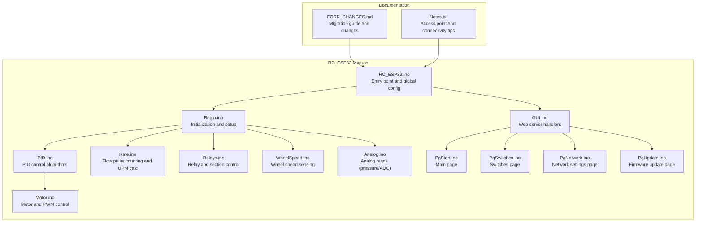
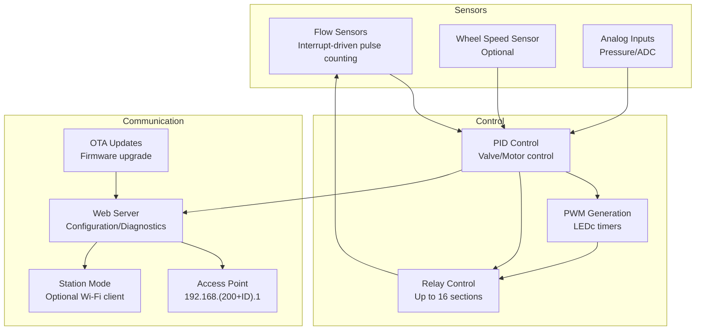
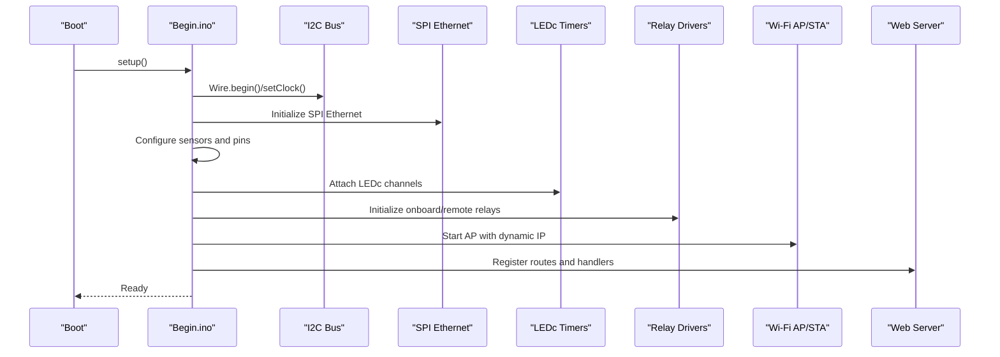
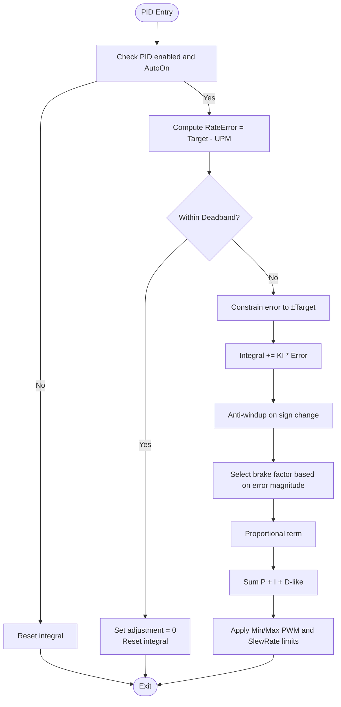
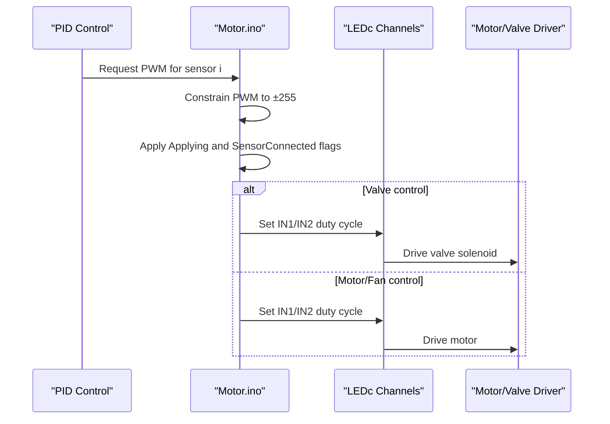
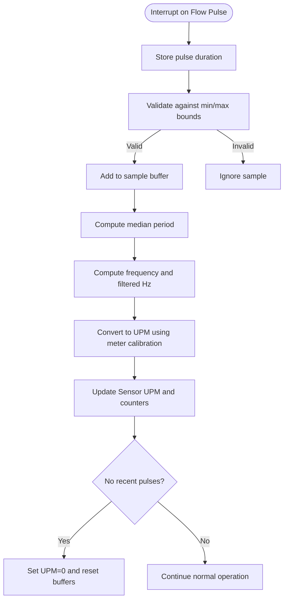
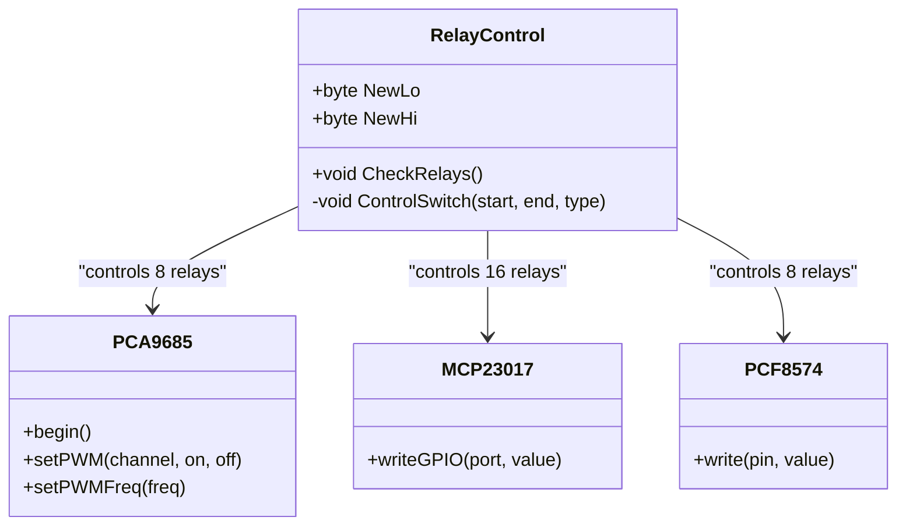
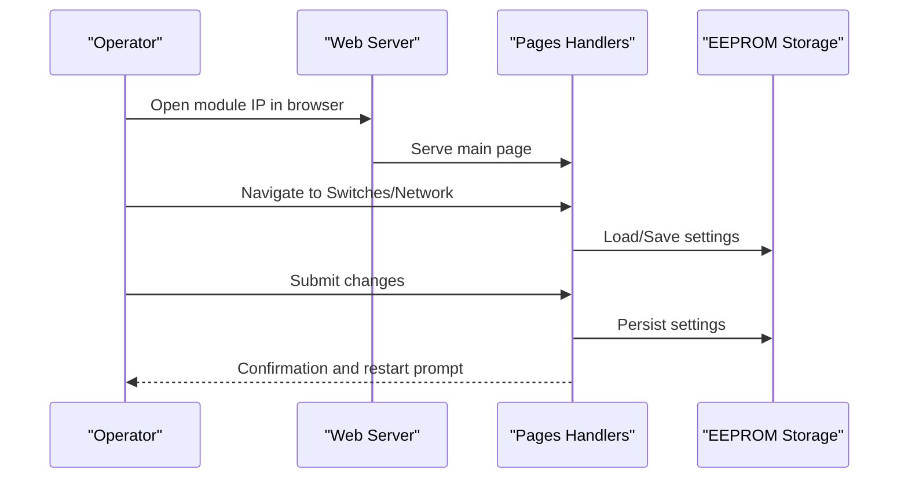
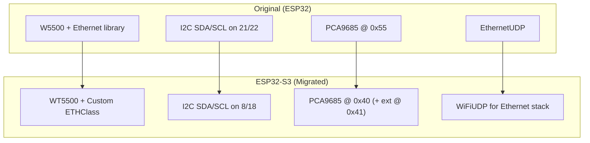
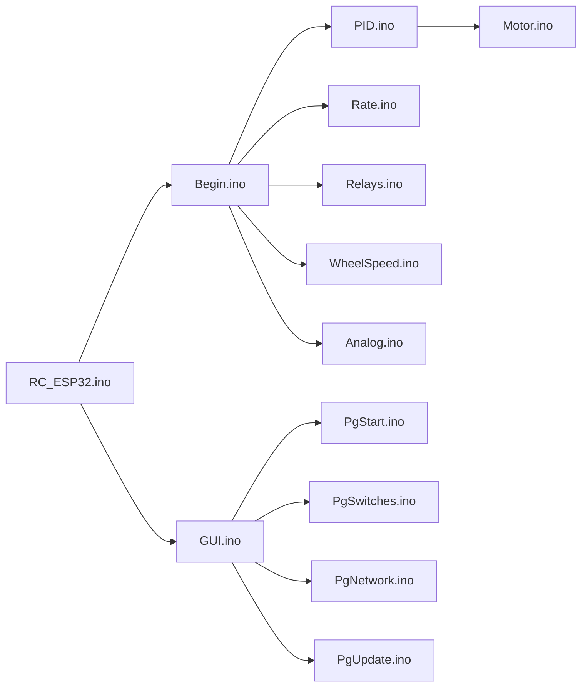

# Project Overview

<cite>
**Referenced Files in This Document**
- [Notes.txt](file://Notes.txt)
- [FORK_CHANGES.md](file://FORK_CHANGES.md)
- [RC_ESP32.ino](file://RC_ESP32/RC_ESP32.ino)
- [Begin.ino](file://RC_ESP32/Begin.ino)
- [PID.ino](file://RC_ESP32/PID.ino)
- [Motor.ino](file://RC_ESP32/Motor.ino)
- [Rate.ino](file://RC_ESP32/Rate.ino)
- [Relays.ino](file://RC_ESP32/Relays.ino)
- [WheelSpeed.ino](file://RC_ESP32/WheelSpeed.ino)
- [Analog.ino](file://RC_ESP32/Analog.ino)
- [GUI.ino](file://RC_ESP32/GUI.ino)
- [PgStart.ino](file://RC_ESP32/PgStart.ino)
- [PgSwitches.ino](file://RC_ESP32/PgSwitches.ino)
- [PgNetwork.ino](file://RC_ESP32/PgNetwork.ino)
- [PgUpdate.ino](file://RC_ESP32/PgUpdate.ino)
- [OLD RC_ESP32.ino](file://OLD CODE/RC_ESP32/RC_ESP32.ino)
</cite>

## Table of Contents
1. [Introduction](#introduction)
2. [Project Structure](#project-structure)
3. [Core Components](#core-components)
4. [Architecture Overview](#architecture-overview)
5. [Detailed Component Analysis](#detailed-component-analysis)
6. [Dependency Analysis](#dependency-analysis)
7. [Performance Considerations](#performance-considerations)
8. [Troubleshooting Guide](#troubleshooting-guide)
9. [Conclusion](#conclusion)
10. [Appendices](#appendices)

## Introduction
The ESP32 Rate Control project is an embedded precision agriculture system designed to monitor and control real-time application rates of fertilizers and pesticides. It targets farmers and agricultural equipment operators who require precise, reliable, and remotely manageable rate control for agricultural sprayers, spreaders, and other crop protection systems. The system operates as a standalone module that communicates wirelessly with a guidance or machine control application, enabling real-time feedback and operator control through a built-in web interface.

Key capabilities include:
- Real-time flow sensing and rate calculation
- PID-based control for valves and motors
- Dual-rate sensor support for independent sections
- Wireless connectivity via Access Point and optional station mode
- Web-based configuration and diagnostics
- Optional wheel speed sensing for ground speed compensation
- Relay-based section control and optional motor control

## Project Structure
The repository organizes the firmware into modular source files grouped by functional areas. The main application resides under RC_ESP32, while historical code is preserved under OLD CODE for comparison. The project’s evolution to ESP32-S3 is documented comprehensively in FORK_CHANGES.md.

**Diagram sources**
- [RC_ESP32.ino](file://RC_ESP32/RC_ESP32.ino)
- [Begin.ino](file://RC_ESP32/Begin.ino)
- [PID.ino](file://RC_ESP32/PID.ino)
- [Motor.ino](file://RC_ESP32/Motor.ino)
- [Rate.ino](file://RC_ESP32/Rate.ino)
- [Relays.ino](file://RC_ESP32/Relays.ino)
- [WheelSpeed.ino](file://RC_ESP32/WheelSpeed.ino)
- [Analog.ino](file://RC_ESP32/Analog.ino)
- [GUI.ino](file://RC_ESP32/GUI.ino)
- [PgStart.ino](file://RC_ESP32/PgStart.ino)
- [PgSwitches.ino](file://RC_ESP32/PgSwitches.ino)
- [PgNetwork.ino](file://RC_ESP32/PgNetwork.ino)
- [PgUpdate.ino](file://RC_ESP32/PgUpdate.ino)
- [FORK_CHANGES.md](file://FORK_CHANGES.md)
- [Notes.txt](file://Notes.txt)

**Section sources**
- [RC_ESP32.ino](file://RC_ESP32/RC_ESP32.ino)
- [Begin.ino](file://RC_ESP32/Begin.ino)
- [FORK_CHANGES.md](file://FORK_CHANGES.md)
- [Notes.txt](file://Notes.txt)

## Core Components
- ESP32-S3 microcontroller with integrated Wi-Fi and optional Ethernet via SPI Ethernet controller
- Real-time rate monitoring using interrupt-driven pulse counting from flow sensors
- PID control loops for valve positioning and motor speed regulation
- Relay-based section control supporting up to 16 sections with multiple I/O expanders
- Web server for configuration, diagnostics, and firmware updates
- Optional wheel speed sensing and analog pressure measurement
- EEPROM-backed persistent configuration storage

Typical use cases include:
- Precision spraying with real-time rate feedback and section control
- Variable rate application based on ground speed and guidance commands
- Remote diagnostics and tuning via web interface
- Multi-section spreader control with independent rate management

**Section sources**
- [RC_ESP32.ino](file://RC_ESP32/RC_ESP32.ino)
- [PID.ino](file://RC_ESP32/PID.ino)
- [Rate.ino](file://RC_ESP32/Rate.ino)
- [Relays.ino](file://RC_ESP32/Relays.ino)
- [Begin.ino](file://RC_ESP32/Begin.ino)
- [Analog.ino](file://RC_ESP32/Analog.ino)
- [WheelSpeed.ino](file://RC_ESP32/WheelSpeed.ino)

## Architecture Overview
The system architecture centers on the ESP32-S3 managing real-time control loops, wireless communication, and hardware interfaces. The control loop integrates sensor feedback, PID computation, actuator control, and network communication in a tight 50 ms cycle.

**Diagram sources**
- [RC_ESP32.ino](file://RC_ESP32/RC_ESP32.ino)
- [PID.ino](file://RC_ESP32/PID.ino)
- [Motor.ino](file://RC_ESP32/Motor.ino)
- [Rate.ino](file://RC_ESP32/Rate.ino)
- [Relays.ino](file://RC_ESP32/Relays.ino)
- [Begin.ino](file://RC_ESP32/Begin.ino)
- [Analog.ino](file://RC_ESP32/Analog.ino)
- [WheelSpeed.ino](file://RC_ESP32/WheelSpeed.ino)
- [GUI.ino](file://RC_ESP32/GUI.ino)
- [PgStart.ino](file://RC_ESP32/PgStart.ino)
- [PgSwitches.ino](file://RC_ESP32/PgSwitches.ino)
- [PgNetwork.ino](file://RC_ESP32/PgNetwork.ino)
- [PgUpdate.ino](file://RC_ESP32/PgUpdate.ino)

## Detailed Component Analysis

### System Initialization and Setup
The initialization sequence configures I2C, Ethernet (via SPI Ethernet controller), sensors, PWM channels, relays, Wi-Fi AP, and web server. It validates pin configurations and loads/saves persistent settings.

**Diagram sources**
- [Begin.ino](file://RC_ESP32/Begin.ino)
- [RC_ESP32.ino](file://RC_ESP32/RC_ESP32.ino)

**Section sources**
- [Begin.ino](file://RC_ESP32/Begin.ino)
- [RC_ESP32.ino](file://RC_ESP32/RC_ESP32.ino)

### PID Control Logic
The PID control computes adjustments based on the difference between target and measured UPM, applying proportional, integral, and derivative-like terms with configurable deadband and brakepoint behavior. The logic supports separate handling for valves and motors, with integral anti-windup and slew limiting.

**Diagram sources**
- [PID.ino](file://RC_ESP32/PID.ino)

**Section sources**
- [PID.ino](file://RC_ESP32/PID.ino)

### Motor and PWM Control
Motor control adjusts PWM output direction and magnitude based on PID results, with safeguards to ensure flow is disabled when not required and to invert direction logic for compatibility with driver circuits.

**Diagram sources**
- [Motor.ino](file://RC_ESP32/Motor.ino)
- [PID.ino](file://RC_ESP32/PID.ino)

**Section sources**
- [Motor.ino](file://RC_ESP32/Motor.ino)

### Flow Sensing and Rate Calculation
Flow sensors trigger interrupts to capture pulse intervals. The system maintains a sliding window of recent periods, computes median values, and converts to UPM using meter calibration. Timeout logic ensures rates return to zero when sensors are inactive.

**Diagram sources**
- [Rate.ino](file://RC_ESP32/Rate.ino)

**Section sources**
- [Rate.ino](file://RC_ESP32/Rate.ino)

### Relay and Section Control
Relay control supports multiple I/O expanders and GPIO-based relays, enabling up to 16 sections. The system dynamically selects onboard vs remote drivers and applies inversion logic based on configuration.

**Diagram sources**
- [Relays.ino](file://RC_ESP32/Relays.ino)

**Section sources**
- [Relays.ino](file://RC_ESP32/Relays.ino)

### Web Interface and Diagnostics
The web interface provides configuration pages for switches, network settings, and firmware updates. It exposes diagnostic endpoints and allows operator-driven control of sections.

**Diagram sources**
- [GUI.ino](file://RC_ESP32/GUI.ino)
- [PgStart.ino](file://RC_ESP32/PgStart.ino)
- [PgSwitches.ino](file://RC_ESP32/PgSwitches.ino)
- [PgNetwork.ino](file://RC_ESP32/PgNetwork.ino)
- [PgUpdate.ino](file://RC_ESP32/PgUpdate.ino)

**Section sources**
- [GUI.ino](file://RC_ESP32/GUI.ino)
- [PgStart.ino](file://RC_ESP32/PgStart.ino)
- [PgSwitches.ino](file://RC_ESP32/PgSwitches.ino)
- [PgNetwork.ino](file://RC_ESP32/PgNetwork.ino)
- [PgUpdate.ino](file://RC_ESP32/PgUpdate.ino)

### ESP32-S3 Migration and Evolution
The project migrated from ESP32 (DOIT DEVKIT V1) to ESP32-S3, introducing significant changes in libraries, Ethernet stack, pin mappings, and feature flags. Key improvements include:
- ESP32-S3 Arduino Core and updated libraries
- Custom Ethernet class for WT5500 SPI Ethernet
- New I2C pins and PCA9685 address changes
- Enhanced PID logic with anti-windup and absolute error handling
- New web routes and diagnostics page
- Feature flags persisted in EEPROM for advanced control modes

**Diagram sources**
- [FORK_CHANGES.md](file://FORK_CHANGES.md)
- [Begin.ino](file://RC_ESP32/Begin.ino)
- [RC_ESP32.ino](file://RC_ESP32/RC_ESP32.ino)

**Section sources**
- [FORK_CHANGES.md](file://FORK_CHANGES.md)
- [Begin.ino](file://RC_ESP32/Begin.ino)
- [RC_ESP32.ino](file://RC_ESP32/RC_ESP32.ino)

## Dependency Analysis
The system exhibits layered dependencies with clear separation of concerns:
- Entry point depends on initialization and configuration structures
- Control layer depends on sensor inputs and relay/actuator drivers
- Communication layer depends on Wi-Fi and web server libraries
- Persistence layer depends on EEPROM storage

**Diagram sources**
- [RC_ESP32.ino](file://RC_ESP32/RC_ESP32.ino)
- [Begin.ino](file://RC_ESP32/Begin.ino)
- [PID.ino](file://RC_ESP32/PID.ino)
- [Motor.ino](file://RC_ESP32/Motor.ino)
- [Rate.ino](file://RC_ESP32/Rate.ino)
- [Relays.ino](file://RC_ESP32/Relays.ino)
- [WheelSpeed.ino](file://RC_ESP32/WheelSpeed.ino)
- [Analog.ino](file://RC_ESP32/Analog.ino)
- [GUI.ino](file://RC_ESP32/GUI.ino)
- [PgStart.ino](file://RC_ESP32/PgStart.ino)
- [PgSwitches.ino](file://RC_ESP32/PgSwitches.ino)
- [PgNetwork.ino](file://RC_ESP32/PgNetwork.ino)
- [PgUpdate.ino](file://RC_ESP32/PgUpdate.ino)

**Section sources**
- [RC_ESP32.ino](file://RC_ESP32/RC_ESP32.ino)
- [Begin.ino](file://RC_ESP32/Begin.ino)

## Performance Considerations
- Control loop runs at approximately 20 Hz (50 ms), balancing responsiveness and CPU utilization
- Interrupt-driven pulse counting minimizes missed edges and reduces loop overhead
- Median filtering reduces noise in pulse measurements for stable rate calculations
- LEDc timers provide precise PWM generation with configurable resolution and frequency
- EEPROM writes are batched and performed on configuration changes to reduce wear
- Wi-Fi AP mode provides immediate connectivity without external router dependencies

## Troubleshooting Guide
Common issues and resolutions:
- Access Point connectivity: Ensure the tablet connects to the module’s Access Point with subnet matching the module’s IP range
- Wi-Fi station mode failures: The module falls back to AP-only mode after repeated disconnections
- Sensor not responding: Verify flow sensor wiring, debouncing thresholds, and meter calibration
- Relay control problems: Confirm I/O expander presence and correct address configuration
- Web interface unresponsive: Restart the module if the web server becomes unresponsive

**Section sources**
- [Notes.txt](file://Notes.txt)
- [Begin.ino](file://RC_ESP32/Begin.ino)
- [RC_ESP32.ino](file://RC_ESP32/RC_ESP32.ino)

## Conclusion
The ESP32 Rate Control project delivers a robust, scalable solution for precision agriculture rate control. Its migration to ESP32-S3 enhances reliability and feature richness, while maintaining simplicity for end users. The modular architecture, real-time control loops, and web-based diagnostics make it suitable for diverse agricultural applications, from small sprayers to large-scale spreaders.

## Appendices

### Typical Use Cases
- Precision spraying with section control and variable rate application
- Ground speed compensation for uniform application rates
- Multi-section spreader control with independent rate management
- Remote diagnostics and configuration updates via web interface
- Integration with guidance systems for automated application control

### Connectivity Notes
- Access Point IP: 192.168.(200 + module ID).1
- Subnet mask: 255.255.255.0
- Default gateway: Same as AP IP
- Wi-Fi station mode: Optional; module reverts to AP-only after connection failures

**Section sources**
- [Notes.txt](file://Notes.txt)
- [Begin.ino](file://RC_ESP32/Begin.ino)