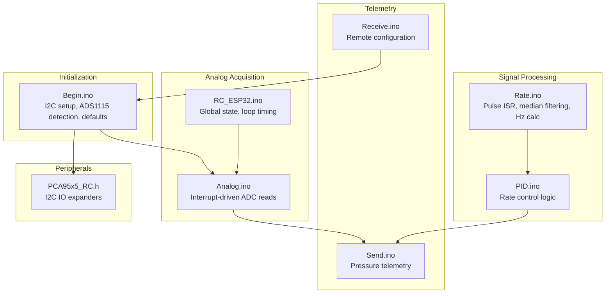
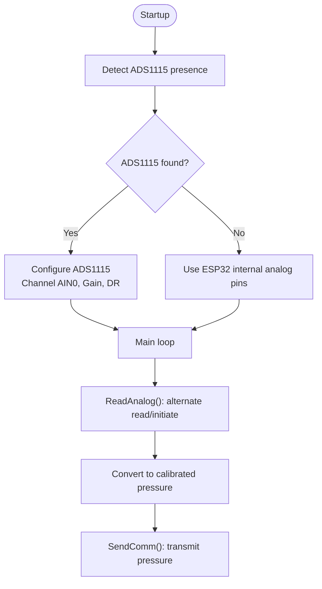
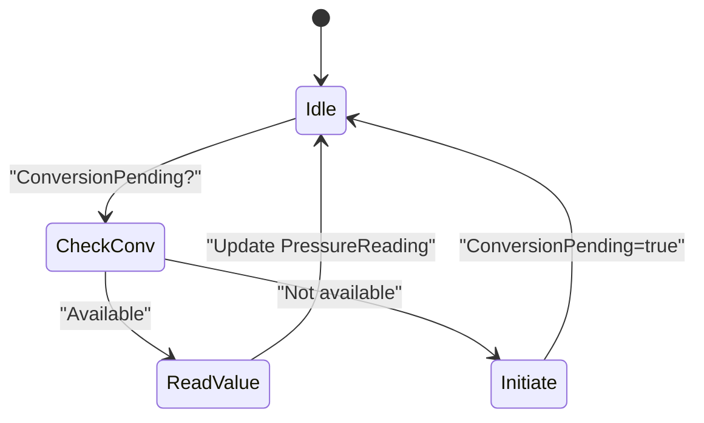
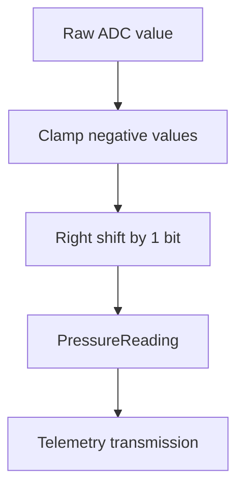
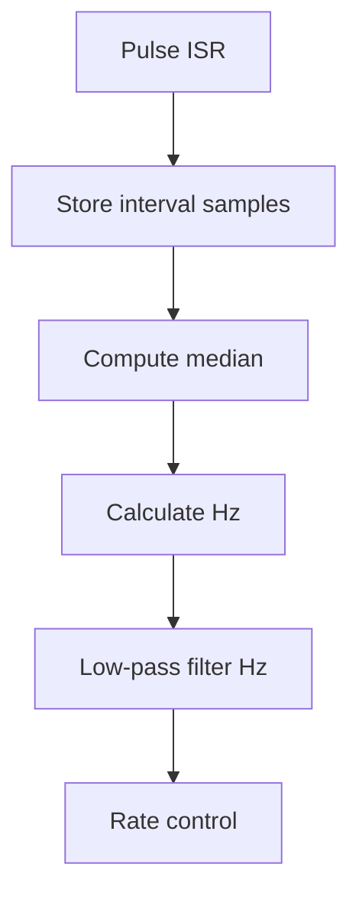
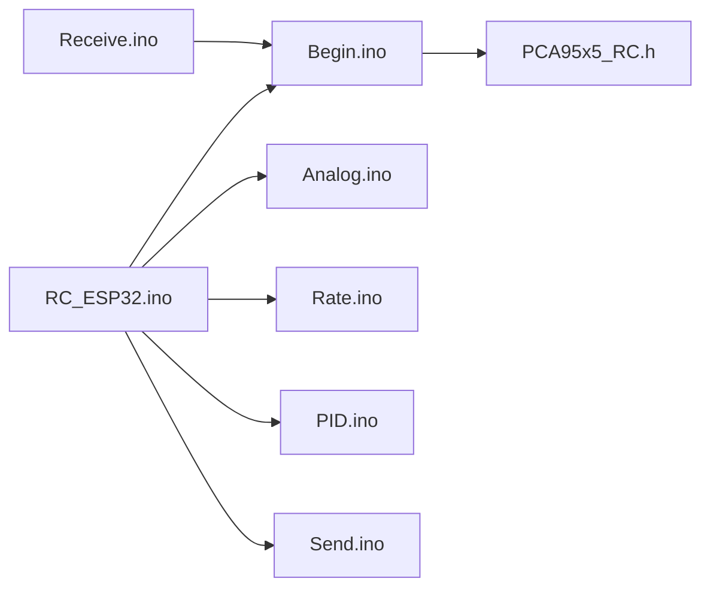

# Analog Sensor Processing

<cite>
**Referenced Files in This Document**
- [RC_ESP32.ino](file://RC_ESP32/RC_ESP32.ino)
- [Analog.ino](file://RC_ESP32/Analog.ino)
- [Begin.ino](file://RC_ESP32/Begin.ino)
- [Rate.ino](file://RC_ESP32/Rate.ino)
- [PID.ino](file://RC_ESP32/PID.ino)
- [Send.ino](file://RC_ESP32/Send.ino)
- [PCA95x5_RC.h](file://RC_ESP32/PCA95x5_RC.h)
- [Receive.ino](file://RC_ESP32/Receive.ino)
</cite>

## Table of Contents
1. [Introduction](#introduction)
2. [Project Structure](#project-structure)
3. [Core Components](#core-components)
4. [Architecture Overview](#architecture-overview)
5. [Detailed Component Analysis](#detailed-component-analysis)
6. [Dependency Analysis](#dependency-analysis)
7. [Performance Considerations](#performance-considerations)
8. [Troubleshooting Guide](#troubleshooting-guide)
9. [Conclusion](#conclusion)

## Introduction
This document explains the analog sensor processing subsystem of the ESP32 Rate Control module, focusing on dual ADC implementation supporting both an external ADS1115 ADC and the ESP32's internal analog pins. It covers ADC configuration parameters (sampling rates, gain settings, channel selection), the conversion pipeline from raw ADC values to calibrated pressure readings, interrupt-driven optimization for loop time, signal conditioning and filtering, error handling for ADC communication, calibration procedures, and power management considerations.

## Project Structure
The analog processing is implemented across several modules:
- Initialization and configuration: setup of I2C, ADS1115 detection, and module-level settings
- ADC acquisition: interrupt-driven alternation between reading completed conversions and initiating new ones
- Data processing: pulse counting and frequency calculation for flow sensors
- Control: PID-based rate control using measured flow and target rates
- Telemetry: transmission of pressure readings and operational status



**Diagram sources**
- [RC_ESP32.ino:250-280](file://RC_ESP32/RC_ESP32.ino#L250-L280)
- [Analog.ino:2-65](file://RC_ESP32/Analog.ino#L2-L65)
- [Begin.ino:54-85](file://RC_ESP32/Begin.ino#L54-L85)
- [Rate.ino:14-74](file://RC_ESP32/Rate.ino#L14-L74)
- [PID.ino:25-126](file://RC_ESP32/PID.ino#L25-L126)
- [Send.ino:1-195](file://RC_ESP32/Send.ino#L1-L195)
- [PCA95x5_RC.h:1-178](file://RC_ESP32/PCA95x5_RC.h#L1-L178)
- [Receive.ino:158-298](file://RC_ESP32/Receive.ino#L158-L298)

**Section sources**
- [RC_ESP32.ino:250-280](file://RC_ESP32/RC_ESP32.ino#L250-L280)
- [Analog.ino:2-65](file://RC_ESP32/Analog.ino#L2-L65)
- [Begin.ino:54-85](file://RC_ESP32/Begin.ino#L54-L85)
- [Rate.ino:14-74](file://RC_ESP32/Rate.ino#L14-L74)
- [PID.ino:25-126](file://RC_ESP32/PID.ino#L25-L126)
- [Send.ino:1-195](file://RC_ESP32/Send.ino#L1-L195)
- [PCA95x5_RC.h:1-178](file://RC_ESP32/PCA95x5_RC.h#L1-L178)
- [Receive.ino:158-298](file://RC_ESP32/Receive.ino#L158-L298)

## Core Components
- Dual ADC support:
  - External ADS1115 via I2C with configurable gain and data rate
  - ESP32 internal analog pins for direct pressure sensing
- Interrupt-driven ADC acquisition:
  - Alternates between checking for conversion completion and initiating new conversions
  - Prevents blocking the main loop and reduces latency spikes
- Signal conditioning and filtering:
  - Median filtering of pulse intervals for flow measurement
  - Low-pass smoothing of frequency estimates
- Conversion pipeline:
  - Raw ADC to calibrated pressure using scaling and offset considerations
  - Pulse-based rate computation with configurable sample window
- Telemetry:
  - Transmits calibrated pressure readings and operational status

**Section sources**
- [Analog.ino:2-65](file://RC_ESP32/Analog.ino#L2-L65)
- [RC_ESP32.ino:200-202](file://RC_ESP32/RC_ESP32.ino#L200-L202)
- [Rate.ino:14-74](file://RC_ESP32/Rate.ino#L14-L74)
- [Send.ino:120-124](file://RC_ESP32/Send.ino#L120-L124)

## Architecture Overview
The analog subsystem integrates with the main control loop and telemetry stack. The loop executes at a fixed cadence, periodically invoking ADC reads, pulse processing, PID control, and telemetry updates.

```mermaid
sequenceDiagram
participant Loop as "Main Loop"
participant ADC as "ReadAnalog()"
participant I2C as "ADS1115 I2C"
participant Rate as "GetUPM()"
participant PID as "SetPWM()"
participant Send as "SendComm()"
Loop->>ADC : "ReadAnalog()"
alt "ADS1115 present"
ADC->>I2C : "Check conversion register"
I2C-->>ADC : "Value or pending"
ADC->>ADC : "Alternate read/initiate"
else "Internal pins"
ADC->>ADC : "analogRead(PressurePin)"
end
Loop->>Rate : "GetUPM()"
Rate->>Rate : "Median filter and Hz calc"
Loop->>PID : "SetPWM()"
PID->>PID : "PIDvalve/motor control"
Loop->>Send : "SendComm()"
Send->>Send : "Transmit PressureReading"
```

**Diagram sources**
- [RC_ESP32.ino:255-280](file://RC_ESP32/RC_ESP32.ino#L255-L280)
- [Analog.ino:2-65](file://RC_ESP32/Analog.ino#L2-L65)
- [Rate.ino:31-74](file://RC_ESP32/Rate.ino#L31-L74)
- [PID.ino:25-126](file://RC_ESP32/PID.ino#L25-L126)
- [Send.ino:1-91](file://RC_ESP32/Send.ino#L1-L91)

## Detailed Component Analysis

### Dual ADC Implementation
The system supports two acquisition paths:
- External ADS1115 ADC:
  - I2C address configured at compile-time
  - Detection during startup with retries and logging
  - Single-ended configuration on AIN0 for pressure sensing
  - Programmable gain and data rate settings
- Internal ESP32 analog pins:
  - Direct reading from configured pressure pin
  - Suitable when external ADC is disabled or unavailable

Key configuration parameters:
- Channel selection: AIN0 single-ended for pressure
- Gain settings: programmable from 6.144V down to 0.256V
- Sampling rate: up to 860 samples per second
- Power mode: single-shot to reduce power consumption



**Diagram sources**
- [Begin.ino:58-85](file://RC_ESP32/Begin.ino#L58-L85)
- [Analog.ino:7-65](file://RC_ESP32/Analog.ino#L7-L65)

**Section sources**
- [Begin.ino:58-85](file://RC_ESP32/Begin.ino#L58-L85)
- [Analog.ino:7-65](file://RC_ESP32/Analog.ino#L7-L65)

### Interrupt-Driven Conversion System
The ADC acquisition uses a state machine to alternate between:
- Checking for conversion completion
- Initiating a new single-shot conversion

This prevents blocking the main loop and ensures timely ADC reads without interfering with other tasks.



**Diagram sources**
- [Analog.ino:4-30](file://RC_ESP32/Analog.ino#L4-L30)

**Section sources**
- [Analog.ino:4-30](file://RC_ESP32/Analog.ino#L4-L30)

### Conversion Pipeline: Raw to Calibrated Pressure
The pipeline transforms raw ADC readings into calibrated pressure values:
- Raw conversion register value is read from ADS1115
- Negative values are clamped to zero
- Value is right-shifted by one bit to normalize scale
- PressureReading is updated for telemetry and control

Scaling and offset considerations:
- Gain selection affects full-scale voltage range
- Right-shift normalization aligns with expected scale factor
- Offset handling ensures non-negative pressure readings



**Diagram sources**
- [Analog.ino:23-29](file://RC_ESP32/Analog.ino#L23-L29)

**Section sources**
- [Analog.ino:23-29](file://RC_ESP32/Analog.ino#L23-L29)

### Signal Conditioning and Noise Filtering
Signal conditioning for pressure sensing:
- External ADC provides higher resolution and programmable gain
- Internal analog pins offer simplicity but lower resolution
- Median filtering of pulse intervals improves robustness for flow measurements

Filtering details:
- Pulse interval arrays with configurable sample size
- Median calculation for outlier rejection
- Low-pass smoothing of frequency estimates



**Diagram sources**
- [Rate.ino:14-74](file://RC_ESP32/Rate.ino#L14-L74)

**Section sources**
- [Rate.ino:14-74](file://RC_ESP32/Rate.ino#L14-L74)

### Error Handling for ADC Communication Failures
Error handling mechanisms:
- ADS1115 detection with retry loops and logging
- Graceful fallback to internal analog pins when external ADC fails
- I2C transaction status checks and error reporting
- Loop continues even if ADC reads fail, maintaining system stability

**Section sources**
- [Begin.ino:63-84](file://RC_ESP32/Begin.ino#L63-L84)
- [Analog.ino:23-29](file://RC_ESP32/Analog.ino#L23-L29)

### Calibration Procedures
Calibration encompasses:
- Sensor-specific meter calibration for converting pulses to units per minute
- Remote configuration via UDP messages for target rates and control parameters
- Gain and data rate tuning for optimal sensitivity and noise performance

Remote configuration highlights:
- Target UPM settings and meter calibration
- PID gains, deadband, brake point, and slew rate
- Pulse min/max thresholds and sample size

**Section sources**
- [Receive.ino:158-298](file://RC_ESP32/Receive.ino#L158-L298)
- [Begin.ino:584-597](file://RC_ESP32/Begin.ino#L584-L597)

### Power Management and Resolution Optimization
Power and resolution considerations:
- ADS1115 single-shot mode reduces power consumption compared to continuous mode
- Programmable gain allows optimizing for sensor output range
- Data rate selection balances accuracy and CPU utilization
- Internal analog pins consume minimal power when unused

**Section sources**
- [Analog.ino:44-54](file://RC_ESP32/Analog.ino#L44-L54)
- [Begin.ino:55-56](file://RC_ESP32/Begin.ino#L55-L56)

## Dependency Analysis
The analog subsystem depends on:
- Global module configuration for pin assignments and ADC enablement
- I2C bus for ADS1115 communication
- Interrupt-driven pulse counting for flow measurement
- PID control for rate regulation
- Telemetry for pressure reporting



**Diagram sources**
- [RC_ESP32.ino:250-280](file://RC_ESP32/RC_ESP32.ino#L250-L280)
- [Begin.ino:54-85](file://RC_ESP32/Begin.ino#L54-L85)
- [Analog.ino:2-65](file://RC_ESP32/Analog.ino#L2-L65)
- [Rate.ino:14-74](file://RC_ESP32/Rate.ino#L14-L74)
- [PID.ino:25-126](file://RC_ESP32/PID.ino#L25-L126)
- [Send.ino:1-91](file://RC_ESP32/Send.ino#L1-L91)
- [PCA95x5_RC.h:1-178](file://RC_ESP32/PCA95x5_RC.h#L1-L178)
- [Receive.ino:158-298](file://RC_ESP32/Receive.ino#L158-L298)

**Section sources**
- [RC_ESP32.ino:250-280](file://RC_ESP32/RC_ESP32.ino#L250-L280)
- [Begin.ino:54-85](file://RC_ESP32/Begin.ino#L54-L85)
- [Analog.ino:2-65](file://RC_ESP32/Analog.ino#L2-L65)
- [Rate.ino:14-74](file://RC_ESP32/Rate.ino#L14-L74)
- [PID.ino:25-126](file://RC_ESP32/PID.ino#L25-L126)
- [Send.ino:1-91](file://RC_ESP32/Send.ino#L1-L91)
- [PCA95x5_RC.h:1-178](file://RC_ESP32/PCA95x5_RC.h#L1-L178)
- [Receive.ino:158-298](file://RC_ESP32/Receive.ino#L158-L298)

## Performance Considerations
- Interrupt-driven ADC minimizes loop time impact by avoiding blocking I2C operations
- Single-shot mode reduces power consumption compared to continuous conversion
- Median filtering improves noise immunity for pulse-based measurements
- Configurable data rate and gain optimize dynamic range and accuracy
- Fixed loop cadence ensures predictable control response

[No sources needed since this section provides general guidance]

## Troubleshooting Guide
Common issues and resolutions:
- ADS1115 not detected:
  - Verify I2C wiring and pull-ups
  - Confirm address configuration and detection loop
  - Check for interference on shared I2C bus
- Inaccurate pressure readings:
  - Adjust gain settings for sensor range
  - Verify external ADC wiring and shielding
  - Consider internal analog pin fallback
- Telemetry gaps:
  - Monitor loop timing and ensure periodic ADC reads
  - Validate I2C clock speed and bus integrity
- Control instability:
  - Tune PID parameters via remote configuration
  - Verify pulse sensor calibration and sample size

**Section sources**
- [Begin.ino:63-84](file://RC_ESP32/Begin.ino#L63-L84)
- [Analog.ino:23-29](file://RC_ESP32/Analog.ino#L23-L29)
- [Receive.ino:158-298](file://RC_ESP32/Receive.ino#L158-L298)

## Conclusion
The ESP32 Rate Control analog subsystem provides robust dual ADC support with interrupt-driven acquisition, efficient power management, and integrated signal conditioning. The modular design enables flexible deployment with external ADCs or internal pins, while remote configuration and telemetry facilitate calibration and monitoring. Proper tuning of gain, data rate, and PID parameters ensures accurate and stable rate control performance.