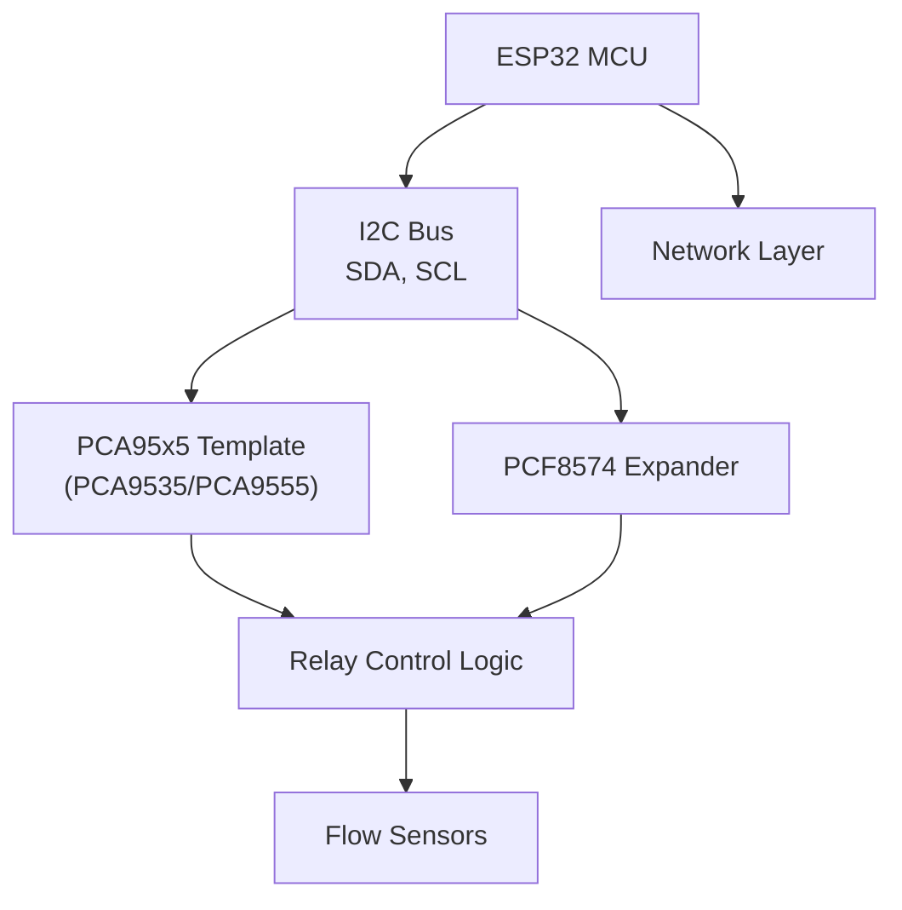
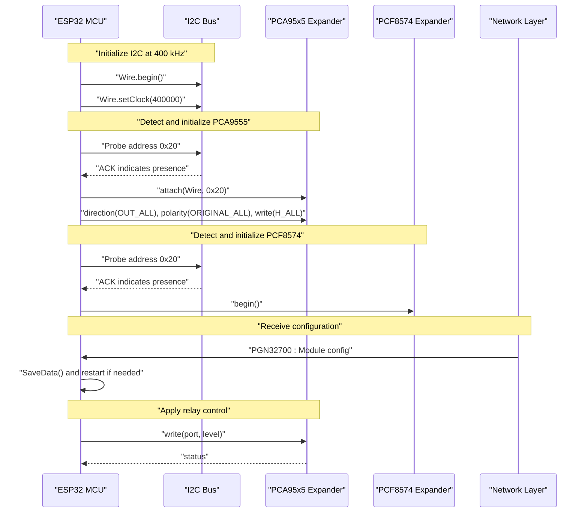
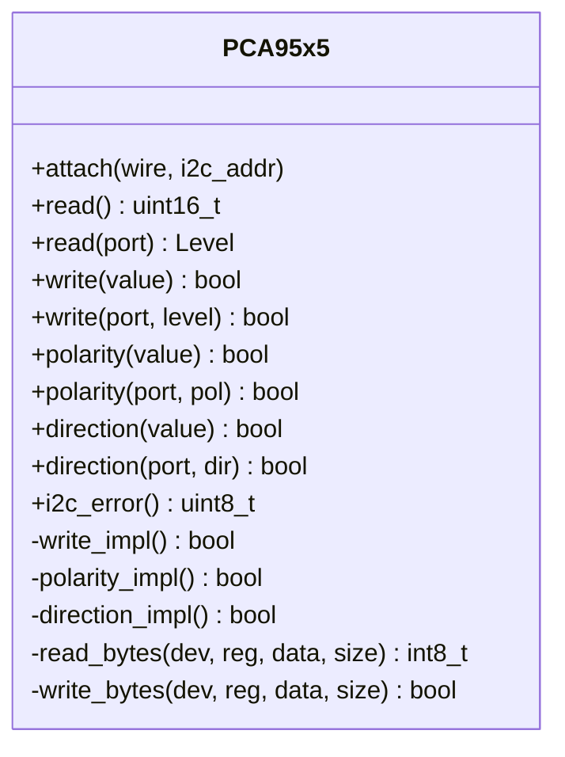
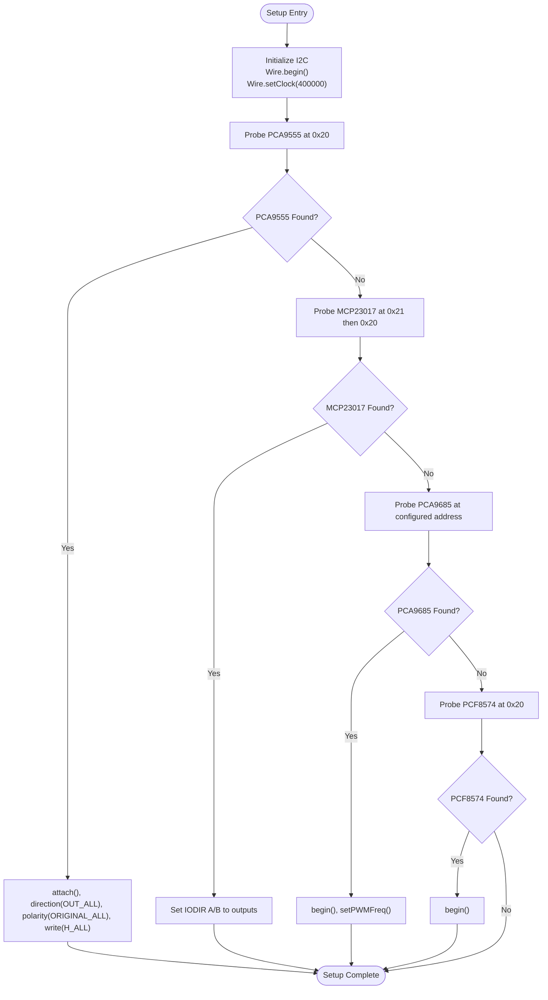
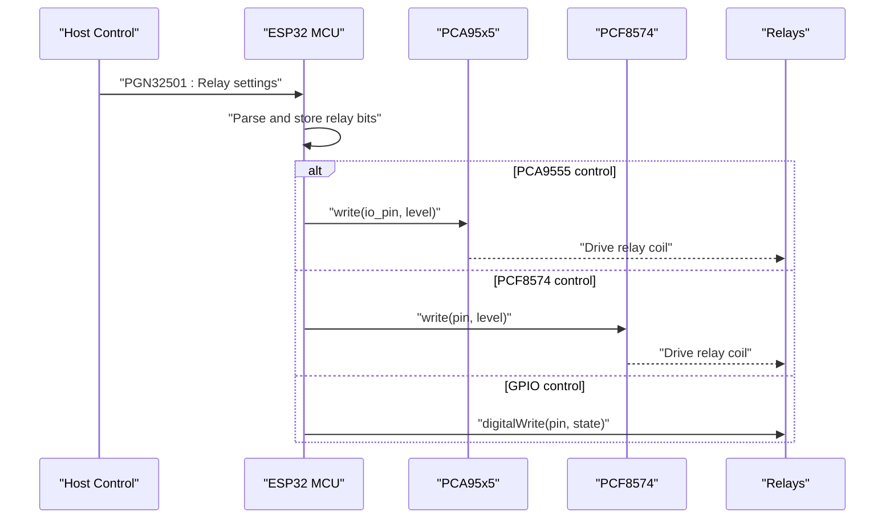
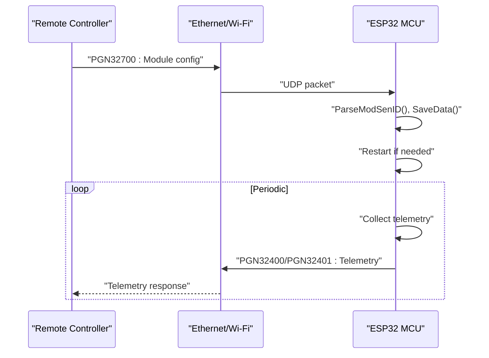
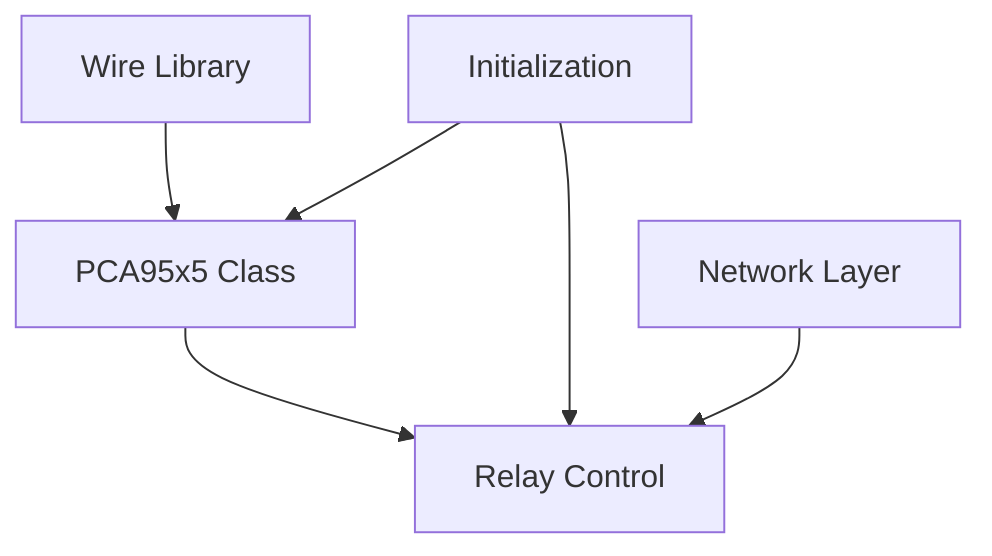

# GPIO Expansion Interfaces

<cite>
**Referenced Files in This Document**
- [PCA95x5_RC.h](file://RC_ESP32/PCA95x5_RC.h)
- [Begin.ino](file://RC_ESP32/Begin.ino)
- [Relays.ino](file://RC_ESP32/Relays.ino)
- [Receive.ino](file://RC_ESP32/Receive.ino)
- [Send.ino](file://RC_ESP32/Send.ino)
- [Rate.ino](file://RC_ESP32/Rate.ino)
- [PgSwitches.ino](file://RC_ESP32/PgSwitches.ino)
</cite>

## Table of Contents
1. [Introduction](#introduction)
2. [Project Structure](#project-structure)
3. [Core Components](#core-components)
4. [Architecture Overview](#architecture-overview)
5. [Detailed Component Analysis](#detailed-component-analysis)
6. [Dependency Analysis](#dependency-analysis)
7. [Performance Considerations](#performance-considerations)
8. [Troubleshooting Guide](#troubleshooting-guide)
9. [Conclusion](#conclusion)
10. [Appendices](#appendices)

## Introduction
This document explains the GPIO expansion interfaces used in the rate control module, focusing on PCF8574 and PCA95x5 expanders. It covers I2C communication protocols, address configuration, bus arbitration, and the hardware abstraction layer that maps expanded I/O pins to system functions. It also documents pin configuration schemes for digital inputs, outputs, and special-function pins used in the rate control system, along with integration details for the main controller, including power distribution and signal routing. Practical guidance is provided for wiring, component placement, signal integrity, limitations, and troubleshooting.

## Project Structure
The rate control module integrates multiple GPIO expansion mechanisms via I2C. The primary components are:
- PCA95x5 template class for PCA9535/PCA9555-style expanders
- Initialization routines for I2C devices and expansion boards
- Relay control logic supporting multiple expansion types
- Network communication for configuration and telemetry

**Diagram sources**
- [PCA95x5_RC.h:55-177](file://RC_ESP32/PCA95x5_RC.h#L55-L177)
- [Begin.ino:347-511](file://RC_ESP32/Begin.ino#L347-L511)
- [Relays.ino:71-273](file://RC_ESP32/Relays.ino#L71-L273)

**Section sources**
- [PCA95x5_RC.h:1-178](file://RC_ESP32/PCA95x5_RC.h#L1-L178)
- [Begin.ino:54-56](file://RC_ESP32/Begin.ino#L54-L56)
- [Relays.ino:1-282](file://RC_ESP32/Relays.ino#L1-L282)

## Core Components
- PCA95x5 template class: Provides a unified abstraction for PCA9535/PCA9555-like expanders with registers for input, output, polarity inversion, and configuration. It supports per-pin and bulk operations and exposes an I2C error status.
- Initialization and detection: The setup routine initializes I2C at 400 kHz and attempts to detect PCA9555, MCP23017, PCA9685, and PCF8574 devices by probing addresses.
- Relay control: The relay control logic selects the appropriate expansion mechanism (GPIO, PCA9555, MCP23017, PCA9685, PCF8574) and applies inverted or non-inverted logic based on configuration.
- Network integration: Configuration and telemetry are exchanged via UDP over Ethernet/Wi-Fi, enabling dynamic updates to relay control types and pin assignments.

Key implementation references:
- PCA95x5 class definition and register mapping: [PCA95x5_RC.h:55-177](file://RC_ESP32/PCA95x5_RC.h#L55-L177)
- I2C initialization and device detection: [Begin.ino:54-56](file://RC_ESP32/Begin.ino#L54-L56), [Begin.ino:347-511](file://RC_ESP32/Begin.ino#L347-L511)
- Relay control selection and logic: [Relays.ino:71-273](file://RC_ESP32/Relays.ino#L71-L273)
- Network configuration and telemetry: [Receive.ino:277-342](file://RC_ESP32/Receive.ino#L277-L342), [Send.ino:1-195](file://RC_ESP32/Send.ino#L1-L195)

**Section sources**
- [PCA95x5_RC.h:55-177](file://RC_ESP32/PCA95x5_RC.h#L55-L177)
- [Begin.ino:54-56](file://RC_ESP32/Begin.ino#L54-L56)
- [Begin.ino:347-511](file://RC_ESP32/Begin.ino#L347-L511)
- [Relays.ino:71-273](file://RC_ESP32/Relays.ino#L71-L273)
- [Receive.ino:277-342](file://RC_ESP32/Receive.ino#L277-L342)
- [Send.ino:1-195](file://RC_ESP32/Send.ino#L1-L195)

## Architecture Overview
The system architecture integrates I2C-based GPIO expansion with the main control loop. The MCU initializes I2C, detects expansion devices, configures their registers, and routes relay control signals through the selected expansion mechanism. Network packets configure operational parameters and relay assignments, while telemetry reports status and measurements.

**Diagram sources**
- [Begin.ino:54-56](file://RC_ESP32/Begin.ino#L54-L56)
- [Begin.ino:366-396](file://RC_ESP32/Begin.ino#L366-L396)
- [Begin.ino:484-509](file://RC_ESP32/Begin.ino#L484-L509)
- [PCA95x5_RC.h:73-140](file://RC_ESP32/PCA95x5_RC.h#L73-L140)
- [Receive.ino:277-342](file://RC_ESP32/Receive.ino#L277-L342)
- [Relays.ino:95-142](file://RC_ESP32/Relays.ino#L95-L142)
- [Relays.ino:262-271](file://RC_ESP32/Relays.ino#L262-L271)

## Detailed Component Analysis

### PCA95x5 Template Abstraction
The PCA95x5 class encapsulates register-level access to PCA9535/PCA9555-like expanders:
- Registers: Input Port 0/1, Output Port 0/1, Polarity Inversion 0/1, Configuration 0/1
- Operations: Bulk read/write, per-port read/write, polarity inversion, direction configuration
- Status reporting: I2C error status via endTransmission

**Diagram sources**
- [PCA95x5_RC.h:55-177](file://RC_ESP32/PCA95x5_RC.h#L55-L177)

**Section sources**
- [PCA95x5_RC.h:55-177](file://RC_ESP32/PCA95x5_RC.h#L55-L177)

### I2C Initialization and Device Detection
The setup routine initializes I2C on SDA/SCL pins and sets the bus speed to 400 kHz. It then probes for PCA9555, MCP23017, PCA9685, and PCF8574 devices by attempting I2C transmissions to known addresses. Successful detection enables subsequent configuration of registers and output states.

**Diagram sources**
- [Begin.ino:54-56](file://RC_ESP32/Begin.ino#L54-L56)
- [Begin.ino:366-396](file://RC_ESP32/Begin.ino#L366-L396)
- [Begin.ino:403-451](file://RC_ESP32/Begin.ino#L403-L451)
- [Begin.ino:453-482](file://RC_ESP32/Begin.ino#L453-L482)
- [Begin.ino:484-509](file://RC_ESP32/Begin.ino#L484-L509)

**Section sources**
- [Begin.ino:54-56](file://RC_ESP32/Begin.ino#L54-L56)
- [Begin.ino:366-396](file://RC_ESP32/Begin.ino#L366-L396)
- [Begin.ino:403-451](file://RC_ESP32/Begin.ino#L403-L451)
- [Begin.ino:453-482](file://RC_ESP32/Begin.ino#L453-L482)
- [Begin.ino:484-509](file://RC_ESP32/Begin.ino#L484-L509)

### Relay Control Logic and Mapping
Relay control supports multiple expansion types. The logic selects the appropriate control path based on configuration and applies inverted or non-inverted output depending on settings. For PCA9555 and PCF8574, the control writes individual port levels to drive relays.

**Diagram sources**
- [Relays.ino:71-273](file://RC_ESP32/Relays.ino#L71-L273)
- [PCA95x5_RC.h:101-109](file://RC_ESP32/PCA95x5_RC.h#L101-L109)

**Section sources**
- [Relays.ino:71-273](file://RC_ESP32/Relays.ino#L71-L273)
- [PCA95x5_RC.h:101-109](file://RC_ESP32/PCA95x5_RC.h#L101-L109)

### Network Configuration and Telemetry
Configuration and telemetry are exchanged via UDP packets. The module receives configuration updates (e.g., module settings, relay assignments) and sends telemetry (rate applied, accumulated quantity, PWM, status, Hz).

**Diagram sources**
- [Receive.ino:277-342](file://RC_ESP32/Receive.ino#L277-L342)
- [Send.ino:1-195](file://RC_ESP32/Send.ino#L1-L195)

**Section sources**
- [Receive.ino:277-342](file://RC_ESP32/Receive.ino#L277-L342)
- [Send.ino:1-195](file://RC_ESP32/Send.ino#L1-L195)

### Pin Configuration Schemes
- Digital Inputs: Configured as pull-up inputs for sensor and switch detection. Interrupts are attached to flow sensor pins for precise pulse counting.
- Digital Outputs: Controlled via expansion devices (PCA9555, PCF8574) or direct GPIO. Polarity inversion is supported to match relay driver logic.
- Special Function Pins: Work switch, pressure sensor, wheel speed sensor, and flow sensor pins are configurable and validated during setup.

References:
- Sensor and switch pin setup: [Begin.ino:124-167](file://RC_ESP32/Begin.ino#L124-L167)
- Work switch and pressure pin configuration: [Begin.ino:51-52](file://RC_ESP32/Begin.ino#L51-L52)
- Wheel speed sensor configuration: [Begin.ino:162-167](file://RC_ESP32/Begin.ino#L162-L167)
- Flow sensor ISR handling: [Rate.ino:14-106](file://RC_ESP32/Rate.ino#L14-L106)

**Section sources**
- [Begin.ino:124-167](file://RC_ESP32/Begin.ino#L124-L167)
- [Begin.ino:51-52](file://RC_ESP32/Begin.ino#L51-L52)
- [Begin.ino:162-167](file://RC_ESP32/Begin.ino#L162-L167)
- [Rate.ino:14-106](file://RC_ESP32/Rate.ino#L14-L106)

## Dependency Analysis
The system exhibits clear separation of concerns:
- Hardware abstraction (PCA95x5) depends on the Wire library for I2C transactions.
- Initialization routines depend on I2C detection and register programming.
- Relay control logic depends on configuration parameters and expansion device availability.
- Network layer depends on UDP transport and CRC validation.

**Diagram sources**
- [PCA95x5_RC.h:1-2](file://RC_ESP32/PCA95x5_RC.h#L1-L2)
- [PCA95x5_RC.h:55-177](file://RC_ESP32/PCA95x5_RC.h#L55-L177)
- [Begin.ino:347-511](file://RC_ESP32/Begin.ino#L347-L511)
- [Relays.ino:71-273](file://RC_ESP32/Relays.ino#L71-L273)
- [Receive.ino:277-342](file://RC_ESP32/Receive.ino#L277-L342)

**Section sources**
- [PCA95x5_RC.h:1-2](file://RC_ESP32/PCA95x5_RC.h#L1-L2)
- [PCA95x5_RC.h:55-177](file://RC_ESP32/PCA95x5_RC.h#L55-L177)
- [Begin.ino:347-511](file://RC_ESP32/Begin.ino#L347-L511)
- [Relays.ino:71-273](file://RC_ESP32/Relays.ino#L71-L273)
- [Receive.ino:277-342](file://RC_ESP32/Receive.ino#L277-L342)

## Performance Considerations
- I2C bus speed: The bus runs at 400 kHz, balancing speed and noise immunity. Ensure proper pull-ups and trace lengths for reliable operation.
- Interrupt-driven pulse counting: ISR handlers minimize latency for flow sensor measurements.
- Network polling intervals: Telemetry and configuration updates are sent at periodic intervals to balance responsiveness and bandwidth.

[No sources needed since this section provides general guidance]

## Troubleshooting Guide
Common issues and resolutions:
- I2C bus conflicts/address collisions:
  - Verify unique addresses for each device on the bus.
  - Use the device detection routine to confirm presence at intended addresses.
  - Check pull-up resistors and wiring continuity.
- Communication timeouts:
  - Confirm I2C initialization and bus speed settings.
  - Validate device-specific register configurations after detection.
  - Monitor I2C error status returned by the PCA95x5 class.
- Expansion board not responding:
  - Re-run device detection and re-initialization.
  - For PCA9555, ensure direction and polarity registers are configured appropriately.
  - For PCF8574, confirm begin() is called after detection.

**Section sources**
- [PCA95x5_RC.h:138-140](file://RC_ESP32/PCA95x5_RC.h#L138-L140)
- [Begin.ino:366-396](file://RC_ESP32/Begin.ino#L366-L396)
- [Begin.ino:484-509](file://RC_ESP32/Begin.ino#L484-L509)

## Conclusion
The rate control module leverages PCA95x5 and PCF8574 expanders to extend GPIO capabilities over I2C. The hardware abstraction layer provides a consistent interface for register-level operations, while initialization routines and relay control logic integrate seamlessly with the main control loop. Network integration enables dynamic configuration and telemetry. Proper I2C configuration, address planning, and signal integrity practices are essential for robust field operation.

[No sources needed since this section summarizes without analyzing specific files]

## Appendices

### Hardware Wiring and Signal Integrity Recommendations
- Keep I2C traces short and matched in length.
- Use 4.7 kΩ pull-up resistors to a 3.3 V supply.
- Place decoupling capacitors near each I2C device.
- Avoid long cable runs; use shielded cables for noisy environments.
- Ensure common ground between MCU and expansion boards.

[No sources needed since this section provides general guidance]