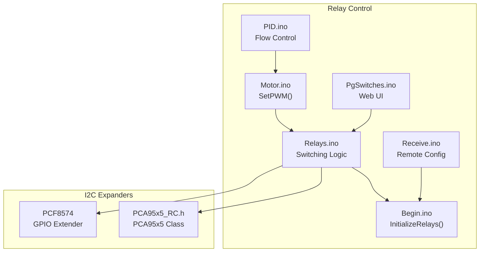
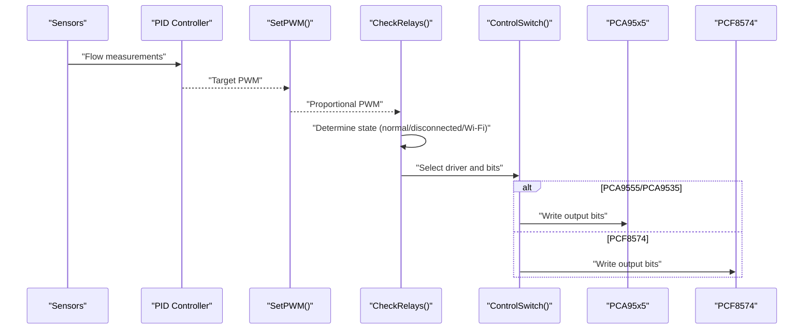
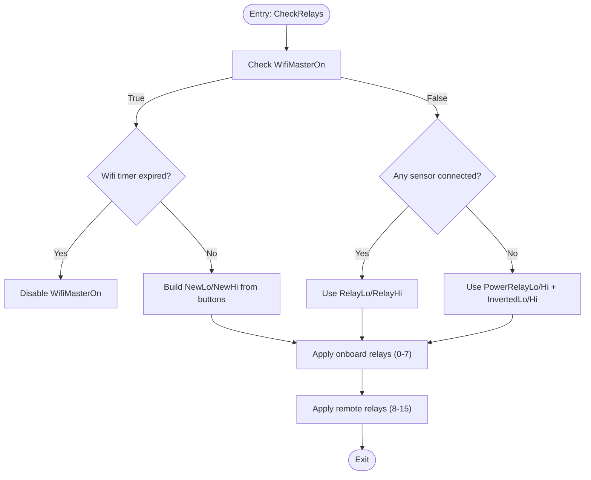
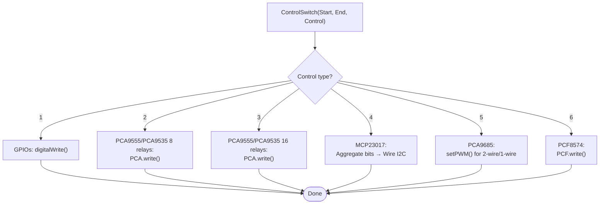
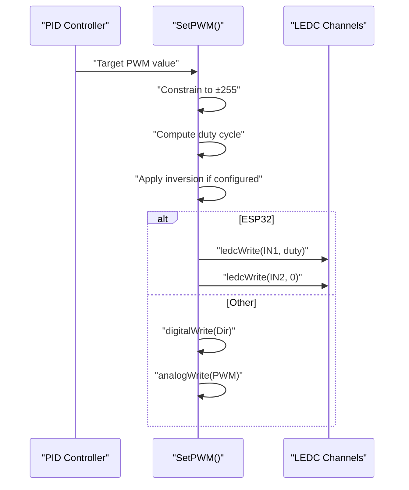
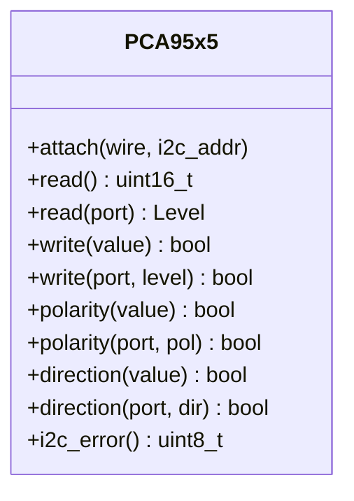
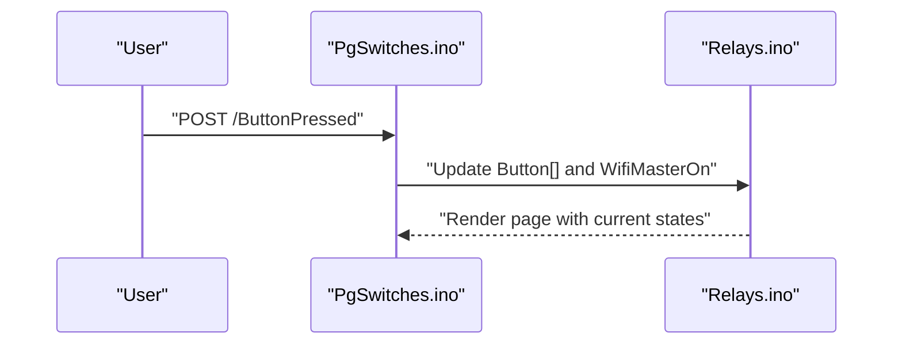
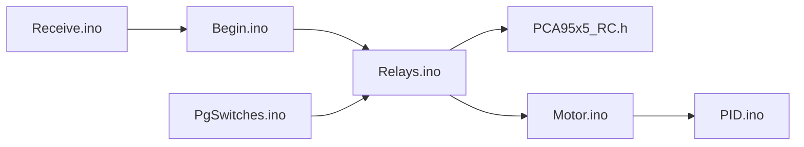

# Relay Control Systems

<cite>
**Referenced Files in This Document**
- [Relays.ino](file://RC_ESP32/Relays.ino)
- [Begin.ino](file://RC_ESP32/Begin.ino)
- [PCA95x5_RC.h](file://RC_ESP32/PCA95x5_RC.h)
- [Motor.ino](file://RC_ESP32/Motor.ino)
- [PgSwitches.ino](file://RC_ESP32/PgSwitches.ino)
- [PID.ino](file://RC_ESP32/PID.ino)
- [Receive.ino](file://RC_ESP32/Receive.ino)
</cite>

## Table of Contents
1. [Introduction](#introduction)
2. [Project Structure](#project-structure)
3. [Core Components](#core-components)
4. [Architecture Overview](#architecture-overview)
5. [Detailed Component Analysis](#detailed-component-analysis)
6. [Dependency Analysis](#dependency-analysis)
7. [Performance Considerations](#performance-considerations)
8. [Safety Protocols](#safety-protocols)
9. [Timing Requirements](#timing-requirements)
10. [Wiring and Electrical Specifications](#wiring-and-electrical-specifications)
11. [Diagnostic Capabilities](#diagnostic-capabilities)
12. [Conclusion](#conclusion)

## Introduction
This document describes the relay control systems used for solenoid activation and pump control in the ESP32 Rate module. It covers relay switching logic, timing sequences, duty cycle control, safety interlocks, and integration with PCF8574 GPIO expanders for additional digital output channels. It also documents relay driver circuits, flyback diode protection, inductive load switching considerations, proportional solenoid operation via pulse-width modulation, safety protocols for relay failure detection, thermal protection, and emergency shutdown procedures. Timing requirements for different solenoid types and pump control scenarios are addressed, along with wiring diagrams, component specifications, electrical isolation requirements, and diagnostic capabilities for relay status monitoring and fault indication.

## Project Structure
The relay control system is implemented across several modules:
- Relay switching logic and control routing
- Initialization and I2C device discovery for GPIO expanders
- PWM generation for proportional solenoid operation
- Web interface for manual relay control
- PID control for flow regulation
- Remote configuration and parameter updates

**Diagram sources**
- [Relays.ino](file://RC_ESP32/Relays.ino)
- [Begin.ino](file://RC_ESP32/Begin.ino)
- [PCA95x5_RC.h](file://RC_ESP32/PCA95x5_RC.h)
- [Motor.ino](file://RC_ESP32/Motor.ino)
- [PgSwitches.ino](file://RC_ESP32/PgSwitches.ino)
- [PID.ino](file://RC_ESP32/PID.ino)
- [Receive.ino](file://RC_ESP32/Receive.ino)

**Section sources**
- [Relays.ino](file://RC_ESP32/Relays.ino)
- [Begin.ino](file://RC_ESP32/Begin.ino)
- [PCA95x5_RC.h](file://RC_ESP32/PCA95x5_RC.h)
- [Motor.ino](file://RC_ESP32/Motor.ino)
- [PgSwitches.ino](file://RC_ESP32/PgSwitches.ino)
- [PID.ino](file://RC_ESP32/PID.ino)
- [Receive.ino](file://RC_ESP32/Receive.ino)

## Core Components
- Relay switching logic orchestrator: Determines relay states based on sensor connectivity, Wi-Fi master control, and power/inverted relay requirements.
- ControlSwitch dispatcher: Routes relay commands to appropriate hardware (GPIOs, PCA9555/PCA9535, MCP23017, PCA9685, PCF8574).
- PWM generation for proportional solenoid operation: Converts control signals to duty-cycle PWM for variable-speed actuation.
- I2C expander abstraction: Provides unified access to PCA9555/PCA9535 and MCP23017 devices.
- Web interface: Allows manual relay toggling and master control.
- PID controller: Computes target PWM values for flow regulation.

**Section sources**
- [Relays.ino](file://RC_ESP32/Relays.ino)
- [Begin.ino](file://RC_ESP32/Begin.ino)
- [PCA95x5_RC.h](file://RC_ESP32/PCA95x5_RC.h)
- [Motor.ino](file://RC_ESP32/Motor.ino)
- [PgSwitches.ino](file://RC_ESP32/PgSwitches.ino)
- [PID.ino](file://RC_ESP32/PID.ino)

## Architecture Overview
The relay control architecture integrates real-time flow control with multiple relay output mechanisms. The system prioritizes sensor connectivity for normal operation, falls back to power/inverted relay states when disconnected, and supports Wi-Fi master control with timeout protection. Outputs are routed through configurable drivers, including direct GPIOs, PCA9555/PCA9535 expanders, MCP23017, PCA9685, and PCF8574.

**Diagram sources**
- [PID.ino](file://RC_ESP32/PID.ino)
- [Motor.ino](file://RC_ESP32/Motor.ino)
- [Relays.ino](file://RC_ESP32/Relays.ino)
- [PCA95x5_RC.h](file://RC_ESP32/PCA95x5_RC.h)

## Detailed Component Analysis

### Relay Switching Logic
The relay switching logic determines output states based on:
- Wi-Fi master control: Active for 30 seconds after a button press; otherwise disabled.
- Sensor connectivity: Normal operation when sensors are connected.
- Power and inverted relays: Ensures solenoids requiring power to close remain powered when disconnected.

**Diagram sources**
- [Relays.ino](file://RC_ESP32/Relays.ino)

**Section sources**
- [Relays.ino](file://RC_ESP32/Relays.ino)

### ControlSwitch Dispatcher
The ControlSwitch function routes relay commands to the selected driver:
- GPIOs: Direct digital writes to configured pins.
- PCA9555/PCA9535: Writes to output registers with polarity and direction configured during initialization.
- MCP23017: Aggregates bits into two 8-bit words and writes to GPIO registers.
- PCA9685: Uses PWM channels to drive solenoid coils for 2-wire or 1-wire configurations.
- PCF8574: Writes all 8 bits to the expander.

**Diagram sources**
- [Relays.ino](file://RC_ESP32/Relays.ino)
- [PCA95x5_RC.h](file://RC_ESP32/PCA95x5_RC.h)

**Section sources**
- [Relays.ino](file://RC_ESP32/Relays.ino)
- [PCA95x5_RC.h](file://RC_ESP32/PCA95x5_RC.h)

### PWM Generation for Proportional Solenoid Operation
PWM generation converts control signals to duty-cycle values:
- Constrain control input to ±255.
- Compute duty cycle based on configured PWM resolution.
- Optionally apply dithering for 8-bit resolution.
- Write to LEDC channels for ESP32 or analog pins for other processors.

**Diagram sources**
- [Motor.ino](file://RC_ESP32/Motor.ino)
- [PID.ino](file://RC_ESP32/PID.ino)

**Section sources**
- [Motor.ino](file://RC_ESP32/Motor.ino)
- [PID.ino](file://RC_ESP32/PID.ino)

### I2C Expander Abstraction (PCA95x5)
The PCA95x5 class provides:
- Read/write operations to input/output registers.
- Polarity inversion and direction configuration.
- I2C transaction error reporting.

**Diagram sources**
- [PCA95x5_RC.h](file://RC_ESP32/PCA95x5_RC.h)

**Section sources**
- [PCA95x5_RC.h](file://RC_ESP32/PCA95x5_RC.h)

### Web Interface for Manual Relay Control
The web interface allows:
- Toggling master control for 30 seconds.
- Individual relay toggles numbered 1–16.
- Real-time button state feedback.

**Diagram sources**
- [PgSwitches.ino](file://RC_ESP32/PgSwitches.ino)
- [Relays.ino](file://RC_ESP32/Relays.ino)

**Section sources**
- [PgSwitches.ino](file://RC_ESP32/PgSwitches.ino)
- [Relays.ino](file://RC_ESP32/Relays.ino)

## Dependency Analysis
The relay control system exhibits modular dependencies:
- Relays.ino depends on Begin.ino for initialization and configuration.
- ControlSwitch relies on PCA95x5_RC.h for PCA expanders and on I2C for MCP23017 and PCF8574.
- Motor.ino depends on PID.ino for computed PWM values.
- PgSwitches.ino interacts with Relays.ino for state updates.
- Receive.ino updates configuration parameters that affect relay behavior.

**Diagram sources**
- [Begin.ino](file://RC_ESP32/Begin.ino)
- [Relays.ino](file://RC_ESP32/Relays.ino)
- [PCA95x5_RC.h](file://RC_ESP32/PCA95x5_RC.h)
- [Motor.ino](file://RC_ESP32/Motor.ino)
- [PID.ino](file://RC_ESP32/PID.ino)
- [PgSwitches.ino](file://RC_ESP32/PgSwitches.ino)
- [Receive.ino](file://RC_ESP32/Receive.ino)

**Section sources**
- [Begin.ino](file://RC_ESP32/Begin.ino)
- [Relays.ino](file://RC_ESP32/Relays.ino)
- [PCA95x5_RC.h](file://RC_ESP32/PCA95x5_RC.h)
- [Motor.ino](file://RC_ESP32/Motor.ino)
- [PID.ino](file://RC_ESP32/PID.ino)
- [PgSwitches.ino](file://RC_ESP32/PgSwitches.ino)
- [Receive.ino](file://RC_ESP32/Receive.ino)

## Performance Considerations
- PWM resolution and frequency: The system configures LEDC channels with a configurable frequency and bits, enabling precise proportional control for solenoids.
- Duty cycle computation: Uses integer arithmetic with optional dithering for smoother low-duty performance.
- I2C speed: I2C bus is initialized at 400 kHz to support rapid expander updates.
- Interrupt-driven flow sensing: Flow interrupts are attached per sensor to minimize CPU overhead.

[No sources needed since this section provides general guidance]

## Safety Protocols
- Wi-Fi master timeout: Automatic deactivation after 30 seconds to prevent unintended long-term control.
- Disconnected operation: When sensors are not connected, the system enables power and inverted relays to maintain safe default states for solenoids requiring power to close.
- Inversion control: Relay inversion is configurable to match solenoid wiring requirements.
- Emergency conditions: While explicit emergency shutdown is not shown in code, the fallback to power/inverted relays ensures solenoids remain in a predictable state when communication is lost.

**Section sources**
- [Relays.ino](file://RC_ESP32/Relays.ino)
- [Begin.ino](file://RC_ESP32/Begin.ino)

## Timing Requirements
- Wi-Fi master control window: 30 seconds duration for manual override.
- PID control intervals: Configurable PID time interval per sensor.
- Pulse timing parameters: Minimum and maximum pulse durations are configurable via remote parameters, affecting solenoid opening/closing rates.

**Section sources**
- [Relays.ino](file://RC_ESP32/Relays.ino)
- [PID.ino](file://RC_ESP32/PID.ino)
- [Receive.ino](file://RC_ESP32/Receive.ino)

## Wiring and Electrical Specifications
- GPIO expansion: PCF8574 provides 8 additional digital outputs via I2C, suitable for solenoid control.
- Relay driver circuits: The system supports multiple drivers including PCA9555/PCA9535 expanders, MCP23017, and PCA9685. Each requires proper I2C pull-ups and appropriate logic-level translation if needed.
- Flyback diode protection: Inductive load switching (solenoids) requires flyback diodes across coil terminals to suppress voltage spikes.
- Electrical isolation: For high-voltage solenoids, consider opto-isolated relay drivers or solid-state relays to protect the ESP32 I/O lines.
- Power supply considerations: Ensure adequate current capacity for solenoid peak current and PWM switching losses.

[No sources needed since this section provides general guidance]

## Diagnostic Capabilities
- I2C device detection: Initialization routines scan for PCA9555, MCP23017, PCA9685, and PCF8574 devices and report presence or absence.
- Status reporting: Serial output indicates detected devices and configuration status.
- Web interface diagnostics: Manual relay toggling confirms output functionality and provides immediate feedback.

**Section sources**
- [Begin.ino](file://RC_ESP32/Begin.ino)
- [PgSwitches.ino](file://RC_ESP32/PgSwitches.ino)

## Conclusion
The relay control system integrates real-time flow regulation with flexible relay output drivers, supporting both direct GPIO control and I2C expanders. It provides robust fallback behavior when sensors are disconnected, Wi-Fi master control with timeout protection, and proportional solenoid operation via PWM. The modular design facilitates easy adaptation to different solenoid and pump control scenarios while maintaining safety and diagnostic capabilities.