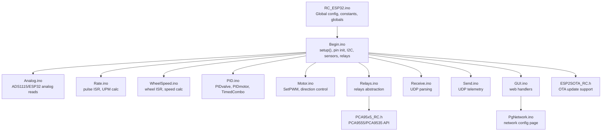
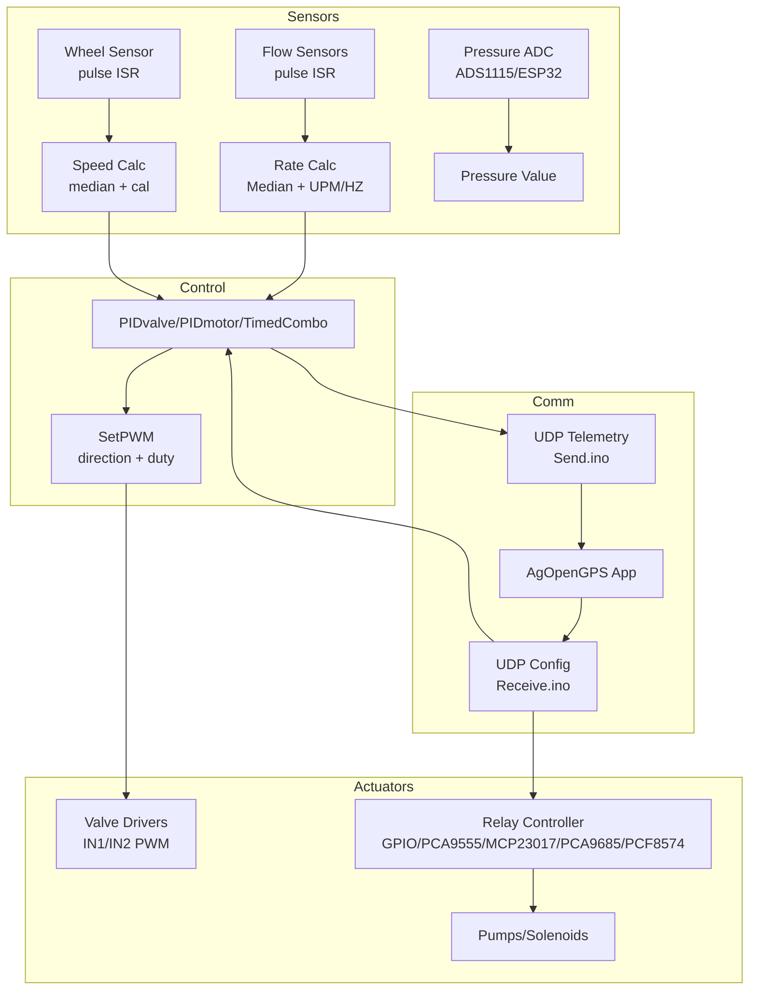
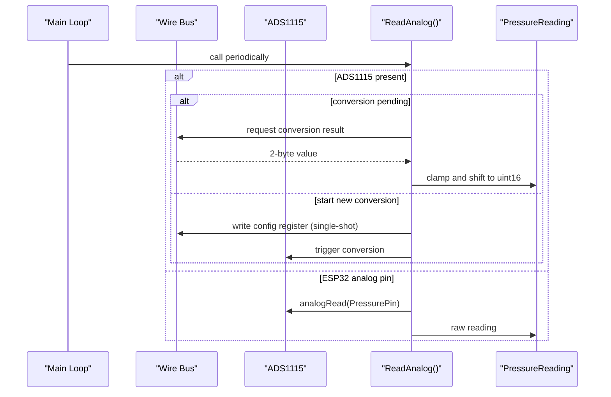
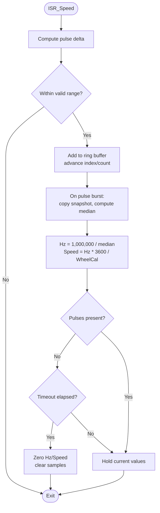
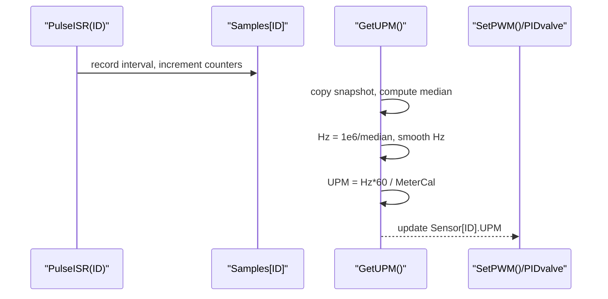
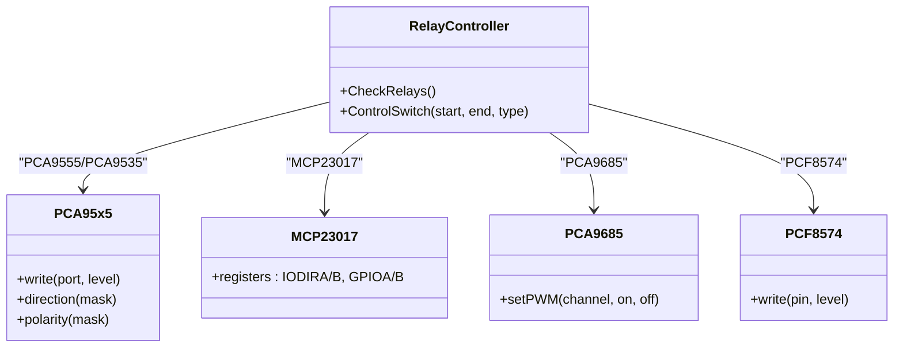
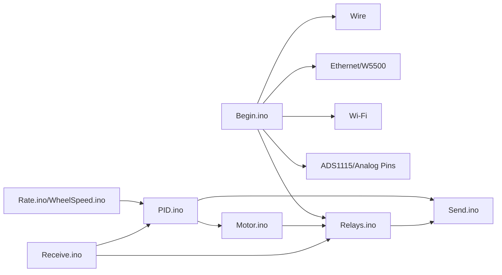

# Sensor and Hardware Interface

<cite>
**Referenced Files in This Document**
- [RC_ESP32.ino](file://RC_ESP32/RC_ESP32.ino)
- [Begin.ino](file://RC_ESP32/Begin.ino)
- [Analog.ino](file://RC_ESP32/Analog.ino)
- [WheelSpeed.ino](file://RC_ESP32/WheelSpeed.ino)
- [Rate.ino](file://RC_ESP32/Rate.ino)
- [PID.ino](file://RC_ESP32/PID.ino)
- [Motor.ino](file://RC_ESP32/Motor.ino)
- [Relays.ino](file://RC_ESP32/Relays.ino)
- [PCA95x5_RC.h](file://RC_ESP32/PCA95x5_RC.h)
- [Receive.ino](file://RC_ESP32/Receive.ino)
- [Send.ino](file://RC_ESP32/Send.ino)
- [GUI.ino](file://RC_ESP32/GUI.ino)
- [PgNetwork.ino](file://RC_ESP32/PgNetwork.ino)
- [ESP2SOTA_RC.h](file://RC_ESP32/ESP2SOTA_RC/ESP2SOTA_RC.h)
- [Notes.txt](file://Notes.txt)
</cite>

## Table of Contents
1. [Introduction](#introduction)
2. [Project Structure](#project-structure)
3. [Core Components](#core-components)
4. [Architecture Overview](#architecture-overview)
5. [Detailed Component Analysis](#detailed-component-analysis)
6. [Dependency Analysis](#dependency-analysis)
7. [Performance Considerations](#performance-considerations)
8. [Troubleshooting Guide](#troubleshooting-guide)
9. [Conclusion](#conclusion)
10. [Appendices](#appendices)

## Introduction
This document describes the sensor and hardware interface for the ESP32 Rate Control system. It covers analog sensor processing (ADC configuration and signal conditioning), wheel speed sensor integration using encoder-style pulses, relay control systems for solenoid and pump actuation, GPIO expansion via PCF8574, and the hardware abstraction layer that unifies these peripherals. It also documents calibration procedures, signal validation, error detection, environmental considerations, and field diagnostics/testing.

## Project Structure
The system is organized around a modular Arduino sketch with dedicated files for setup, sensor handling, control loops, communication, and web-based configuration. Key areas:
- Initialization and hardware discovery
- Analog pressure sensing (ADC or ESP32 analog pins)
- Flow sensor pulse counting and rate computation
- Wheel speed sensor decoding and speed computation
- PID-based control for valves and motors
- Relay control abstraction supporting multiple I/O expanders
- Communication via UDP over Ethernet and Wi-Fi
- Web UI for configuration and diagnostics
- Over-the-air firmware updates

**Diagram sources**
- [RC_ESP32.ino:1-418](file://RC_ESP32/RC_ESP32.ino#L1-L418)
- [Begin.ino:1-769](file://RC_ESP32/Begin.ino#L1-L769)
- [Analog.ino:1-70](file://RC_ESP32/Analog.ino#L1-L70)
- [Rate.ino:1-106](file://RC_ESP32/Rate.ino#L1-L106)
- [WheelSpeed.ino:1-71](file://RC_ESP32/WheelSpeed.ino#L1-L71)
- [PID.ino:1-232](file://RC_ESP32/PID.ino#L1-L232)
- [Motor.ino:1-76](file://RC_ESP32/Motor.ino#L1-L76)
- [Relays.ino:1-282](file://RC_ESP32/Relays.ino#L1-L282)
- [PCA95x5_RC.h:1-178](file://RC_ESP32/PCA95x5_RC.h#L1-L178)
- [Receive.ino:1-346](file://RC_ESP32/Receive.ino#L1-L346)
- [Send.ino:1-195](file://RC_ESP32/Send.ino#L1-L195)
- [GUI.ino:1-104](file://RC_ESP32/GUI.ino#L1-L104)
- [PgNetwork.ino:1-155](file://RC_ESP32/PgNetwork.ino#L1-L155)
- [ESP2SOTA_RC.h:1-34](file://RC_ESP32/ESP2SOTA_RC/ESP2SOTA_RC.h#L1-L34)

**Section sources**
- [RC_ESP32.ino:1-418](file://RC_ESP32/RC_ESP32.ino#L1-L418)
- [Begin.ino:1-769](file://RC_ESP32/Begin.ino#L1-L769)

## Core Components
- Global configuration and constants: device identity, I2C addresses, pin mappings, control enums, and global structures for module/network/sensor settings.
- Setup and initialization: EEPROM load/defaults, I2C bus, ADS1115 presence, Ethernet/W5500, sensors (flow pins, interrupts, PWM channels), wheel speed pin, relays (GPIO/I2C expanders), Wi-Fi AP/STA, web server, OTA.
- Analog pressure sensing: dual-path selection between external ADS1115 and ESP32 analog pins with single-shot conversion scheduling.
- Flow sensor processing: interrupt-driven pulse capture, median filtering, and UPM/HZ computation with timeout-based zeroing.
- Wheel speed sensor: dedicated interrupt for encoder pulses, median sampling, Hz smoothing, and derived vehicle speed using calibration.
- Control logic: PIDvalve for proportional-integral control, PIDmotor for motor/fan control with slew limiting, TimedCombo for combo-close sequences.
- Actuation: SetPWM translates normalized PWM [-255..255] to duty cycle and direction, with 3-wire vs 2-wire logic and optional dithering on lower-bit PWM.
- Relays: unified control across onboard GPIOs, PCA9555/PCA9535, MCP23017, PCA9685, and PCF8574, with power/inverted relay groups and master/apply gating.
- Communication: bidirectional UDP telemetry and configuration using custom PGNs, with Ethernet preferred and Wi-Fi fallback.
- Diagnostics and UI: web pages for network configuration, live status, and OTA updates.

**Section sources**
- [RC_ESP32.ino:67-149](file://RC_ESP32/RC_ESP32.ino#L67-L149)
- [Begin.ino:54-345](file://RC_ESP32/Begin.ino#L54-L345)
- [Analog.ino:2-65](file://RC_ESP32/Analog.ino#L2-L65)
- [Rate.ino:14-74](file://RC_ESP32/Rate.ino#L14-L74)
- [WheelSpeed.ino:15-71](file://RC_ESP32/WheelSpeed.ino#L15-L71)
- [PID.ino:25-178](file://RC_ESP32/PID.ino#L25-L178)
- [Motor.ino:31-60](file://RC_ESP32/Motor.ino#L31-L60)
- [Relays.ino:11-273](file://RC_ESP32/Relays.ino#L11-L273)
- [Receive.ino:29-343](file://RC_ESP32/Receive.ino#L29-L343)
- [Send.ino:1-195](file://RC_ESP32/Send.ino#L1-L195)

## Architecture Overview
The system integrates multiple sensors and actuators through a central control loop:
- Sensors: flow pulses (multiple channels), wheel encoder pulses, and optional pressure via ADC or analog pin.
- Control: PID-based regulation for valves and motors, plus timed combo logic for rapid shutoff.
- Actuators: PWM-driven solenoids/valves with direction control and optional 3-wire/2-wire configurations; relays for pumps and other high-current loads.
- Communication: periodic telemetry and real-time configuration via UDP, with Ethernet as primary transport and Wi-Fi as fallback.
- Abstraction: a relay controller abstracts multiple I/O expanders behind a single interface.

**Diagram sources**
- [Rate.ino:14-74](file://RC_ESP32/Rate.ino#L14-L74)
- [WheelSpeed.ino:15-71](file://RC_ESP32/WheelSpeed.ino#L15-L71)
- [Analog.ino:2-65](file://RC_ESP32/Analog.ino#L2-L65)
- [PID.ino:25-178](file://RC_ESP32/PID.ino#L25-L178)
- [Motor.ino:31-60](file://RC_ESP32/Motor.ino#L31-L60)
- [Relays.ino:11-273](file://RC_ESP32/Relays.ino#L11-L273)
- [Send.ino:1-195](file://RC_ESP32/Send.ino#L1-L195)
- [Receive.ino:29-343](file://RC_ESP32/Receive.ino#L29-L343)

## Detailed Component Analysis

### Analog Sensor Processing (ADC and Signal Conditioning)
- ADC selection: The system checks for an ADS1115 at a fixed I2C address. If present, it performs single-shot conversions and reads the conversion register alternately with config writes to avoid continuous mode overhead. Otherwise, it falls back to ESP32 analog pins configured by module settings.
- Signal conditioning: The ADS1115 is configured for single-ended inputs on AIN0 with programmable gain and sample rate. The code schedules conversions to balance latency and CPU time.
- Noise filtering: A median filter is applied to recent pulse intervals for both flow and wheel sensors to reject glitches and noise.

**Diagram sources**
- [Analog.ino:2-65](file://RC_ESP32/Analog.ino#L2-L65)
- [Begin.ino:58-85](file://RC_ESP32/Begin.ino#L58-L85)

**Section sources**
- [Analog.ino:2-65](file://RC_ESP32/Analog.ino#L2-L65)
- [Begin.ino:58-85](file://RC_ESP32/Begin.ino#L58-L85)

### Wheel Speed Sensor Integration
- Interrupt-driven capture: A dedicated ISR records time deltas between falling edges on the wheel speed pin, with bounds checking to reject unrealistic pulses.
- Median sampling: Up to a fixed sample size captures recent periods; the median is computed and smoothed to derive instantaneous Hz and derived speed.
- Timeout-based reset: If no pulses are seen for a configured timeout, Hz and speed are reset and sample buffers cleared.

**Diagram sources**
- [WheelSpeed.ino:15-71](file://RC_ESP32/WheelSpeed.ino#L15-L71)

**Section sources**
- [WheelSpeed.ino:15-71](file://RC_ESP32/WheelSpeed.ino#L15-L71)

### Flow Sensor Processing and Rate Calculation
- Multi-channel pulse capture: Up to six channels can be attached to separate pins with dedicated ISRs. Each channel maintains a ring buffer of intervals and a running pulse counter.
- Median filtering and smoothing: Median is computed from recent samples; Hz is exponentially smoothed; UPM is derived from Hz and meter calibration.
- Timeout handling: If no pulses are detected for a period or relays are off, readings are reset.

**Diagram sources**
- [Rate.ino:14-74](file://RC_ESP32/Rate.ino#L14-L74)

**Section sources**
- [Rate.ino:14-74](file://RC_ESP32/Rate.ino#L14-L74)

### Relay Control Systems and Solenoid/Pump Activation
- Unified relay abstraction: The system supports multiple relay controller types (GPIOs, PCA9555/PCA9535, MCP23017, PCA9685, PCF8574). The abstraction selects the appropriate backend and writes outputs accordingly.
- Power and inverted relays: Separate masks allow relays that require power to remain closed when the module loses connectivity.
- Master/apply gating: Relays are only controlled when a master flag is set and target rates are non-zero (or manual mode is active).
- PCA9685 specifics: When used for relays, the implementation drives pairs of PWM pins to control solenoid direction and on/off, with optional spare driver usage for additional sections.

**Diagram sources**
- [Relays.ino:71-273](file://RC_ESP32/Relays.ino#L71-L273)
- [PCA95x5_RC.h:56-178](file://RC_ESP32/PCA95x5_RC.h#L56-L178)

**Section sources**
- [Relays.ino:11-273](file://RC_ESP32/Relays.ino#L11-L273)
- [PCA95x5_RC.h:56-178](file://RC_ESP32/PCA95x5_RC.h#L56-L178)

### GPIO Expansion via PCF8574
- Presence detection: The system probes the PCF8574 I2C address during initialization and initializes the device if found.
- Output control: Writes individual pins with inversion controlled by module settings, enabling up to 8 additional digital outputs.

**Section sources**
- [Begin.ino:484-509](file://RC_ESP32/Begin.ino#L484-L509)
- [Relays.ino:262-271](file://RC_ESP32/Relays.ino#L262-L271)

### Hardware Abstraction Layer (HAL) for Sensors and Actuators
- Sensor HAL: The module defines a generic sensor configuration structure with per-sensor parameters (pins, calibration, PID gains, limits). The ISR and rate computation routines operate uniformly across channels.
- Actuator HAL: The relay abstraction encapsulates differences between GPIO direct control and I2C expanders, ensuring consistent control semantics.
- Control HAL: PIDvalve and PIDmotor share common structures and parameters, with specialized handling for motor/fan and timed combo modes.

**Section sources**
- [RC_ESP32.ino:113-149](file://RC_ESP32/RC_ESP32.ino#L113-L149)
- [PID.ino:69-178](file://RC_ESP32/PID.ino#L69-L178)
- [Relays.ino:71-273](file://RC_ESP32/Relays.ino#L71-L273)

### Sensor Calibration Procedures
- Flow meter calibration: Set the meter calibration factor per sensor so UPM computation is accurate. The system derives UPM from Hz using the formula UPM = Hz * 60 / MeterCal.
- Wheel calibration: Set the wheel circumference or gear ratio so speed equals Hz * 3600 / WheelCal.
- Pressure calibration: If using an analog pin, apply known pressures and record the raw reading to establish a linear relationship; if using ADS1115, ensure proper gain and offset are considered in post-processing.

**Section sources**
- [Rate.ino:50-57](file://RC_ESP32/Rate.ino#L50-L57)
- [WheelSpeed.ino:50-54](file://RC_ESP32/WheelSpeed.ino#L50-L54)

### Signal Validation and Error Detection
- CRC validation: All incoming UDP packets are validated with a simple additive checksum before processing.
- Connectivity timeouts: Sensors are marked disconnected if no communication is received within a defined window; relays fall back to safe power/inverted states when disconnected.
- Pin validity: During setup, the system validates that configured pins belong to the supported subset for the processor.
- ADS1115 presence: The system attempts to communicate with the ADC and disables it if not responding.

**Section sources**
- [RC_ESP32.ino:299-314](file://RC_ESP32/RC_ESP32.ino#L299-L314)
- [Begin.ino:621-736](file://RC_ESP32/Begin.ino#L621-L736)
- [Begin.ino:58-85](file://RC_ESP32/Begin.ino#L58-L85)
- [Receive.ino:62-99](file://RC_ESP32/Receive.ino#L62-L99)

### Environmental Considerations
- Temperature compensation: No explicit temperature compensation is implemented in the code for pressure or flow sensors.
- Moisture protection: The code does not include built-in moisture detection; ensure physical enclosures meet IP ratings suitable for agricultural environments.
- Vibration resistance: Debouncing and median filtering mitigate electrical noise and mechanical vibration effects on sensor signals.

[No sources needed since this section provides general guidance]

### Hardware Testing and Diagnostic Capabilities
- Web-based diagnostics: The module exposes a web UI with network configuration and status pages. It reports Wi-Fi RSSI thresholds, Ethernet link status, and pin configuration validity.
- Telemetry: Periodic UDP messages report applied rate, accumulated quantity, PWM, Hz, pressure, wheel speed, and wheel counts.
- OTA updates: Over-the-air firmware updates are supported via a web endpoint.

**Section sources**
- [GUI.ino:1-104](file://RC_ESP32/GUI.ino#L1-L104)
- [PgNetwork.ino:1-155](file://RC_ESP32/PgNetwork.ino#L1-L155)
- [Send.ino:27-92](file://RC_ESP32/Send.ino#L27-L92)
- [Send.ino:117-192](file://RC_ESP32/Send.ino#L117-L192)
- [ESP2SOTA_RC.h:15-33](file://RC_ESP32/ESP2SOTA_RC/ESP2SOTA_RC.h#L15-L33)

## Dependency Analysis
- Initialization depends on EEPROM for persistent storage, I2C for ADC and expanders, Ethernet/W5500 for wired transport, and Wi-Fi for AP/STA.
- Control depends on sensor ISR routines and PID logic; actuation depends on PWM channels and relay abstraction.
- Communication depends on UDP parsing and sending logic; web UI depends on embedded HTML and server routing.

**Diagram sources**
- [Begin.ino:54-345](file://RC_ESP32/Begin.ino#L54-L345)
- [Rate.ino:14-74](file://RC_ESP32/Rate.ino#L14-L74)
- [WheelSpeed.ino:15-71](file://RC_ESP32/WheelSpeed.ino#L15-L71)
- [PID.ino:25-178](file://RC_ESP32/PID.ino#L25-L178)
- [Motor.ino:31-60](file://RC_ESP32/Motor.ino#L31-L60)
- [Relays.ino:11-273](file://RC_ESP32/Relays.ino#L11-L273)
- [Receive.ino:29-343](file://RC_ESP32/Receive.ino#L29-L343)
- [Send.ino:1-195](file://RC_ESP32/Send.ino#L1-L195)

**Section sources**
- [Begin.ino:54-345](file://RC_ESP32/Begin.ino#L54-L345)
- [Receive.ino:29-343](file://RC_ESP32/Receive.ino#L29-L343)
- [Send.ino:1-195](file://RC_ESP32/Send.ino#L1-L195)

## Performance Considerations
- Loop timing: The main loop runs at approximately 20 Hz, with PID updates governed by per-sensor PIDtime. Ensure PIDtime and sample sizes are tuned to maintain stability and responsiveness.
- ISR efficiency: ISRs minimize work and defer heavy computations to the main loop; use of ring buffers avoids heap allocation.
- PWM resolution: ESP32 uses 12-bit PWM; lower platforms use 8-bit with optional dithering to improve low-duty performance.
- I2C speed: The bus is configured to 400 kHz to reduce transaction latency.

[No sources needed since this section provides general guidance]

## Troubleshooting Guide
- No sensor response:
  - Verify pin assignments and that flow pins are configured with pull-up resistors.
  - Confirm interrupts are attached to the correct pins and that no pin conflicts exist.
- Incorrect rate readings:
  - Recalibrate meter calibration and verify wheel calibration.
  - Check for debris or air bubbles affecting the flow sensor.
- Pressure sensor issues:
  - If ADS1115 is enabled but not found, the system falls back to analog pins; confirm wiring and gain settings.
- Relay problems:
  - Ensure the selected relay controller type matches the hardware installed.
  - Check power/inverted relay masks and master/apply flags.
- Communication failures:
  - Confirm Ethernet link status and Wi-Fi credentials; the module can fall back to AP mode if STA fails to connect after several attempts.
- Web UI not reachable:
  - Access the module’s AP network and navigate to the AP IP address shown during boot.

**Section sources**
- [Begin.ino:124-167](file://RC_ESP32/Begin.ino#L124-L167)
- [Begin.ino:244-244](file://RC_ESP32/Begin.ino#L244-L244)
- [Notes.txt:1-8](file://Notes.txt#L1-L8)

## Conclusion
The ESP32 Rate Control system provides a robust, extensible platform for agricultural rate control. Its hardware abstraction layer simplifies integration of diverse sensors and actuators, while PID control and relay abstractions deliver precise and reliable operation. The modular design, web-based diagnostics, and OTA updates facilitate field maintenance and calibration.

## Appendices

### UDP Protocol Summary
- Rate settings (PGN 32500): target UPM, meter calibration, control type, master/auto flags, calibration flag, manual PWM.
- Relay settings (PGN 32501): relay state masks, power/inverted masks, master valve index.
- Control settings (PGN 32502): PID gains, limits, timing, and pulse thresholds.
- Subnet change (PGN 32503): dynamic IP subnet update.
- Wheel speed settings (PGN 32504): wheel pin, calibration, and count reset.
- Module config (PGN 32700): module ID, sensor count, pin assignments, relay controller types, and flags.

**Section sources**
- [Receive.ino:29-343](file://RC_ESP32/Receive.ino#L29-L343)
- [Send.ino:27-92](file://RC_ESP32/Send.ino#L27-L92)
- [Send.ino:117-192](file://RC_ESP32/Send.ino#L117-L192)