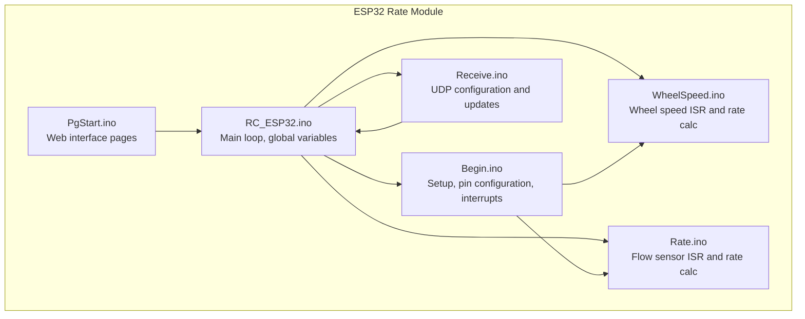
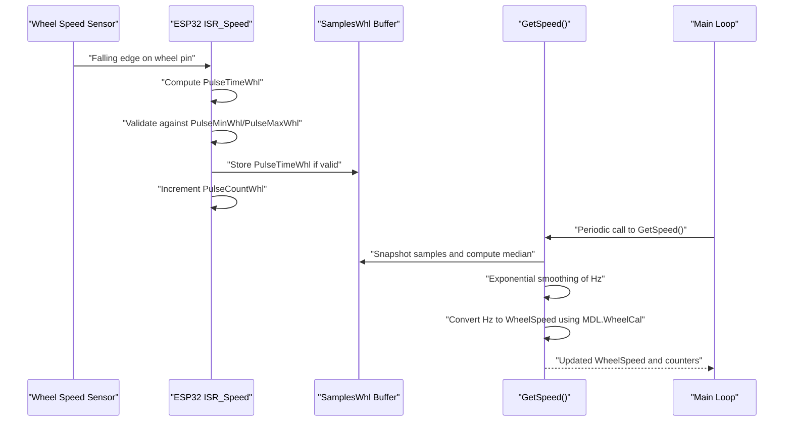
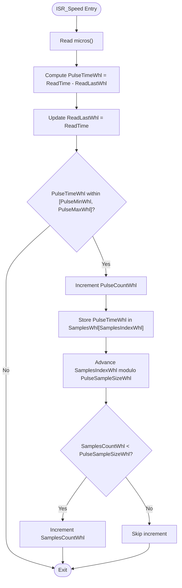
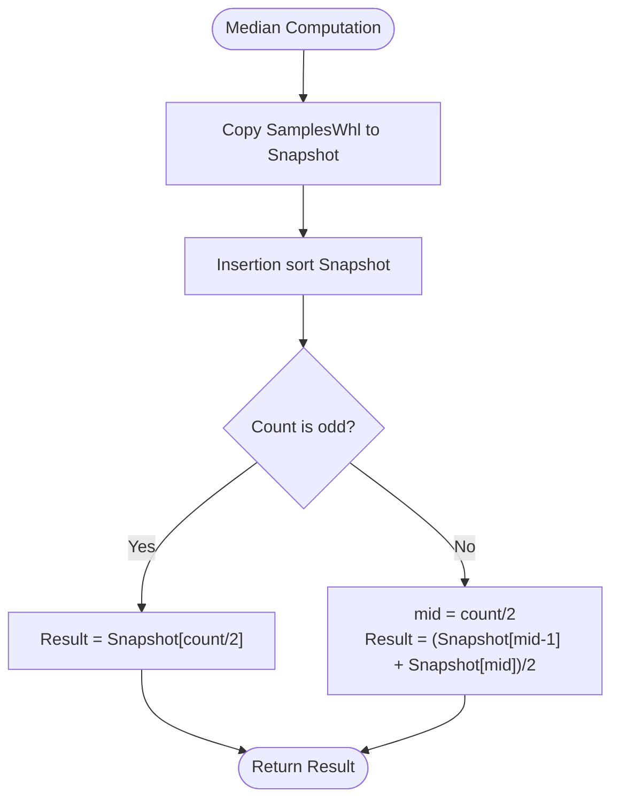
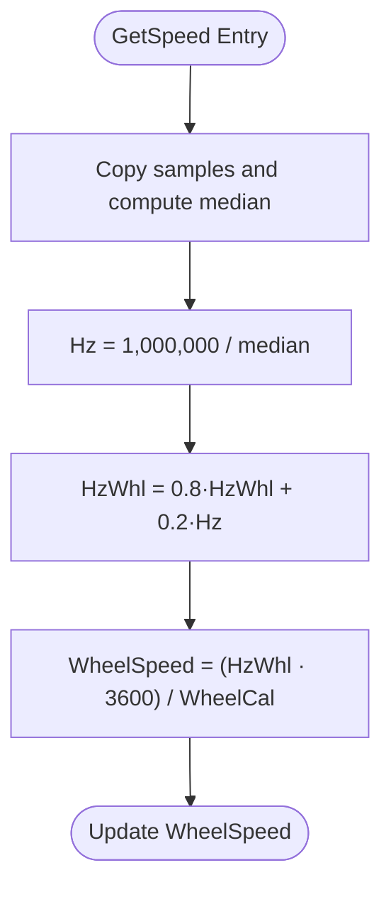
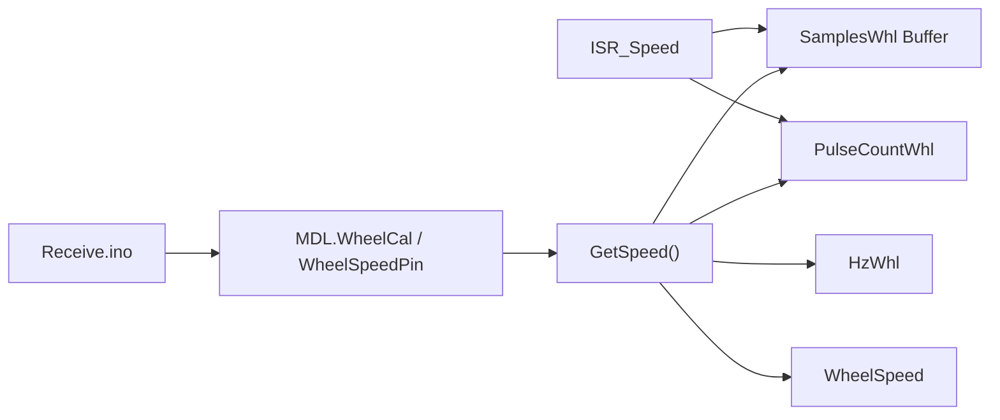

# Wheel Speed Sensors

<cite>
**Referenced Files in This Document**
- [RC_ESP32.ino](file://RC_ESP32/RC_ESP32.ino)
- [Begin.ino](file://RC_ESP32/Begin.ino)
- [WheelSpeed.ino](file://RC_ESP32/WheelSpeed.ino)
- [Rate.ino](file://RC_ESP32/Rate.ino)
- [Receive.ino](file://RC_ESP32/Receive.ino)
- [PgStart.ino](file://RC_ESP32/PgStart.ino)
</cite>

## Table of Contents
1. [Introduction](#introduction)
2. [Project Structure](#project-structure)
3. [Core Components](#core-components)
4. [Architecture Overview](#architecture-overview)
5. [Detailed Component Analysis](#detailed-component-analysis)
6. [Dependency Analysis](#dependency-analysis)
7. [Performance Considerations](#performance-considerations)
8. [Troubleshooting Guide](#troubleshooting-guide)
9. [Conclusion](#conclusion)
10. [Appendices](#appendices)

## Introduction
This document explains the wheel speed sensor integration and rate calculation implementation in the ESP32 Rate module. It covers interrupt-based encoder signal processing for precise wheel rotation detection, debouncing and edge detection techniques, rate calculation algorithms converting wheel speed to application rate using calibration constants and gear ratios, and mathematical models for RPM to flow rate conversions and distance-based application rates. It also documents sensor mounting requirements, signal integrity considerations, environmental protection measures, calibration procedures for different tire sizes and ground conditions, and troubleshooting for common wheel speed sensor issues.

## Project Structure
The wheel speed sensor implementation is part of the ESP32 Rate module, which integrates multiple sensor channels and control logic. The wheel speed sensor is processed separately from the flow sensors to optimize timing and reduce noise.

**Diagram sources**
- [RC_ESP32.ino:250-280](file://RC_ESP32/RC_ESP32.ino#L250-L280)
- [Begin.ino:124-167](file://RC_ESP32/Begin.ino#L124-L167)
- [WheelSpeed.ino:15-29](file://RC_ESP32/WheelSpeed.ino#L15-L29)
- [Rate.ino:14-29](file://RC_ESP32/Rate.ino#L14-L29)
- [Receive.ino:29-100](file://RC_ESP32/Receive.ino#L29-L100)

**Section sources**
- [RC_ESP32.ino:250-280](file://RC_ESP32/RC_ESP32.ino#L250-L280)
- [Begin.ino:124-167](file://RC_ESP32/Begin.ino#L124-L167)

## Core Components
- Interrupt-driven wheel speed ISR: Captures rising/falling edges on the wheel speed pin and validates pulse durations against configured thresholds.
- Sample buffer and median filtering: Stores recent pulse intervals and computes a robust median to reject outliers.
- Exponential smoothing: Applies a weighted average to stabilize frequency estimates.
- Rate conversion: Converts smoothed frequency to wheel speed using a calibration constant representing circumference-related scaling.
- Timeout-based deactivation: Resets rate and counters when no pulses are detected beyond a configurable timeout.

Key variables and constants:
- Pulse thresholds and sample sizes for wheel speed validation and buffering.
- Global wheel speed and counter variables updated by the ISR and rate calculation routines.
- Configuration constants for sampling depth and smoothing factors.

**Section sources**
- [WheelSpeed.ino:2-8](file://RC_ESP32/WheelSpeed.ino#L2-L8)
- [WheelSpeed.ino:15-29](file://RC_ESP32/WheelSpeed.ino#L15-L29)
- [WheelSpeed.ino:31-69](file://RC_ESP32/WheelSpeed.ino#L31-L69)
- [RC_ESP32.ino:344-377](file://RC_ESP32/RC_ESP32.ino#L344-L377)

## Architecture Overview
The wheel speed sensor operates independently from the flow sensors. The ISR captures edges and validates them against min/max pulse time limits. The main loop periodically computes a median from buffered samples, applies exponential smoothing, and converts the frequency to wheel speed using the module’s wheel calibration constant.

**Diagram sources**
- [WheelSpeed.ino:15-29](file://RC_ESP32/WheelSpeed.ino#L15-L29)
- [WheelSpeed.ino:31-69](file://RC_ESP32/WheelSpeed.ino#L31-L69)
- [RC_ESP32.ino:276](file://RC_ESP32/RC_ESP32.ino#L276)

## Detailed Component Analysis

### Interrupt-Based Wheel Speed ISR
- Edge detection: Uses falling edge detection on the configured wheel speed pin to trigger the ISR.
- Pulse interval measurement: Computes time elapsed since the last pulse and stores it as the latest interval.
- Validation: Only counts pulses whose interval falls within configured minimum and maximum bounds.
- Sampling: Stores up to a fixed number of recent intervals in a ring buffer for median computation.
- Counter increment: Increments a pulse counter atomically to track total pulses captured during the sampling window.

**Diagram sources**
- [WheelSpeed.ino:15-29](file://RC_ESP32/WheelSpeed.ino#L15-L29)

**Section sources**
- [WheelSpeed.ino:15-29](file://RC_ESP32/WheelSpeed.ino#L15-L29)

### Sample Buffer and Median Filtering
- Snapshot: During rate calculation, the ISR’s atomic counter and buffer are copied into a local snapshot to avoid race conditions.
- Sorting: A simple insertion sort is used to sort the sampled intervals.
- Median: The median is computed as either the middle element (odd count) or the average of the two middle elements (even count).
- Robustness: The median effectively rejects outliers caused by electrical noise or mechanical jitter.

**Diagram sources**
- [RC_ESP32.ino:344-377](file://RC_ESP32/RC_ESP32.ino#L344-L377)
- [WheelSpeed.ino:40-48](file://RC_ESP32/WheelSpeed.ino#L40-L48)

**Section sources**
- [RC_ESP32.ino:344-377](file://RC_ESP32/RC_ESP32.ino#L344-L377)
- [WheelSpeed.ino:40-48](file://RC_ESP32/WheelSpeed.ino#L40-L48)

### Exponential Smoothing and Rate Calculation
- Frequency estimation: Converts the median interval to frequency using microseconds per interval.
- Smoothing: Applies exponential smoothing to stabilize the frequency estimate over time.
- Application rate: Converts smoothed frequency to wheel speed using the module’s wheel calibration constant.

Mathematical model:
- f_median = 1,000,000 / median_interval
- f_smoothed = α · f_median + (1 − α) · f_previous
- wheel_speed = (f_smoothed · 3600) / wheel_calibration

Where wheel_calibration represents the distance traveled per pulse (e.g., meters per pulse or equivalent).

**Diagram sources**
- [WheelSpeed.ino:48-54](file://RC_ESP32/WheelSpeed.ino#L48-L54)

**Section sources**
- [WheelSpeed.ino:48-54](file://RC_ESP32/WheelSpeed.ino#L48-L54)

### Timeout-Based Deactivation
- Detection: If no pulses are received for longer than the configured timeout, the system resets frequency and speed to zero.
- Buffer cleanup: Clears the sample buffer indices and counts to prevent stale data from skewing future readings.

**Section sources**
- [WheelSpeed.ino:56-68](file://RC_ESP32/WheelSpeed.ino#L56-L68)

### Setup and Pin Configuration
- Pin setup: Configures the wheel speed pin as an input with pull-up and attaches a falling-edge interrupt.
- Duplicate detection: Prevents the wheel speed pin from being used as a flow sensor pin.
- Initialization order: Ensures interrupts are attached after sensor pins are configured.

**Section sources**
- [Begin.ino:162-167](file://RC_ESP32/Begin.ino#L162-L167)
- [Begin.ino:159-160](file://RC_ESP32/Begin.ino#L159-L160)

### Configuration and Calibration
- Wheel calibration constant: Stored in the module configuration and used to convert pulses-per-second to wheel speed.
- Remote configuration: Wheel pin and calibration can be updated via UDP messages, with immediate effect and optional restart.
- Defaults: Provides sensible defaults for wheel pin and calibration when no valid configuration exists.

**Section sources**
- [Begin.ino:617-618](file://RC_ESP32/Begin.ino#L617-L618)
- [Receive.ino:264-273](file://RC_ESP32/Receive.ino#L264-L273)

## Dependency Analysis
The wheel speed subsystem depends on:
- Global module configuration for wheel pin and calibration.
- ISR to capture edges and maintain counters/buffers.
- Main loop to compute median, smooth frequency, and convert to speed.
- UDP configuration to update wheel pin and calibration remotely.

**Diagram sources**
- [WheelSpeed.ino:15-29](file://RC_ESP32/WheelSpeed.ino#L15-L29)
- [WheelSpeed.ino:31-69](file://RC_ESP32/WheelSpeed.ino#L31-L69)
- [RC_ESP32.ino:276](file://RC_ESP32/RC_ESP32.ino#L276)
- [Receive.ino:264-273](file://RC_ESP32/Receive.ino#L264-L273)

**Section sources**
- [WheelSpeed.ino:15-29](file://RC_ESP32/WheelSpeed.ino#L15-L29)
- [WheelSpeed.ino:31-69](file://RC_ESP32/WheelSpeed.ino#L31-L69)
- [RC_ESP32.ino:276](file://RC_ESP32/RC_ESP32.ino#L276)
- [Receive.ino:264-273](file://RC_ESP32/Receive.ino#L264-L273)

## Performance Considerations
- ISR responsiveness: Using IRAM_ATTR ensures the ISR executes in RAM for deterministic timing.
- Sample depth: Balances noise rejection (larger samples) with responsiveness (smaller samples).
- Smoothing factor: Exponential smoothing reduces jitter while maintaining responsiveness.
- Interrupt safety: Atomic copying of counters and buffers prevents race conditions during rate calculation.
- Timeout handling: Prevents stale values from persisting indefinitely.

[No sources needed since this section provides general guidance]

## Troubleshooting Guide
Common issues and resolutions:
- No signal detected:
  - Verify wheel speed pin configuration and that it is not duplicated as a flow sensor pin.
  - Confirm the sensor wiring and pull-up resistor configuration.
  - Check for electrical noise or insufficient signal amplitude.
- Intermittent or noisy readings:
  - Increase the sample size to improve median stability.
  - Adjust pulse min/max thresholds to filter out spurious pulses.
  - Inspect sensor mounting and magnetic gap for consistent triggering.
- Incorrect calibration:
  - Recalibrate wheel calibration constant using known tire circumference and encoder pulses per revolution.
  - Validate calibration against a known reference speed or odometer.
- Signal loss or interference:
  - Use shielded cable and ensure proper grounding.
  - Keep sensor wiring away from high-frequency switching circuits.
  - Verify the interrupt pin is not shared with other high-frequency peripherals.
- Mechanical wear or debris:
  - Clean sensor and magnet surfaces.
  - Ensure adequate clearance and alignment between sensor and target.
  - Replace worn components if necessary.

**Section sources**
- [Begin.ino:162-167](file://RC_ESP32/Begin.ino#L162-L167)
- [WheelSpeed.ino:21-28](file://RC_ESP32/WheelSpeed.ino#L21-L28)
- [WheelSpeed.ino:56-68](file://RC_ESP32/WheelSpeed.ino#L56-L68)

## Conclusion
The wheel speed sensor implementation leverages precise interrupt-based edge detection, robust median filtering, and exponential smoothing to deliver reliable wheel speed measurements. The modular design allows for easy calibration and remote configuration, while the timeout mechanism ensures safe deactivation when signals are lost. Proper sensor mounting, signal integrity, and environmental protection are essential for consistent operation across varying conditions.

[No sources needed since this section summarizes without analyzing specific files]

## Appendices

### Mathematical Models and Conversions
- Frequency to RPM: RPM = Hz · 60
- Distance-based rate: If wheel calibration represents distance per pulse, then application rate equals wheel speed multiplied by a scaling factor derived from the desired units (e.g., km/h or mph).
- Calibration constant interpretation: WheelCal defines the distance covered per pulse; adjust this constant for different tire sizes or encoder configurations.

[No sources needed since this section provides general guidance]