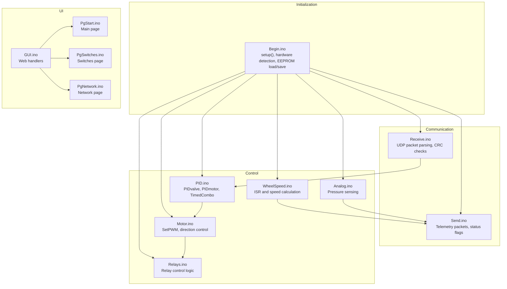
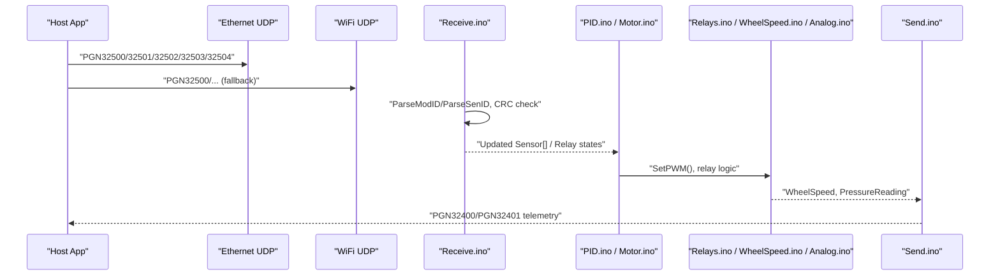
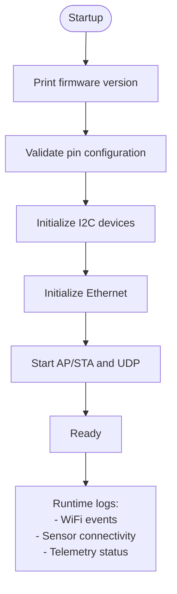
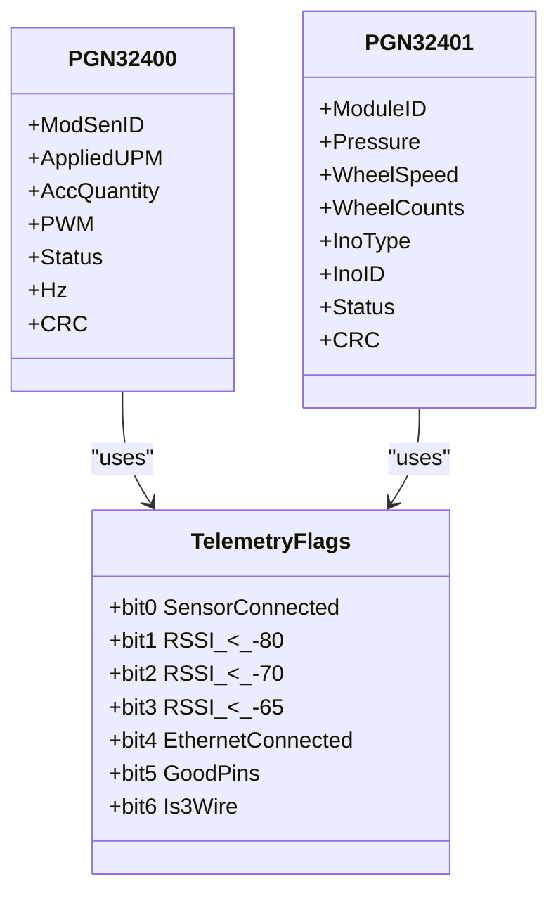
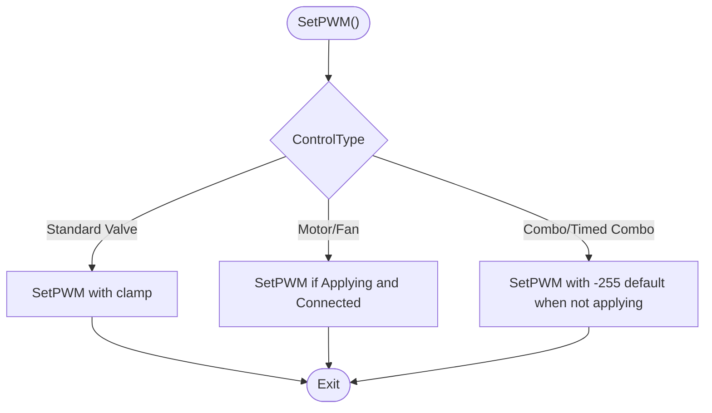
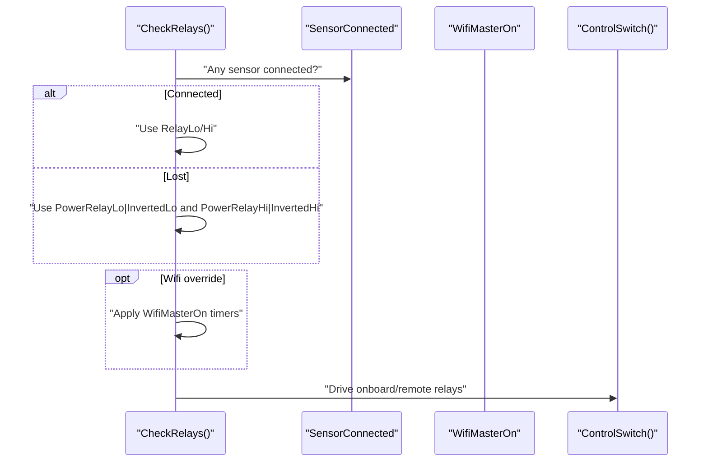
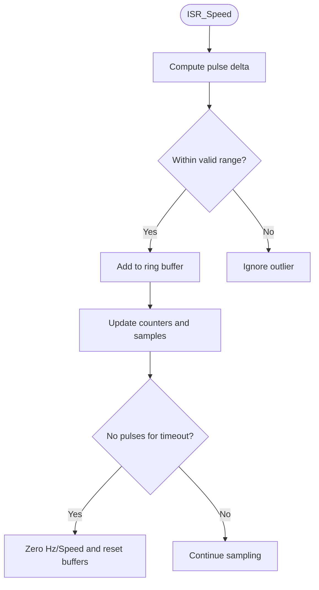
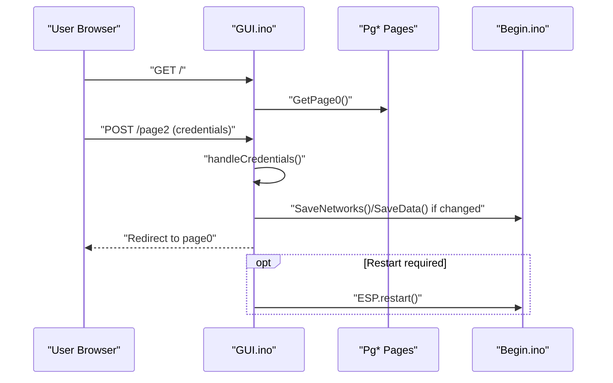
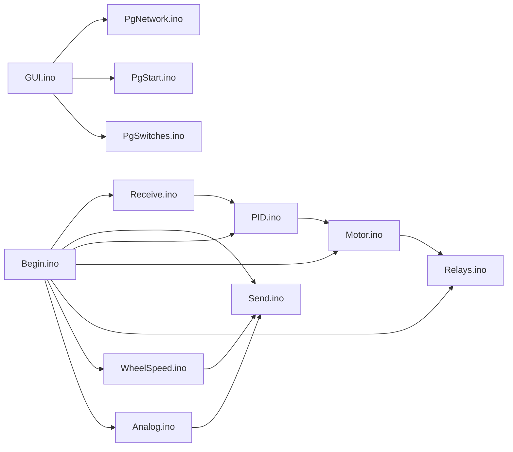

# Error Reporting and Diagnostics

<cite>
**Referenced Files in This Document**
- [RC_ESP32.ino](file://RC_ESP32/RC_ESP32.ino)
- [Begin.ino](file://RC_ESP32/Begin.ino)
- [Receive.ino](file://RC_ESP32/Receive.ino)
- [Send.ino](file://RC_ESP32/Send.ino)
- [PID.ino](file://RC_ESP32/PID.ino)
- [Motor.ino](file://RC_ESP32/Motor.ino)
- [Analog.ino](file://RC_ESP32/Analog.ino)
- [WheelSpeed.ino](file://RC_ESP32/WheelSpeed.ino)
- [Relays.ino](file://RC_ESP32/Relays.ino)
- [PgNetwork.ino](file://RC_ESP32/PgNetwork.ino)
- [GUI.ino](file://RC_ESP32/GUI.ino)
- [PgStart.ino](file://RC_ESP32/PgStart.ino)
- [PgSwitches.ino](file://RC_ESP32/PgSwitches.ino)
</cite>

## Table of Contents
1. [Introduction](#introduction)
2. [Project Structure](#project-structure)
3. [Core Components](#core-components)
4. [Architecture Overview](#architecture-overview)
5. [Detailed Component Analysis](#detailed-component-analysis)
6. [Dependency Analysis](#dependency-analysis)
7. [Performance Considerations](#performance-considerations)
8. [Troubleshooting Guide](#troubleshooting-guide)
9. [Conclusion](#conclusion)
10. [Appendices](#appendices)

## Introduction
This document describes the error reporting and diagnostics capabilities of the ESP32 Rate Control system. It covers:
- Diagnostic error codes and indicators for hardware failures, communication errors, and control system faults
- Log generation mechanisms including serial output formatting, timestamped error records, and diagnostic data collection
- Status message systems for real-time telemetry, fault condition alerts, and system state notifications
- Error categorization by severity (critical, warning, informational)
- Diagnostic procedures to isolate hardware issues, software bugs, and communication problems
- Troubleshooting workflows for common error scenarios
- Remote diagnostics capabilities and field service support procedures

## Project Structure
The system is organized around a modular Arduino-style layout with functional separation:
- Initialization and hardware discovery
- Communication receive/send (UDP over Ethernet and WiFi)
- Control loops (PID, PWM, relays)
- Telemetry and status reporting
- Web UI for diagnostics and configuration

**Diagram sources**
- [Begin.ino:4-345](file://RC_ESP32/Begin.ino#L4-L345)
- [Receive.ino:2-346](file://RC_ESP32/Receive.ino#L2-L346)
- [Send.ino:1-195](file://RC_ESP32/Send.ino#L1-L195)
- [PID.ino:25-232](file://RC_ESP32/PID.ino#L25-L232)
- [Motor.ino:31-76](file://RC_ESP32/Motor.ino#L31-L76)
- [Relays.ino:11-282](file://RC_ESP32/Relays.ino#L11-L282)
- [WheelSpeed.ino:15-71](file://RC_ESP32/WheelSpeed.ino#L15-L71)
- [Analog.ino:2-70](file://RC_ESP32/Analog.ino#L2-L70)
- [GUI.ino:1-104](file://RC_ESP32/GUI.ino#L1-L104)
- [PgStart.ino:1-148](file://RC_ESP32/PgStart.ino#L1-L148)
- [PgSwitches.ino:3-132](file://RC_ESP32/PgSwitches.ino#L3-L132)
- [PgNetwork.ino:1-155](file://RC_ESP32/PgNetwork.ino#L1-L155)

**Section sources**
- [RC_ESP32.ino:250-280](file://RC_ESP32/RC_ESP32.ino#L250-L280)
- [Begin.ino:4-345](file://RC_ESP32/Begin.ino#L4-L345)

## Core Components
- Serial diagnostics: Extensive console logs during initialization, hardware detection, and runtime events.
- Communication: UDP-based telemetry and configuration messages with CRC validation.
- Control: PID control with configurable parameters and PWM output shaping.
- Relays: Multi-interface relay drivers (GPIO, PCA9555, MCP23017, PCA9685, PCF8574).
- Telemetry: Periodic status packets with flags for sensor connectivity, power, and system health.

Key diagnostics surfaces:
- Serial printouts for hardware presence, configuration, and runtime conditions
- CRC-checked incoming packets for integrity
- Status flags embedded in outgoing telemetry packets
- Web UI pages for configuration and diagnostics

**Section sources**
- [Begin.ino:9-344](file://RC_ESP32/Begin.ino#L9-L344)
- [Receive.ino:29-343](file://RC_ESP32/Receive.ino#L29-L343)
- [Send.ino:25-192](file://RC_ESP32/Send.ino#L25-L192)
- [Relays.ino:11-69](file://RC_ESP32/Relays.ino#L11-L69)

## Architecture Overview
The system integrates hardware initialization, control logic, and telemetry into a cohesive diagnostics pipeline.

**Diagram sources**
- [Receive.ino:29-343](file://RC_ESP32/Receive.ino#L29-L343)
- [PID.ino:25-67](file://RC_ESP32/PID.ino#L25-L67)
- [Motor.ino:31-60](file://RC_ESP32/Motor.ino#L31-L60)
- [Relays.ino:11-69](file://RC_ESP32/Relays.ino#L11-L69)
- [WheelSpeed.ino:31-69](file://RC_ESP32/WheelSpeed.ino#L31-L69)
- [Analog.ino:2-65](file://RC_ESP32/Analog.ino#L2-L65)
- [Send.ino:1-195](file://RC_ESP32/Send.ino#L1-L195)

## Detailed Component Analysis

### Serial Logging and Diagnostics
- Firmware version, module ID, and feature flags are printed during startup.
- Hardware detection logs presence/absence of ADS1115, Ethernet chip, and relay expanders.
- Runtime logs include WiFi connection events, IP assignment, and configuration changes.
- Pin configuration correctness is reported; invalid configurations trigger warnings.

Severity mapping:
- Critical: Hardware not found (Ethernet chip, ADC, relay expanders)
- Warning: No Ethernet link, WiFi disconnects exceeding threshold
- Informational: Firmware version, module ID, feature flags, configuration updates

**Diagram sources**
- [Begin.ino:9-344](file://RC_ESP32/Begin.ino#L9-L344)
- [RC_ESP32.ino:212-244](file://RC_ESP32/RC_ESP32.ino#L212-L244)

**Section sources**
- [Begin.ino:9-344](file://RC_ESP32/Begin.ino#L9-L344)
- [RC_ESP32.ino:212-244](file://RC_ESP32/RC_ESP32.ino#L212-L244)

### Communication and Telemetry
- Incoming packets:
  - PGN32500: Rate settings and commands
  - PGN32501: Relay configuration
  - PGN32502: Control parameters
  - PGN32503: Subnet change
  - PGN32504: Wheel speed sensor settings
- Outgoing telemetry:
  - PGN32400: Per-sensor applied rate, quantity, PWM, status flags
  - PGN32401: Module-wide telemetry (pressure, wheel speed/count, status flags)

Status flags (telemetry):
- Bit 0: Sensor connected
- Bit 1: WiFi RSSI thresholds (< -80, < -70, < -65)
- Bit 4: Ethernet connected
- Bit 5: Good pin configuration
- Bit 6: 3-wire vs 2-wire valve configuration

**Diagram sources**
- [Send.ino:25-192](file://RC_ESP32/Send.ino#L25-L192)

**Section sources**
- [Receive.ino:29-343](file://RC_ESP32/Receive.ino#L29-L343)
- [Send.ino:25-192](file://RC_ESP32/Send.ino#L25-L192)

### Control Logic and Fault Indicators
- PIDvalve and PIDmotor compute PWM with deadband, integral anti-windup, and slew limiting.
- TimedCombo toggles between adjustment and pause windows for combo valves.
- PWM output respects invert flags and hardware-specific constraints.

Fault indicators:
- SensorConnected flag toggles based on recent communication activity
- AutoOn and MasterOn gates control enablement
- CalibrationOn flag indicates calibration mode

**Diagram sources**
- [Motor.ino:2-29](file://RC_ESP32/Motor.ino#L2-L29)

**Section sources**
- [PID.ino:25-178](file://RC_ESP32/PID.ino#L25-L178)
- [Motor.ino:2-29](file://RC_ESP32/Motor.ino#L2-L29)

### Relay Control and Hardware Health
- Dynamic relay control based on connectivity, manual overrides, and power requirements.
- Automatic fallback to power/inverted relays when communication is lost.
- Support for multiple relay driver types with presence detection and initialization.

**Diagram sources**
- [Relays.ino:11-69](file://RC_ESP32/Relays.ino#L11-L69)

**Section sources**
- [Relays.ino:11-282](file://RC_ESP32/Relays.ino#L11-L282)

### Wheel Speed and Pressure Sensing
- Interrupt-driven pulse counting with median filtering and timeout-based reset.
- Pressure reading via ADS1115 or ESP32 analog pin with fallback logic.

**Diagram sources**
- [WheelSpeed.ino:15-69](file://RC_ESP32/WheelSpeed.ino#L15-L69)

**Section sources**
- [WheelSpeed.ino:15-71](file://RC_ESP32/WheelSpeed.ino#L15-L71)
- [Analog.ino:2-65](file://RC_ESP32/Analog.ino#L2-L65)

### Web UI and Remote Diagnostics
- Main page links to Switches, Network, and Firmware Update pages.
- Network page displays current WiFi status and allows saving/restarting.
- Credentials handler applies network changes and restarts when needed.

**Diagram sources**
- [GUI.ino:1-104](file://RC_ESP32/GUI.ino#L1-L104)
- [PgNetwork.ino:1-155](file://RC_ESP32/PgNetwork.ino#L1-L155)
- [PgStart.ino:1-148](file://RC_ESP32/PgStart.ino#L1-L148)
- [Begin.ino:738-766](file://RC_ESP32/Begin.ino#L738-L766)

**Section sources**
- [GUI.ino:1-104](file://RC_ESP32/GUI.ino#L1-L104)
- [PgNetwork.ino:1-155](file://RC_ESP32/PgNetwork.ino#L1-L155)
- [PgStart.ino:1-148](file://RC_ESP32/PgStart.ino#L1-L148)

## Dependency Analysis
- Initialization depends on I2C devices, Ethernet, and WiFi subsystems.
- Control depends on received configuration and sensor state.
- Telemetry depends on computed values and status flags.
- Web UI depends on configuration persistence and restart semantics.

**Diagram sources**
- [Begin.ino:4-345](file://RC_ESP32/Begin.ino#L4-L345)
- [Receive.ino:2-346](file://RC_ESP32/Receive.ino#L2-L346)
- [Send.ino:1-195](file://RC_ESP32/Send.ino#L1-L195)
- [PID.ino:25-232](file://RC_ESP32/PID.ino#L25-L232)
- [Motor.ino:31-76](file://RC_ESP32/Motor.ino#L31-L76)
- [Relays.ino:11-282](file://RC_ESP32/Relays.ino#L11-L282)
- [WheelSpeed.ino:31-71](file://RC_ESP32/WheelSpeed.ino#L31-L71)
- [Analog.ino:2-70](file://RC_ESP32/Analog.ino#L2-L70)
- [GUI.ino:1-104](file://RC_ESP32/GUI.ino#L1-L104)
- [PgNetwork.ino:1-155](file://RC_ESP32/PgNetwork.ino#L1-L155)
- [PgStart.ino:1-148](file://RC_ESP32/PgStart.ino#L1-L148)
- [PgSwitches.ino:3-132](file://RC_ESP32/PgSwitches.ino#L3-L132)

**Section sources**
- [RC_ESP32.ino:250-280](file://RC_ESP32/RC_ESP32.ino#L250-L280)

## Performance Considerations
- Loop timing: 50 ms loop with 200 ms telemetry send cadence balances responsiveness and throughput.
- Interrupt-driven wheel speed sampling minimizes loop overhead.
- Median filtering reduces noise impact while maintaining responsiveness.
- CRC validation adds integrity but requires careful buffer sizing and timing.

[No sources needed since this section provides general guidance]

## Troubleshooting Guide

### Hardware Failure Indicators
- Ethernet hardware not found: Indicates missing or faulty W5500 chip.
- No Ethernet link: Verify cable, switch, and subnet configuration.
- ADS1115 not found: Check I2C pull-ups, wiring, and address conflicts.
- Relay driver not found: Confirm I2C address and wiring; try alternate addresses.

Resolution steps:
- Reinitialize hardware in setup; if persistent, report as critical.
- Use serial logs to confirm presence detection outcomes.

**Section sources**
- [Begin.ino:87-117](file://RC_ESP32/Begin.ino#L87-L117)
- [Begin.ino:347-511](file://RC_ESP32/Begin.ino#L347-L511)

### Communication Errors
- Packet dropped or malformed: CRC mismatch or wrong module ID.
- No sensor telemetry: SensorCommTime exceeded timeout; verify wiring and host connectivity.
- Subnet change: Ensure destination IP broadcast is updated and host reboots.

Resolution steps:
- Verify CRC and Mod/Sen ID parsing.
- Confirm listening ports and destination IPs.
- Reapply subnet change and restart.

**Section sources**
- [Receive.ino:29-343](file://RC_ESP32/Receive.ino#L29-L343)
- [Send.ino:1-195](file://RC_ESP32/Send.ino#L1-L195)

### Control System Faults
- PWM not responding: Check control type, invert flags, and sensor connectivity.
- PID oscillation or windup: Adjust deadband, Ki, MaxIntegral, and SlewRate.
- Timed combo not operating: Verify TimedAdjust/TimedPause and sensor enabling.

Resolution steps:
- Inspect control parameters and flags.
- Toggle AutoOn and MasterOn to test manual operation.
- Review PID slow adjust and brake point settings.

**Section sources**
- [PID.ino:69-178](file://RC_ESP32/PID.ino#L69-L178)
- [Motor.ino:2-29](file://RC_ESP32/Motor.ino#L2-L29)

### Isolation Procedures
- Hardware isolation: Power cycle, recheck I2C addresses and pull-ups, swap cables.
- Software isolation: Clear EEPROM defaults, re-run setup, monitor serial logs.
- Communication isolation: Test with minimal host app, verify firewall and routing.

**Section sources**
- [Begin.ino:521-562](file://RC_ESP32/Begin.ino#L521-L562)
- [RC_ESP32.ino:250-280](file://RC_ESP32/RC_ESP32.ino#L250-L280)

### Remote Diagnostics and Field Service
- Use the web UI to:
  - View current status and flags
  - Change network credentials and AP password
  - Trigger restart after configuration changes
- Monitor serial logs remotely via USB or external logger for continuous diagnostics.

Support procedures:
- Collect serial logs during failure reproduction.
- Capture telemetry packets and timestamps.
- Validate configuration EEPROM values and checksums.

**Section sources**
- [GUI.ino:25-79](file://RC_ESP32/GUI.ino#L25-L79)
- [PgNetwork.ino:1-155](file://RC_ESP32/PgNetwork.ino#L1-L155)
- [Begin.ino:550-562](file://RC_ESP32/Begin.ino#L550-L562)

## Conclusion
The ESP32 Rate Control system provides robust diagnostics through:
- Comprehensive serial logging during initialization and runtime
- CRC-validated communication with explicit status flags
- Real-time telemetry with actionable system state
- Web-based configuration and diagnostics
- Clear isolation procedures for hardware, software, and communication domains

These capabilities enable efficient field service support and reliable operation across diverse agricultural environments.

[No sources needed since this section summarizes without analyzing specific files]

## Appendices

### Error Categorization Reference
- Critical: Hardware not found, Ethernet chip absent, ADC absent, relay driver absent
- Warning: No Ethernet link, WiFi disconnects exceed threshold, invalid pin configuration
- Informational: Firmware version, module ID, feature flags, configuration updates

**Section sources**
- [Begin.ino:87-117](file://RC_ESP32/Begin.ino#L87-L117)
- [RC_ESP32.ino:212-244](file://RC_ESP32/RC_ESP32.ino#L212-L244)
- [Send.ino:140-167](file://RC_ESP32/Send.ino#L140-L167)