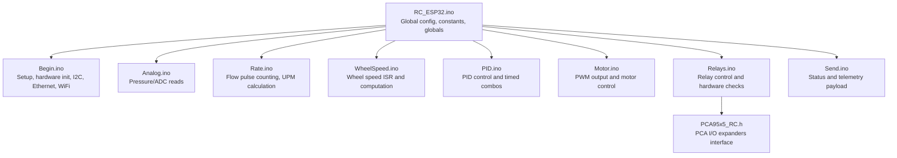
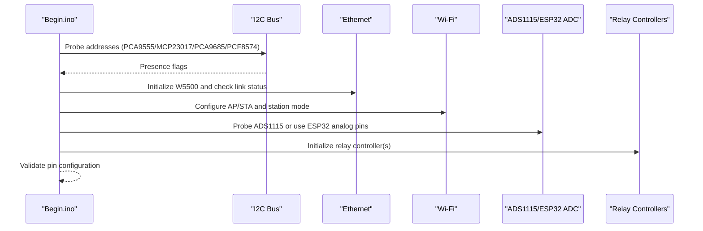
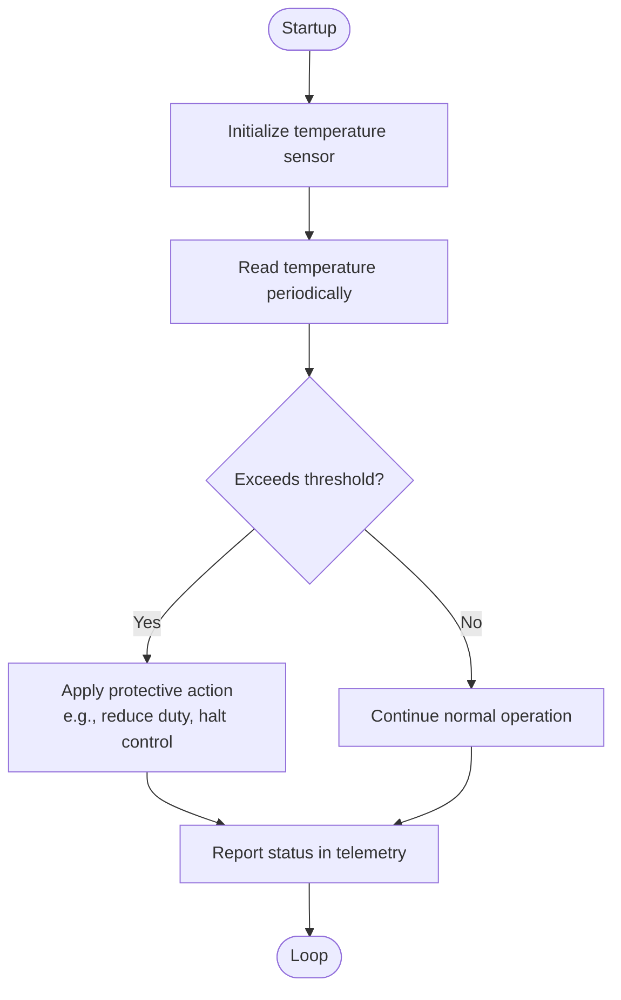
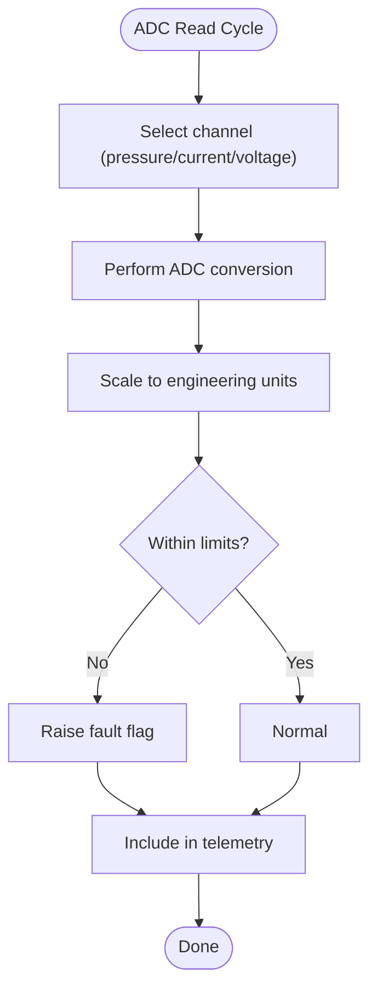
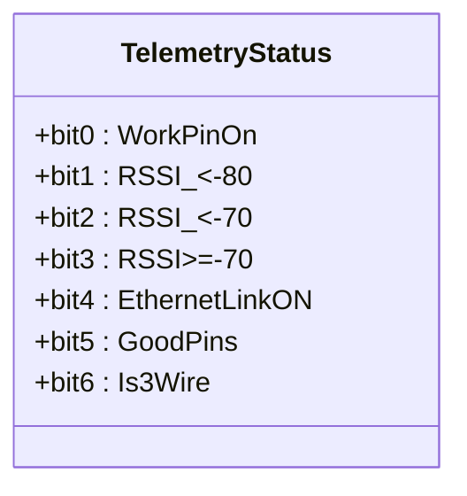
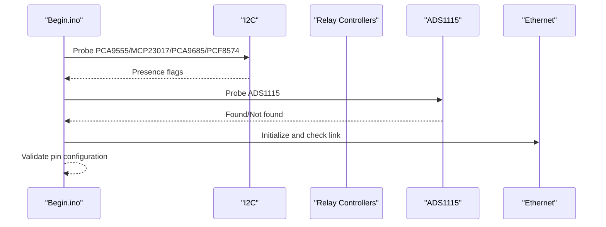
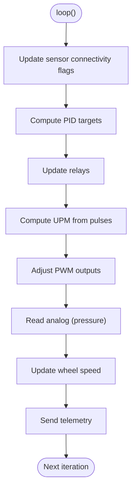
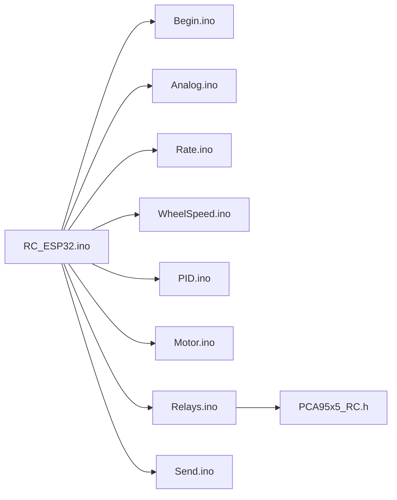
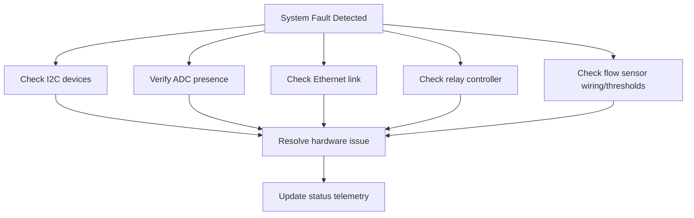

# Health Monitoring

<cite>
**Referenced Files in This Document**
- [RC_ESP32.ino](file://RC_ESP32/RC_ESP32.ino)
- [Begin.ino](file://RC_ESP32/Begin.ino)
- [Analog.ino](file://RC_ESP32/Analog.ino)
- [Rate.ino](file://RC_ESP32/Rate.ino)
- [WheelSpeed.ino](file://RC_ESP32/WheelSpeed.ino)
- [PID.ino](file://RC_ESP32/PID.ino)
- [Motor.ino](file://RC_ESP32/Motor.ino)
- [Relays.ino](file://RC_ESP32/Relays.ino)
- [Send.ino](file://RC_ESP32/Send.ino)
- [PCA95x5_RC.h](file://RC_ESP32/PCA95x5_RC.h)
- [FORK_CHANGES.md](file://FORK_CHANGES.md)
- [OLD CODE\RC_ESP32\Begin.ino](file://OLD CODE/RC_ESP32/Begin.ino)
- [OLD CODE\RC_ESP32\Analog.ino](file://OLD CODE/RC_ESP32/Analog.ino)
- [OLD CODE\RC_ESP32\UDPComm.ino](file://OLD CODE/RC_ESP32/UDPComm.ino)
- [OLD CODE\RC_ESP32\PGInfo.ino](file://OLD CODE/RC_ESP32/PGInfo.ino)
</cite>

## Table of Contents
1. [Introduction](#introduction)
2. [Project Structure](#project-structure)
3. [Core Components](#core-components)
4. [Architecture Overview](#architecture-overview)
5. [Detailed Component Analysis](#detailed-component-analysis)
6. [Dependency Analysis](#dependency-analysis)
7. [Performance Considerations](#performance-considerations)
8. [Troubleshooting Guide](#troubleshooting-guide)
9. [Conclusion](#conclusion)
10. [Appendices](#appendices)

## Introduction
This document provides comprehensive health monitoring guidance for the ESP32 Rate Control system. It focuses on:
- Temperature monitoring capabilities, including sensor placement, reading thresholds, and protective shutdown procedures
- Voltage monitoring for power integrity verification and battery level detection
- System status indicators (LED patterns, relay status monitoring, hardware component verification)
- Critical parameter thresholds (maximum operating temperatures, voltage limits, flow rate safety margins)
- Hardware health checks for ADC circuits, motor drivers, and communication interfaces
- Preventive maintenance schedules and automated health check routines
- Environmental monitoring requirements and thermal management strategies

Where applicable, this document references actual source files and line ranges to ground recommendations in the codebase.

## Project Structure
The ESP32 Rate Control firmware is organized around modular functionality:
- Initialization and hardware discovery
- Sensor acquisition (flow, wheel speed, pressure)
- Control loops (PID, PWM, relay switching)
- Communication (Ethernet, Wi-Fi, UDP)
- Status reporting and diagnostics

**Diagram sources**
- [RC_ESP32.ino:250-280](file://RC_ESP32/RC_ESP32.ino#L250-L280)
- [Begin.ino:4-345](file://RC_ESP32/Begin.ino#L4-L345)
- [Analog.ino:2-65](file://RC_ESP32/Analog.ino#L2-L65)
- [Rate.ino:14-74](file://RC_ESP32/Rate.ino#L14-L74)
- [WheelSpeed.ino:15-69](file://RC_ESP32/WheelSpeed.ino#L15-L69)
- [PID.ino:25-67](file://RC_ESP32/PID.ino#L25-L67)
- [Motor.ino:31-60](file://RC_ESP32/Motor.ino#L31-L60)
- [Relays.ino:11-69](file://RC_ESP32/Relays.ino#L11-L69)
- [Send.ino:117-170](file://RC_ESP32/Send.ino#L117-L170)
- [PCA95x5_RC.h:55-172](file://RC_ESP32/PCA95x5_RC.h#L55-L172)

**Section sources**
- [RC_ESP32.ino:250-280](file://RC_ESP32/RC_ESP32.ino#L250-L280)
- [Begin.ino:4-345](file://RC_ESP32/Begin.ino#L4-L345)

## Core Components
- Initialization and hardware discovery: I2C bus probing, Ethernet/Wi-Fi initialization, relay controller detection, and pin configuration validation
- Sensor acquisition: Flow pulses (with median filtering), wheel speed pulses, and optional pressure readings via external ADC or ESP32 pins
- Control loops: PID control for valves/motors, PWM generation, and relay switching logic
- Communication: UDP over Ethernet and Wi-Fi, with periodic status telemetry
- Diagnostics: Status flags embedded in telemetry packets for connectivity, hardware presence, and configuration validity

Key health-related elements:
- ADS1115 presence detection and fallback to ESP32 analog pins
- Ethernet/Wi-Fi link status and RSSI reporting
- Relay controller presence checks (PCA9555/MCP23017/PCA9685/PCF8574)
- Flow timeout and zero-rate reset logic
- Wheel speed monitoring and calibration

**Section sources**
- [Begin.ino:58-85](file://RC_ESP32/Begin.ino#L58-L85)
- [Begin.ino:347-511](file://RC_ESP32/Begin.ino#L347-L511)
- [Send.ino:140-170](file://RC_ESP32/Send.ino#L140-L170)
- [Rate.ino:31-74](file://RC_ESP32/Rate.ino#L31-L74)
- [WheelSpeed.ino:31-69](file://RC_ESP32/WheelSpeed.ino#L31-L69)

## Architecture Overview
The health monitoring architecture integrates hardware checks during startup with runtime diagnostics and telemetry.

**Diagram sources**
- [Begin.ino:58-85](file://RC_ESP32/Begin.ino#L58-L85)
- [Begin.ino:87-118](file://RC_ESP32/Begin.ino#L87-L118)
- [Begin.ino:347-511](file://RC_ESP32/Begin.ino#L347-L511)
- [Analog.ino:7-65](file://RC_ESP32/Analog.ino#L7-L65)

## Detailed Component Analysis

### Temperature Monitoring
- Current codebase does not implement dedicated CPU temperature monitoring or protective shutdown logic.
- Historical code indicates a temperature sensor initialization routine and a diagnostics page that could report temperature.
- Recommendation: Implement CPU temperature monitoring using the internal sensor and define protective thresholds and shutdown actions.

**Section sources**
- [OLD CODE\RC_ESP32\Begin.ino:621-626](file://OLD CODE/RC_ESP32/Begin.ino#L621-L626)
- [OLD CODE\RC_ESP32\PGInfo.ino:40-40](file://OLD CODE/RC_ESP32/PGInfo.ino#L40-L40)
- [FORK_CHANGES.md:406-431](file://FORK_CHANGES.md#L406-L431)

### Voltage Monitoring and Battery Detection
- The system supports external pressure sensing via ADC. The historical code includes a function to compute current in amps from ADC readings.
- Recommendation: Implement voltage monitoring for battery integrity and integrate with existing ADC infrastructure.

**Section sources**
- [OLD CODE\RC_ESP32\Analog.ino:628-631](file://OLD CODE/RC_ESP32/Analog.ino#L628-L631)
- [Analog.ino:2-65](file://RC_ESP32/Analog.ino#L2-L65)

### System Status Indicators
- Telemetry payload encodes status bits for:
  - Work switch activation
  - Wi-Fi RSSI quality bands
  - Ethernet link status
  - Pin configuration validity
  - 3-wire relay configuration
- These bits provide a compact health summary over the network.

**Diagram sources**
- [Send.ino:140-170](file://RC_ESP32/Send.ino#L140-L170)

**Section sources**
- [Send.ino:140-170](file://RC_ESP32/Send.ino#L140-L170)

### Critical Parameter Thresholds
- Flow measurement thresholds:
  - Minimum and maximum pulse intervals for valid flow detection
  - Pulse sample window for median filtering
- Wheel speed thresholds:
  - Minimum/maximum pulse intervals and sample size
- PID control limits:
  - Max/Min PWM, integral limits, brake point, and slew rate
- These parameters are configured per sensor and validated during setup.

Recommendations:
- Define maximum operating temperature thresholds and protective actions
- Define voltage limits for battery protection
- Define flow rate safety margins and timeout behavior

**Section sources**
- [Rate.ino:21-27](file://RC_ESP32/Rate.ino#L21-L27)
- [WheelSpeed.ino:6-8](file://RC_ESP32/WheelSpeed.ino#L6-L8)
- [PID.ino:15-18](file://RC_ESP32/PID.ino#L15-L18)
- [PID.ino:69-126](file://RC_ESP32/PID.ino#L69-L126)
- [PID.ino:128-178](file://RC_ESP32/PID.ino#L128-L178)

### Hardware Health Checks
- I2C device scanning and presence detection for:
  - PCA9555 (8/16 relays)
  - MCP23017
  - PCA9685
  - PCF8574
- ADS1115 presence detection and fallback to ESP32 analog pins
- Ethernet chip detection and link status
- Wi-Fi station reconnect logic with failure threshold

**Diagram sources**
- [Begin.ino:58-85](file://RC_ESP32/Begin.ino#L58-L85)
- [Begin.ino:347-511](file://RC_ESP32/Begin.ino#L347-L511)

**Section sources**
- [Begin.ino:58-85](file://RC_ESP32/Begin.ino#L58-L85)
- [Begin.ino:347-511](file://RC_ESP32/Begin.ino#L347-L511)

### Automated Health Check Routines
- Periodic loop executes:
  - Sensor connectivity checks
  - PID enablement logic
  - Relay updates
  - Flow rate calculations
  - PWM adjustments
  - Analog reads
  - Wheel speed updates
  - Telemetry transmission

**Diagram sources**
- [RC_ESP32.ino:255-280](file://RC_ESP32/RC_ESP32.ino#L255-L280)
- [PID.ino:25-67](file://RC_ESP32/PID.ino#L25-L67)
- [Relays.ino:11-69](file://RC_ESP32/Relays.ino#L11-L69)
- [Rate.ino:31-74](file://RC_ESP32/Rate.ino#L31-L74)
- [Motor.ino:2-29](file://RC_ESP32/Motor.ino#L2-L29)
- [Analog.ino:2-65](file://RC_ESP32/Analog.ino#L2-L65)
- [WheelSpeed.ino:31-69](file://RC_ESP32/WheelSpeed.ino#L31-L69)
- [Send.ino:117-170](file://RC_ESP32/Send.ino#L117-L170)

**Section sources**
- [RC_ESP32.ino:255-280](file://RC_ESP32/RC_ESP32.ino#L255-L280)

### Environmental Monitoring and Thermal Management
- Current implementation lacks CPU temperature monitoring and protective shutdown.
- Historical code indicates a temperature sensor initialization and diagnostics page.
- Recommendation: Integrate CPU temperature monitoring and define thresholds for derating or shutdown.

**Section sources**
- [OLD CODE\RC_ESP32\Begin.ino:621-626](file://OLD CODE/RC_ESP32/Begin.ino#L621-L626)
- [OLD CODE\RC_ESP32\PGInfo.ino:40-40](file://OLD CODE/RC_ESP32/PGInfo.ino#L40-L40)
- [FORK_CHANGES.md:406-431](file://FORK_CHANGES.md#L406-L431)

## Dependency Analysis
- Relays depend on detected I2C controllers and pin mappings
- ADC selection depends on presence of external converter
- Telemetry depends on connectivity status and hardware flags
- Control loops depend on sensor measurements and relay states

**Diagram sources**
- [RC_ESP32.ino:250-280](file://RC_ESP32/RC_ESP32.ino#L250-L280)
- [Begin.ino:4-345](file://RC_ESP32/Begin.ino#L4-L345)
- [Analog.ino:2-65](file://RC_ESP32/Analog.ino#L2-L65)
- [Rate.ino:14-74](file://RC_ESP32/Rate.ino#L14-L74)
- [WheelSpeed.ino:15-69](file://RC_ESP32/WheelSpeed.ino#L15-L69)
- [PID.ino:25-67](file://RC_ESP32/PID.ino#L25-L67)
- [Motor.ino:31-60](file://RC_ESP32/Motor.ino#L31-L60)
- [Relays.ino:11-69](file://RC_ESP32/Relays.ino#L11-L69)
- [Send.ino:117-170](file://RC_ESP32/Send.ino#L117-L170)
- [PCA95x5_RC.h:55-172](file://RC_ESP32/PCA95x5_RC.h#L55-L172)

**Section sources**
- [RC_ESP32.ino:250-280](file://RC_ESP32/RC_ESP32.ino#L250-L280)

## Performance Considerations
- Loop timing and telemetry intervals are defined centrally
- ISR-based pulse counting minimizes missed edges
- Median filtering reduces noise impact on flow calculations
- PWM resolution and frequency are configurable for motor compatibility

Recommendations:
- Monitor loop execution time and adjust sample rates if necessary
- Ensure ISR routines remain minimal to preserve real-time responsiveness
- Tune PID parameters for stability under varying loads

**Section sources**
- [RC_ESP32.ino:179-183](file://RC_ESP32/RC_ESP32.ino#L179-L183)
- [Rate.ino:14-29](file://RC_ESP32/Rate.ino#L14-L29)
- [PID.ino:69-126](file://RC_ESP32/PID.ino#L69-L126)

## Troubleshooting Guide
Common issues and diagnostics:
- No ADS1115 detected: System falls back to ESP32 analog pins; verify wiring and address
- Ethernet not connected: Check hardware presence and link status
- Wi-Fi disconnects repeatedly: Review credentials and reconnect logic; consider AP-only mode after repeated failures
- Relay controller not found: Verify I2C address and wiring; PCA9555/MCP23017/PCA9685/PCF8574 presence checks
- Flow pulses not registering: Confirm sensor wiring, pin configuration, and thresholds
- Telemetry status bits indicate faults: Decode status byte to identify specific issues

**Section sources**
- [Begin.ino:58-85](file://RC_ESP32/Begin.ino#L58-L85)
- [Begin.ino:87-118](file://RC_ESP32/Begin.ino#L87-L118)
- [Begin.ino:347-511](file://RC_ESP32/Begin.ino#L347-L511)
- [Send.ino:140-170](file://RC_ESP32/Send.ino#L140-L170)

## Conclusion
The ESP32 Rate Control system includes robust hardware discovery and telemetry mechanisms suitable for health monitoring. To achieve comprehensive health coverage, integrate CPU temperature monitoring, define protective thresholds, and extend ADC-based diagnostics for power integrity. The existing modular design facilitates adding these capabilities with minimal disruption.

## Appendices

### Preventive Maintenance Schedule
- Monthly: Inspect I2C connections and relay controller wiring
- Quarterly: Recalibrate flow sensors and verify ADC scaling
- Annually: Validate Ethernet/Wi-Fi connectivity and firmware OTA readiness

### Telemetry Status Bit Definitions
- Bit 0: Work switch active
- Bit 1: Wi-Fi RSSI < -80
- Bit 2: Wi-Fi RSSI < -70
- Bit 3: Wi-Fi RSSI >= -70
- Bit 4: Ethernet link ON
- Bit 5: Pin configuration valid
- Bit 6: 3-wire relay configuration

**Section sources**
- [Send.ino:140-170](file://RC_ESP32/Send.ino#L140-L170)