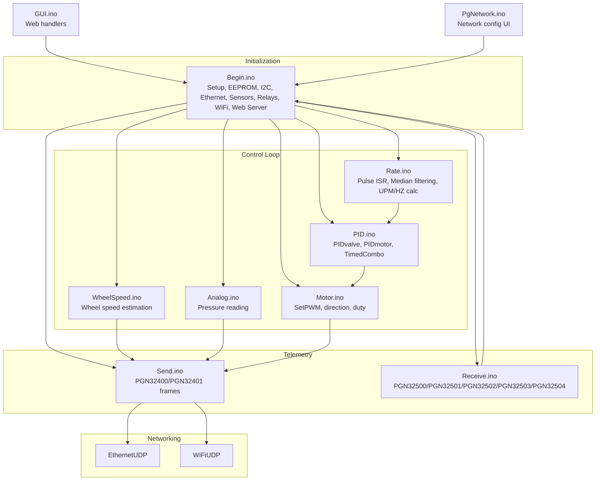
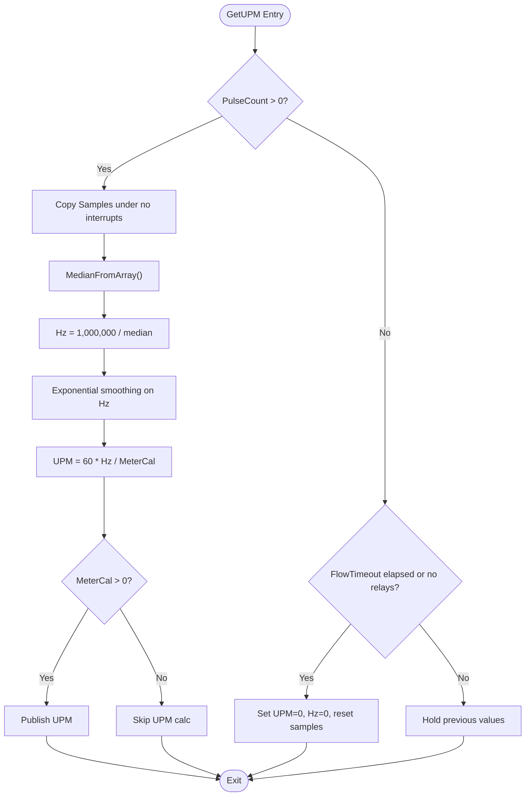
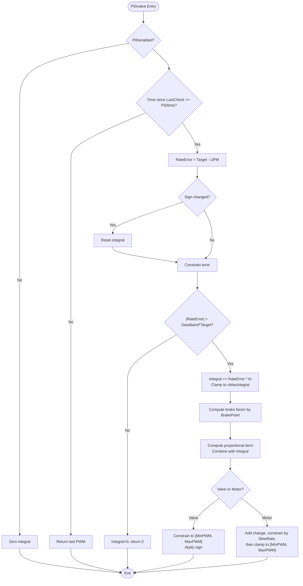
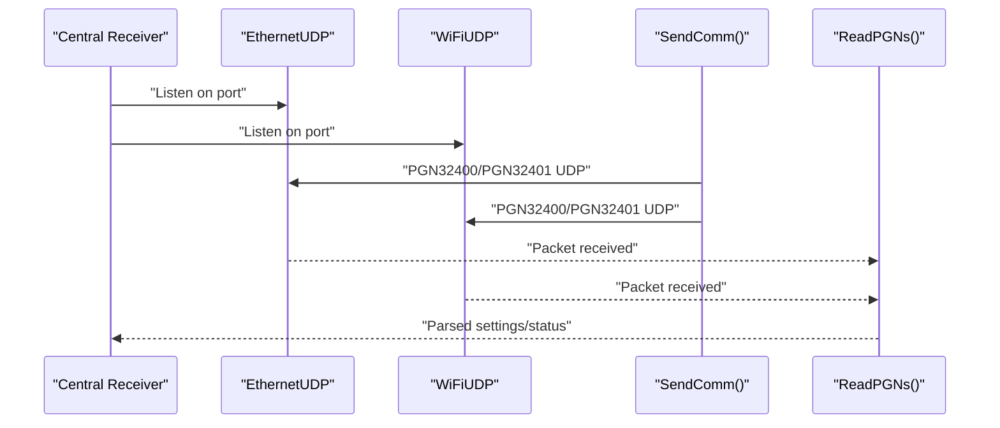
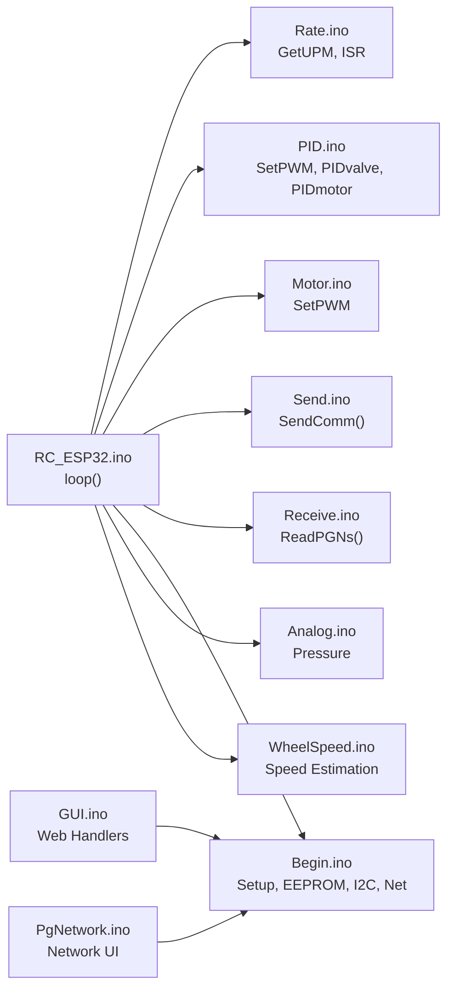

# Performance Metrics Collection

<cite>
**Referenced Files in This Document**
- [RC_ESP32.ino](file://RC_ESP32/RC_ESP32.ino)
- [Begin.ino](file://RC_ESP32/Begin.ino)
- [PID.ino](file://RC_ESP32/PID.ino)
- [Rate.ino](file://RC_ESP32/Rate.ino)
- [WheelSpeed.ino](file://RC_ESP32/WheelSpeed.ino)
- [Motor.ino](file://RC_ESP32/Motor.ino)
- [Send.ino](file://RC_ESP32/Send.ino)
- [Receive.ino](file://RC_ESP32/Receive.ino)
- [Analog.ino](file://RC_ESP32/Analog.ino)
- [GUI.ino](file://RC_ESP32/GUI.ino)
- [PgNetwork.ino](file://RC_ESP32/PgNetwork.ino)
</cite>

## Table of Contents
1. [Introduction](#introduction)
2. [Project Structure](#project-structure)
3. [Core Components](#core-components)
4. [Architecture Overview](#architecture-overview)
5. [Detailed Component Analysis](#detailed-component-analysis)
6. [Dependency Analysis](#dependency-analysis)
7. [Performance Considerations](#performance-considerations)
8. [Troubleshooting Guide](#troubleshooting-guide)
9. [Conclusion](#conclusion)
10. [Appendices](#appendices)

## Introduction
This document describes performance metrics collection for the ESP32 Rate Control system. It focuses on:
- Rate accuracy measurement: target vs. actual flow rate, precision specifications, and calibration verification
- Control loop response monitoring: PID performance metrics, response time, and stability indicators
- Communication statistics: packet transmission rates, network latency, and UDP protocol performance
- System resource utilization: CPU load monitoring, memory usage tracking, and real-time processing efficiency
- Benchmarking procedures and optimization recommendations
- Metrics collection intervals, data aggregation, and trend analysis
- Detection of performance degradation and automatic corrective actions

## Project Structure
The system is organized around a real-time control loop with sensor acquisition, PID control, actuator output, and telemetry over Ethernet and Wi-Fi. Key modules:
- Initialization and configuration
- Sensor pulse counting and derived rate computation
- PID control logic and actuator output
- Telemetry sending and receiving
- Analog sensing and wheel speed estimation
- Web UI for configuration and diagnostics



**Diagram sources**
- [Begin.ino:1-769](file://RC_ESP32/Begin.ino#L1-L769)
- [Rate.ino:1-106](file://RC_ESP32/Rate.ino#L1-L106)
- [PID.ino:1-232](file://RC_ESP32/PID.ino#L1-L232)
- [Motor.ino:1-76](file://RC_ESP32/Motor.ino#L1-L76)
- [WheelSpeed.ino:1-71](file://RC_ESP32/WheelSpeed.ino#L1-L71)
- [Analog.ino:1-70](file://RC_ESP32/Analog.ino#L1-L70)
- [Send.ino:1-195](file://RC_ESP32/Send.ino#L1-L195)
- [Receive.ino:1-346](file://RC_ESP32/Receive.ino#L1-L346)
- [GUI.ino:1-104](file://RC_ESP32/GUI.ino#L1-L104)
- [PgNetwork.ino:1-155](file://RC_ESP32/PgNetwork.ino#L1-L155)

**Section sources**
- [RC_ESP32.ino:250-280](file://RC_ESP32/RC_ESP32.ino#L250-L280)
- [Begin.ino:123-167](file://RC_ESP32/Begin.ino#L123-L167)

## Core Components
- Real-time loop timing and scheduling
- Pulse acquisition and median filtering for robust rate estimation
- PID control with configurable gains, deadband, brake point, and slew limiting
- Actuator output mapping to PWM with direction control
- Telemetry frames for rate, quantity, PWM, status, and module health
- Network stack supporting Ethernet and Wi-Fi with UDP transport
- Optional analog pressure and wheel speed sensing

Key performance-critical constants and structures:
- Loop time and send intervals
- Sensor configuration with PID parameters and pulse sampling
- Module configuration for relays, pins, and wheel calibration

**Section sources**
- [RC_ESP32.ino:179-182](file://RC_ESP32/RC_ESP32.ino#L179-L182)
- [RC_ESP32.ino:113-147](file://RC_ESP32/RC_ESP32.ino#L113-L147)
- [RC_ESP32.ino:76-97](file://RC_ESP32/RC_ESP32.ino#L76-L97)

## Architecture Overview
The control loop executes at a fixed cadence, acquiring pulses, computing instantaneous frequency and UPM, running PID control, and applying PWM to actuators. Telemetry is transmitted periodically over UDP to a central receiver. Configuration updates are received via UDP and persisted to EEPROM.

```mermaid
sequenceDiagram
participant HW as "Hardware"
participant ISR as "Pulse ISR<br/>Rate.ino"
participant LOOP as "Control Loop<br/>RC_ESP32.ino"
participant RATE as "Rate Calc<br/>Rate.ino"
participant PID as "PID Control<br/>PID.ino"
participant MOTOR as "Actuator Output<br/>Motor.ino"
participant SEND as "Telemetry TX<br/>Send.ino"
participant NET as "UDP Stack"
HW->>ISR : "Rising edge on flow pin"
ISR-->>RATE : "Store pulse interval"
LOOP->>RATE : "Periodic GetUPM()"
RATE-->>LOOP : "UPM, Hz, TotalPulses"
LOOP->>PID : "Compute PWM"
PID-->>MOTOR : "Apply PWM"
LOOP->>SEND : "Periodic SendComm()"
SEND->>NET : "PGN32400/PGN32401 UDP"
NET-->>SEND : "ACK/NACK"
```

**Diagram sources**
- [Rate.ino:14-29](file://RC_ESP32/Rate.ino#L14-L29)
- [Rate.ino:31-74](file://RC_ESP32/Rate.ino#L31-L74)
- [PID.ino:25-67](file://RC_ESP32/PID.ino#L25-L67)
- [Motor.ino:31-60](file://RC_ESP32/Motor.ino#L31-L60)
- [Send.ino:1-195](file://RC_ESP32/Send.ino#L1-L195)

## Detailed Component Analysis

### Rate Accuracy Measurement
- Target vs. actual flow rate:
  - Target is received via PGN32500 and stored in sensor configuration.
  - Actual UPM is computed from median-filtered pulse intervals and calibrated meter constant.
- Precision specifications:
  - Hz estimation uses exponential smoothing on the latest median.
  - Pulse sampling window and median selection reduce noise and spikes.
- Calibration verification:
  - Meter calibration is applied to convert Hz to UPM.
  - Wheel speed calibration enables vehicle-relative metrics.



**Diagram sources**
- [Rate.ino:31-74](file://RC_ESP32/Rate.ino#L31-L74)
- [Rate.ino:344-377](file://RC_ESP32/Rate.ino#L344-L377)

**Section sources**
- [Rate.ino:31-74](file://RC_ESP32/Rate.ino#L31-L74)
- [Receive.ino:29-99](file://RC_ESP32/Receive.ino#L29-L99)

### PID Performance Metrics and Response Monitoring
- PIDvalve and PIDmotor compute adjustments based on error, integral accumulation, and slew limiting.
- Deadband prevents oscillation near zero error.
- Brake point and slow-adjust factor modify aggressiveness at large errors.
- Slew rate limits total change per loop for motors.
- Stability indicators:
  - Integral sum clamping and sign-change reset at zero-crossing.
  - Periodic PID execution controlled by PIDtime.



**Diagram sources**
- [PID.ino:69-126](file://RC_ESP32/PID.ino#L69-L126)
- [PID.ino:128-178](file://RC_ESP32/PID.ino#L128-L178)

**Section sources**
- [PID.ino:69-178](file://RC_ESP32/PID.ino#L69-L178)

### Actuator Output and Response Time
- PWM mapping converts normalized [-255..255] to hardware-specific duty with direction control.
- Direction inversion respects module configuration.
- Response time is primarily governed by loop time and PIDtime, plus ISR-to-PWM latency.

```mermaid
sequenceDiagram
participant LOOP as "Control Loop"
participant PID as "PID Control"
participant MOTOR as "SetPWM"
participant PWM as "LED Controller"
LOOP->>PID : "Request PWM"
PID-->>LOOP : "PWM value"
LOOP->>MOTOR : "SetPWM(ID, PWM)"
MOTOR->>PWM : "Configure channel 1/2 duty"
PWM-->>MOTOR : "Applied"
MOTOR-->>LOOP : "Done"
```

**Diagram sources**
- [PID.ino:25-67](file://RC_ESP32/PID.ino#L25-L67)
- [Motor.ino:31-60](file://RC_ESP32/Motor.ino#L31-L60)

**Section sources**
- [Motor.ino:31-60](file://RC_ESP32/Motor.ino#L31-L60)

### Communication Statistics and UDP Protocol Performance
- Telemetry frames:
  - PGN32400: per-sensor rate, accumulated quantity, PWM, status, Hz
  - PGN32401: module info including pressure, wheel speed/count, status flags
- Transmission cadence: SendTime interval
- Transport: EthernetUDP or WiFiUDP to destination IP/port
- Reception:
  - PGN32500: rate settings, meter cal, command flags
  - PGN32501: relay assignments
  - PGN32502: control parameters (PID, limits, timing)
  - PGN32503: subnet change
  - PGN32504: wheel speed sensor settings



**Diagram sources**
- [Send.ino:1-195](file://RC_ESP32/Send.ino#L1-L195)
- [Receive.ino:29-343](file://RC_ESP32/Receive.ino#L29-L343)

**Section sources**
- [Send.ino:1-195](file://RC_ESP32/Send.ino#L1-L195)
- [Receive.ino:29-343](file://RC_ESP32/Receive.ino#L29-L343)

### System Resource Utilization
- CPU load monitoring:
  - Loop timing and periodic tasks enable coarse CPU utilization assessment.
  - ISR routines minimize overhead by storing intervals and deferring heavy math.
- Memory usage tracking:
  - EEPROM stores module and sensor configurations.
  - Static buffers for pulse samples and counters.
- Real-time processing efficiency:
  - Interrupt-driven pulse capture reduces loop overhead.
  - Median filter and exponential smoothing balance accuracy and latency.

**Section sources**
- [RC_ESP32.ino:179-182](file://RC_ESP32/RC_ESP32.ino#L179-L182)
- [Rate.ino:9-12](file://RC_ESP32/Rate.ino#L9-L12)
- [Begin.ino:550-562](file://RC_ESP32/Begin.ino#L550-L562)

### Configuration and Diagnostics UI
- Web UI supports:
  - Network credentials and AP configuration
  - Live toggles for master and relay switches
  - Status reporting (Wi-Fi RSSI bands, Ethernet link, pin config validity)

**Section sources**
- [GUI.ino:1-104](file://RC_ESP32/GUI.ino#L1-L104)
- [PgNetwork.ino:1-155](file://RC_ESP32/PgNetwork.ino#L1-L155)

## Dependency Analysis
Inter-module dependencies and control flow:



**Diagram sources**
- [RC_ESP32.ino:255-280](file://RC_ESP32/RC_ESP32.ino#L255-L280)
- [Rate.ino:31-74](file://RC_ESP32/Rate.ino#L31-L74)
- [PID.ino:25-67](file://RC_ESP32/PID.ino#L25-L67)
- [Motor.ino:31-60](file://RC_ESP32/Motor.ino#L31-L60)
- [Send.ino:1-195](file://RC_ESP32/Send.ino#L1-L195)
- [Receive.ino:29-343](file://RC_ESP32/Receive.ino#L29-L343)
- [Begin.ino:4-345](file://RC_ESP32/Begin.ino#L4-L345)
- [Analog.ino:2-65](file://RC_ESP32/Analog.ino#L2-L65)
- [WheelSpeed.ino:31-69](file://RC_ESP32/WheelSpeed.ino#L31-L69)
- [GUI.ino:1-104](file://RC_ESP32/GUI.ino#L1-L104)
- [PgNetwork.ino:1-155](file://RC_ESP32/PgNetwork.ino#L1-L155)

**Section sources**
- [RC_ESP32.ino:255-280](file://RC_ESP32/RC_ESP32.ino#L255-L280)
- [Begin.ino:123-167](file://RC_ESP32/Begin.ino#L123-L167)

## Performance Considerations
- Metrics collection intervals
  - Control loop interval: LoopTime milliseconds
  - Telemetry send interval: SendTime milliseconds
- Data aggregation methods
  - Pulse sampling window and median filtering reduce noise
  - Exponential smoothing on Hz for stability
- Trend analysis
  - Track UPM vs. Target over time for drift detection
  - Monitor integral accumulation and PWM saturation
- Stability indicators
  - Zero-crossing resets of integral
  - Slew-rate limiting for motors
  - Deadband to avoid chatter
- Optimization recommendations
  - Tune PIDtime to balance responsiveness and CPU usage
  - Adjust PulseSampleSize and smoothing weights for noise vs. latency
  - Prefer Ethernet when available for lower jitter
  - Reduce SendTime for higher telemetry frequency at the cost of bandwidth

[No sources needed since this section provides general guidance]

## Troubleshooting Guide
- No flow detected
  - Verify pulse ISR wiring and pull-up resistors
  - Confirm PulseMin/PulseMax bounds and PulseSampleSize
- Excessive oscillation or instability
  - Increase Deadband and/or PIDslowAdjust
  - Reduce Kp/Ki or enable integral clamping
- Poor accuracy at low rates
  - Increase PulseSampleSize and consider longer averaging windows
  - Verify meter calibration and ensure sufficient pulses per sample
- Network connectivity issues
  - Check Wi-Fi credentials and AP availability
  - Validate subnet configuration via PGN32503
- Telemetry gaps
  - Confirm destination IP/port and network reachability
  - Inspect CRC validation and payload lengths

**Section sources**
- [Rate.ino:21-28](file://RC_ESP32/Rate.ino#L21-L28)
- [Receive.ino:222-243](file://RC_ESP32/Receive.ino#L222-L243)
- [Send.ino:68-70](file://RC_ESP32/Send.ino#L68-L70)

## Conclusion
The ESP32 Rate Control system provides a robust foundation for performance monitoring through:
- Target vs. actual rate comparison with calibrated UPM
- Configurable PID tuning and stability safeguards
- Periodic telemetry with CRC validation and status flags
- ISR-based pulse acquisition with median filtering
- Practical UI for configuration and diagnostics

By leveraging the documented intervals, aggregation methods, and stability indicators, operators can establish reliable benchmarks, detect degradation, and apply corrective actions.

[No sources needed since this section summarizes without analyzing specific files]

## Appendices

### Appendix A: Metrics Inventory and Collection Plan
- Rate accuracy
  - Target UPM (from PGN32500)
  - Actual UPM (computed in GetUPM)
  - Meter calibration (from PGN32500)
  - Precision: median-filtered Hz with exponential smoothing
- Control loop response
  - PIDtime interval
  - Integral accumulation and PWM saturation
  - Deadband and brake point thresholds
- Communication statistics
  - Packet send cadence (SendTime)
  - UDP frame types and sizes
  - Status flags (Wi-Fi RSSI bands, Ethernet link)
- System resources
  - Loop timing and ISR overhead
  - EEPROM usage for persistent settings
  - I2C bus utilization for ADC and expanders

**Section sources**
- [Send.ino:1-195](file://RC_ESP32/Send.ino#L1-L195)
- [Receive.ino:29-343](file://RC_ESP32/Receive.ino#L29-L343)
- [Begin.ino:550-562](file://RC_ESP32/Begin.ino#L550-L562)