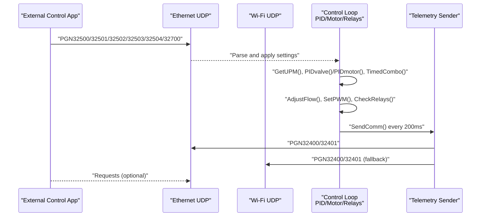
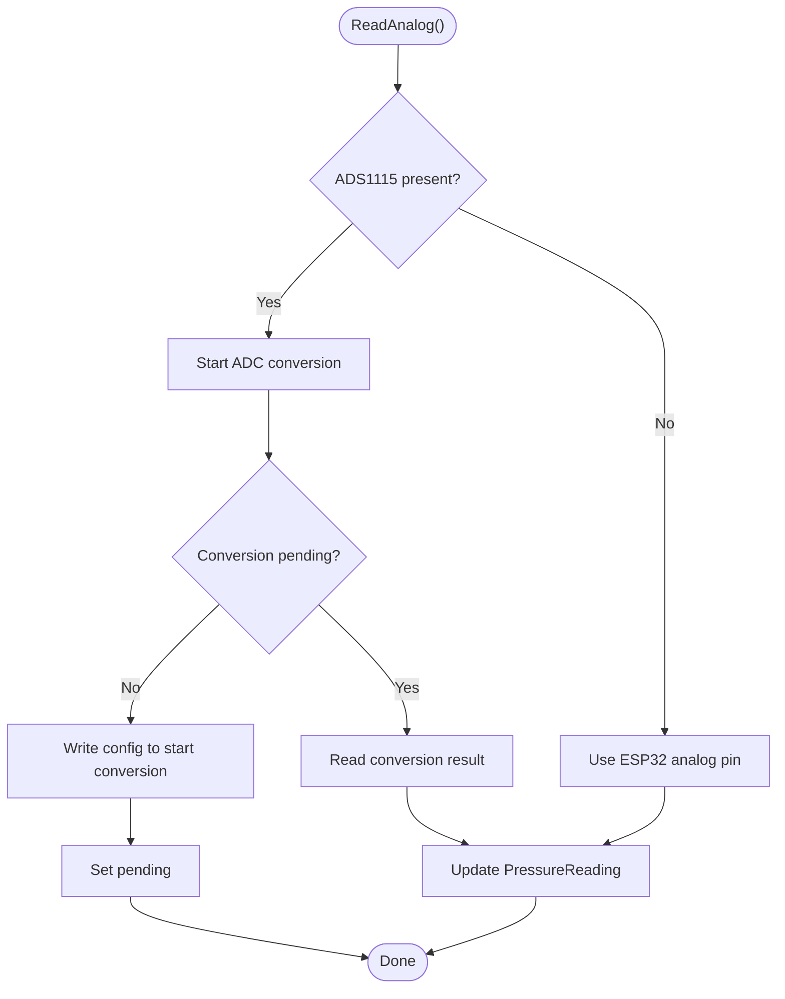
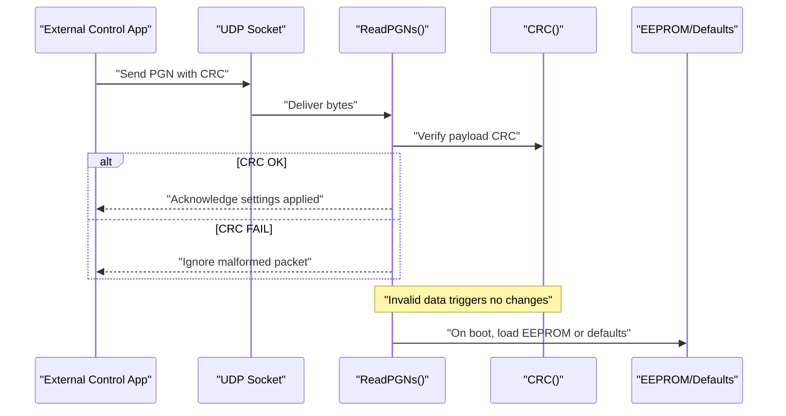
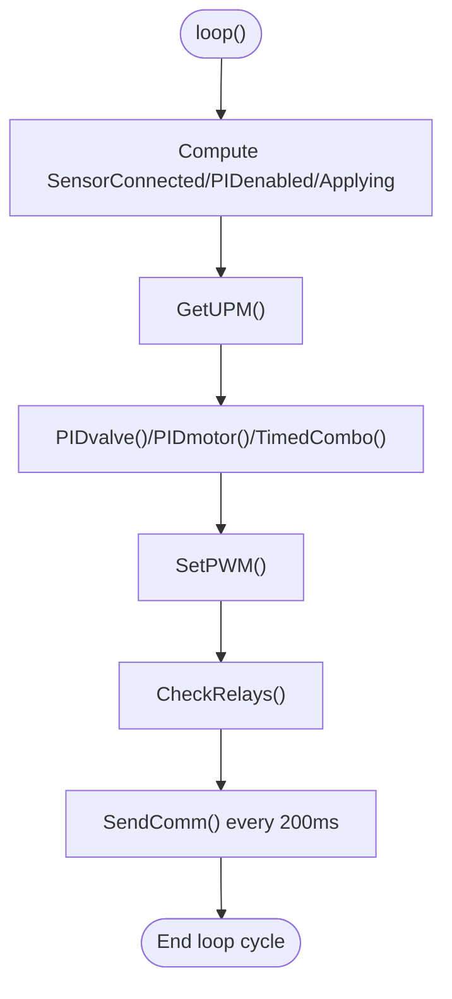
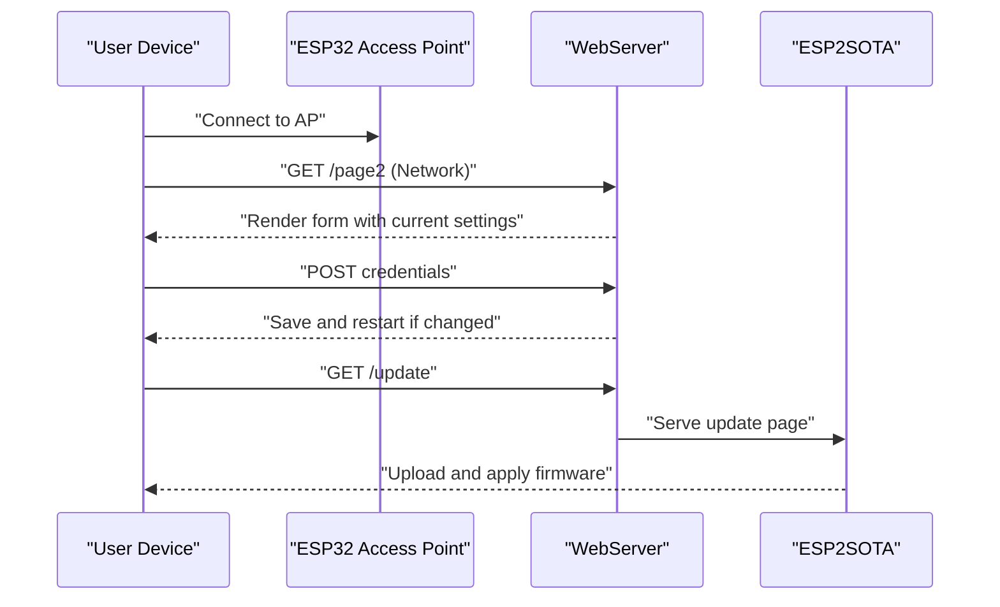
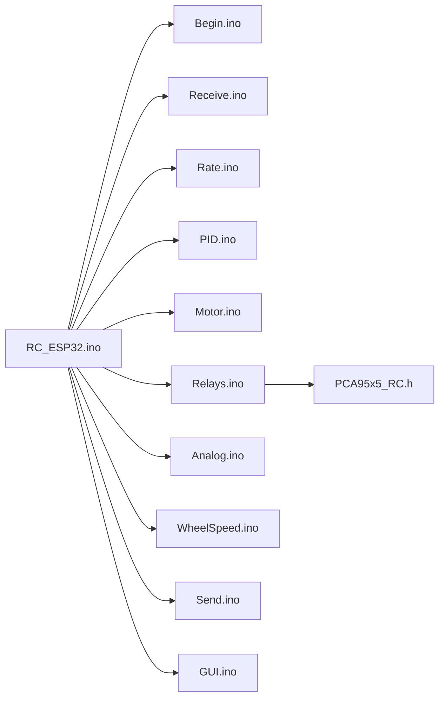

# System Diagnostics and Monitoring

<cite>
**Referenced Files in This Document**
- [RC_ESP32.ino](file://RC_ESP32/RC_ESP32.ino)
- [Begin.ino](file://RC_ESP32/Begin.ino)
- [Analog.ino](file://RC_ESP32/Analog.ino)
- [PID.ino](file://RC_ESP32/PID.ino)
- [Rate.ino](file://RC_ESP32/Rate.ino)
- [Motor.ino](file://RC_ESP32/Motor.ino)
- [Relays.ino](file://RC_ESP32/Relays.ino)
- [WheelSpeed.ino](file://RC_ESP32/WheelSpeed.ino)
- [Receive.ino](file://RC_ESP32/Receive.ino)
- [Send.ino](file://RC_ESP32/Send.ino)
- [GUI.ino](file://RC_ESP32/GUI.ino)
- [PgNetwork.ino](file://RC_ESP32/PgNetwork.ino)
- [PCA95x5_RC.h](file://RC_ESP32/PCA95x5_RC.h)
- [ESP2SOTA_RC.h](file://RC_ESP32/ESP2SOTA_RC/ESP2SOTA_RC.h)
- [Notes.txt](file://Notes.txt)
</cite>

## Table of Contents
1. [Introduction](#introduction)
2. [Project Structure](#project-structure)
3. [Core Components](#core-components)
4. [Architecture Overview](#architecture-overview)
5. [Detailed Component Analysis](#detailed-component-analysis)
6. [Dependency Analysis](#dependency-analysis)
7. [Performance Considerations](#performance-considerations)
8. [Troubleshooting Guide](#troubleshooting-guide)
9. [Conclusion](#conclusion)
10. [Appendices](#appendices)

## Introduction
This document provides comprehensive diagnostics and monitoring guidance for the ESP32 Rate Control module. It covers health monitoring (temperature sensors, voltage monitoring, system status indicators), error reporting (diagnostic codes, logs, status messages), performance metrics (rate accuracy, control loop response, communication statistics), debugging procedures (serial output interpretation, signal tracing, problem isolation), web-based monitoring (real-time status and historical data), troubleshooting workflows, preventive maintenance, and remote diagnostics for field service.

## Project Structure
The system is organized around a modular Arduino-style firmware with separate concerns for setup, control loops, communication, and web interface. Key modules include:
- Initialization and configuration (EEPROM, I2C, Ethernet/Wi-Fi, web server)
- Sensor input handling (pulse counting, median filtering, wheel speed)
- Control logic (PID for valves/motors, timed combo logic)
- Actuation (PWM output, relay control)
- Communication (UDP receive/send to external control app)
- Web interface (settings pages, OTA updates)

```mermaid
graph TB
A["RC_ESP32.ino<br/>Entry point, globals, constants"] --> B["Begin.ino<br/>Setup, EEPROM, I2C, Ethernet, Wi-Fi, WebServer"]
A --> C["Receive.ino<br/>UDP packet parsing"]
A --> D["Rate.ino<br/>Pulse ISR, UPM calculation"]
A --> E["PID.ino<br/>PIDvalve, PIDmotor, TimedCombo"]
A --> F["Motor.ino<br/>SetPWM, direction control"]
A --> G["Relays.ino<br/>Relay control via GPIO/I2C expanders"]
A --> H["Analog.ino<br/>Pressure sensing via ADS1115 or ESP32 ADC"]
A --> I["WheelSpeed.ino<br/>Wheel speed ISR and median filtering"]
A --> J["Send.ino<br/>Periodic telemetry UDP packets"]
A --> K["GUI.ino<br/>Web handlers for settings"]
A --> L["PgNetwork.ino<br/>Network settings page"]
A --> M["PCA95x5_RC.h<br/>PCA9555/PCA9535 I2C expander API"]
A --> N["ESP2SOTA_RC.h<br/>OTA update integration"]
```

**Diagram sources**
- [RC_ESP32.ino:1-418](file://RC_ESP32/RC_ESP32.ino#L1-L418)
- [Begin.ino:1-769](file://RC_ESP32/Begin.ino#L1-L769)
- [Receive.ino:1-346](file://RC_ESP32/Receive.ino#L1-L346)
- [Rate.ino:1-106](file://RC_ESP32/Rate.ino#L1-L106)
- [PID.ino:1-232](file://RC_ESP32/PID.ino#L1-L232)
- [Motor.ino:1-76](file://RC_ESP32/Motor.ino#L1-L76)
- [Relays.ino:1-282](file://RC_ESP32/Relays.ino#L1-L282)
- [Analog.ino:1-70](file://RC_ESP32/Analog.ino#L1-L70)
- [WheelSpeed.ino:1-71](file://RC_ESP32/WheelSpeed.ino#L1-L71)
- [Send.ino:1-195](file://RC_ESP32/Send.ino#L1-L195)
- [GUI.ino:1-104](file://RC_ESP32/GUI.ino#L1-L104)
- [PgNetwork.ino:1-155](file://RC_ESP32/PgNetwork.ino#L1-L155)
- [PCA95x5_RC.h:1-178](file://RC_ESP32/PCA95x5_RC.h#L1-L178)
- [ESP2SOTA_RC.h:1-34](file://RC_ESP32/ESP2SOTA_RC/ESP2SOTA_RC.h#L1-L34)

**Section sources**
- [RC_ESP32.ino:1-418](file://RC_ESP32/RC_ESP32.ino#L1-L418)
- [Begin.ino:1-769](file://RC_ESP32/Begin.ino#L1-L769)

## Core Components
- Health monitoring
  - Pressure sensing via ADS1115 or ESP32 ADC
  - Wheel speed sensing and calibration
  - System status flags (Wi-Fi RSSI bands, Ethernet link, pin configuration validity, 2/3-wire relay mode)
- Error reporting
  - CRC validation for incoming UDP packets
  - WiFi disconnect handling with retry and fallback to AP-only mode
  - EEPROM-backed configuration with defaults and validation
- Performance metrics
  - UPM calculation with median-filtered Hz
  - PWM output and direction control
  - Telemetry packets with applied rate, accumulated quantity, PWM, Hz, and status
- Debugging and diagnostics
  - Serial console output during setup and runtime
  - Web-based settings pages for network and module configuration
  - OTA update capability via embedded HTTP server

**Section sources**
- [Analog.ino:1-70](file://RC_ESP32/Analog.ino#L1-L70)
- [WheelSpeed.ino:1-71](file://RC_ESP32/WheelSpeed.ino#L1-L71)
- [Send.ino:1-195](file://RC_ESP32/Send.ino#L1-L195)
- [Receive.ino:1-346](file://RC_ESP32/Receive.ino#L1-L346)
- [Begin.ino:1-769](file://RC_ESP32/Begin.ino#L1-L769)

## Architecture Overview
The system operates a continuous loop:
- Interrupt-driven pulse counting for flow and wheel speed
- Periodic control loop computing PWM based on target vs measured rate
- Actuation via PWM and relay logic
- Telemetry sent periodically over UDP (Ethernet preferred, fallback to Wi-Fi)
- Settings received via UDP and served via a local WebServer

**Diagram sources**
- [Receive.ino:29-343](file://RC_ESP32/Receive.ino#L29-L343)
- [Rate.ino:31-74](file://RC_ESP32/Rate.ino#L31-L74)
- [PID.ino:25-178](file://RC_ESP32/PID.ino#L25-L178)
- [Motor.ino:2-29](file://RC_ESP32/Motor.ino#L2-L29)
- [Relays.ino:11-69](file://RC_ESP32/Relays.ino#L11-L69)
- [Send.ino:1-195](file://RC_ESP32/Send.ino#L1-L195)

## Detailed Component Analysis

### Health Monitoring Systems
- Pressure monitoring
  - Uses ADS1115 when enabled; otherwise falls back to ESP32 analog pin
  - Reads ADC in a non-blocking pattern alternating between start and read phases
- Wheel speed monitoring
  - Dedicated ISR captures wheel sensor pulses
  - Median filtering and timeout logic to zero speed when inactive
- System status indicators
  - Wi-Fi RSSI strength bands encoded in telemetry status byte
  - Ethernet link status flag
  - Pin configuration validity flag
  - 2/3-wire relay mode flag

**Diagram sources**
- [Analog.ino:2-65](file://RC_ESP32/Analog.ino#L2-L65)

**Section sources**
- [Analog.ino:1-70](file://RC_ESP32/Analog.ino#L1-L70)
- [WheelSpeed.ino:1-71](file://RC_ESP32/WheelSpeed.ino#L1-L71)
- [Send.ino:140-168](file://RC_ESP32/Send.ino#L140-L168)

### Error Reporting Mechanisms
- Packet integrity
  - CRC computed over payload and verified on reception
- Network resilience
  - Wi-Fi disconnect handler increments a counter and forces AP-only mode after threshold
- Configuration safety
  - EEPROM-backed defaults loaded on invalid checksum
  - Validity checks for pin assignments per processor family

**Diagram sources**
- [Receive.ino:29-343](file://RC_ESP32/Receive.ino#L29-L343)
- [RC_ESP32.ino:299-314](file://RC_ESP32/RC_ESP32.ino#L299-L314)
- [Begin.ino:521-562](file://RC_ESP32/Begin.ino#L521-L562)

**Section sources**
- [RC_ESP32.ino:299-314](file://RC_ESP32/RC_ESP32.ino#L299-L314)
- [Begin.ino:521-562](file://RC_ESP32/Begin.ino#L521-L562)
- [Begin.ino:212-244](file://RC_ESP32/Begin.ino#L212-L244)

### Performance Metrics Collection
- Rate accuracy
  - UPM computed from median-filtered Hz and meter calibration
  - Target vs applied rate drives PID adjustments
- Control loop response
  - PID runs at configurable intervals
  - Slew rate limits and integral clamping prevent runaway
- Communication statistics
  - Telemetry includes applied rate, accumulated quantity, PWM, Hz, and status flags
  - Ethernet preferred; fallback to Wi-Fi when link down

**Diagram sources**
- [RC_ESP32.ino:255-280](file://RC_ESP32/RC_ESP32.ino#L255-L280)
- [Rate.ino:31-74](file://RC_ESP32/Rate.ino#L31-L74)
- [PID.ino:25-178](file://RC_ESP32/PID.ino#L25-L178)
- [Motor.ino:31-60](file://RC_ESP32/Motor.ino#L31-L60)
- [Relays.ino:11-69](file://RC_ESP32/Relays.ino#L11-L69)
- [Send.ino:1-92](file://RC_ESP32/Send.ino#L1-L92)

**Section sources**
- [Rate.ino:31-74](file://RC_ESP32/Rate.ino#L31-L74)
- [PID.ino:69-178](file://RC_ESP32/PID.ino#L69-L178)
- [Send.ino:25-92](file://RC_ESP32/Send.ino#L25-L92)

### Debugging Procedures
- Serial output interpretation
  - Setup prints firmware version, module ID, detected peripherals, and configuration summary
  - Wi-Fi events print connection state and reasons for disconnections
- Signal tracing
  - Pulse ISRs capture timing; median filtering reduces noise
  - PWM direction controlled by configuration flags and relay topology
- Problem isolation
  - Toggle module configuration via web settings and observe telemetry changes
  - Verify CRC correctness for incoming commands

**Section sources**
- [Begin.ino:9-344](file://RC_ESP32/Begin.ino#L9-L344)
- [RC_ESP32.ino:212-244](file://RC_ESP32/RC_ESP32.ino#L212-L244)
- [Rate.ino:14-29](file://RC_ESP32/Rate.ino#L14-L29)
- [Motor.ino:31-60](file://RC_ESP32/Motor.ino#L31-L60)

### Web Interface and Remote Diagnostics
- Real-time status display
  - Network settings page shows current Wi-Fi connection status and allows saving credentials and AP password
  - Settings pages expose module configuration and trigger restarts when necessary
- Historical data tracking
  - Telemetry packets carry accumulated quantity and rate; external app can aggregate and visualize trends
- OTA updates
  - Embedded HTTP update server supports firmware upgrades over Wi-Fi

**Diagram sources**
- [PgNetwork.ino:1-155](file://RC_ESP32/PgNetwork.ino#L1-L155)
- [GUI.ino:1-104](file://RC_ESP32/GUI.ino#L1-L104)
- [ESP2SOTA_RC.h:1-34](file://RC_ESP32/ESP2SOTA_RC/ESP2SOTA_RC.h#L1-L34)
- [Begin.ino:230-242](file://RC_ESP32/Begin.ino#L230-L242)

**Section sources**
- [PgNetwork.ino:1-155](file://RC_ESP32/PgNetwork.ino#L1-L155)
- [GUI.ino:1-104](file://RC_ESP32/GUI.ino#L1-L104)
- [ESP2SOTA_RC.h:1-34](file://RC_ESP32/ESP2SOTA_RC/ESP2SOTA_RC.h#L1-L34)
- [Notes.txt:1-8](file://Notes.txt#L1-L8)

### Preventive Maintenance and System Health Checks
- Regularly verify:
  - Sensor wiring and pin assignments
  - ADS1115 presence and I2C connectivity
  - Ethernet link and Wi-Fi connectivity
  - Wheel sensor pin and calibration
- Use web interface to:
  - Reset accumulated quantities when appropriate
  - Adjust control parameters and confirm telemetry reflects changes
- Monitor telemetry status flags for early warning signs (Wi-Fi RSSI bands, Ethernet link, pin configuration validity)

**Section sources**
- [Begin.ino:513-562](file://RC_ESP32/Begin.ino#L513-L562)
- [Send.ino:140-168](file://RC_ESP32/Send.ino#L140-L168)

## Dependency Analysis
Key internal dependencies:
- RC_ESP32.ino defines global structures and constants used across modules
- Begin.ino initializes subsystems and exposes shared state
- Receive.ino depends on CRC and PGN definitions
- Rate.ino and WheelSpeed.ino depend on ISR routines and median filters
- PID.ino depends on sensor state and control parameters
- Motor.ino depends on PWM configuration and direction logic
- Relays.ino depends on PCA95x5 API for I2C expanders
- Send.ino depends on telemetry fields populated by other modules

**Diagram sources**
- [RC_ESP32.ino:1-418](file://RC_ESP32/RC_ESP32.ino#L1-L418)
- [Begin.ino:1-769](file://RC_ESP32/Begin.ino#L1-L769)
- [Receive.ino:1-346](file://RC_ESP32/Receive.ino#L1-L346)
- [Rate.ino:1-106](file://RC_ESP32/Rate.ino#L1-L106)
- [PID.ino:1-232](file://RC_ESP32/PID.ino#L1-L232)
- [Motor.ino:1-76](file://RC_ESP32/Motor.ino#L1-L76)
- [Relays.ino:1-282](file://RC_ESP32/Relays.ino#L1-L282)
- [Analog.ino:1-70](file://RC_ESP32/Analog.ino#L1-L70)
- [WheelSpeed.ino:1-71](file://RC_ESP32/WheelSpeed.ino#L1-L71)
- [Send.ino:1-195](file://RC_ESP32/Send.ino#L1-L195)
- [GUI.ino:1-104](file://RC_ESP32/GUI.ino#L1-L104)
- [PCA95x5_RC.h:1-178](file://RC_ESP32/PCA95x5_RC.h#L1-L178)

**Section sources**
- [RC_ESP32.ino:1-418](file://RC_ESP32/RC_ESP32.ino#L1-L418)
- [Begin.ino:1-769](file://RC_ESP32/Begin.ino#L1-L769)

## Performance Considerations
- Loop timing
  - Control loop runs every 50 ms; telemetry every 200 ms
  - Median filtering trades CPU for noise immunity
- PWM resolution and frequency
  - Configurable bits and frequency tailored for valve operation
- I2C throughput
  - ADS1115 sampling rate configured for balance between fidelity and latency
- Network reliability
  - Prefer Ethernet; fallback to Wi-Fi with CRC validation ensures robustness

[No sources needed since this section provides general guidance]

## Troubleshooting Guide
- No telemetry received
  - Verify Ethernet link status and Wi-Fi connectivity
  - Confirm destination IP and port settings
- Incorrect rate readings
  - Check meter calibration and pulse sample size
  - Inspect ISR wiring and pull-up resistors
- Relay control issues
  - Validate relay controller type and I2C address detection
  - Confirm pin assignments and polarity settings
- Wi-Fi connectivity problems
  - Review disconnect logs and AP-only fallback behavior
  - Re-enter credentials via web interface and restart if needed
- Pressure sensor not updating
  - Ensure ADS1115 is enabled and detected during setup
  - Check analog pin assignment and wiring

**Section sources**
- [Send.ino:72-91](file://RC_ESP32/Send.ino#L72-L91)
- [Begin.ino:87-118](file://RC_ESP32/Begin.ino#L87-L118)
- [Begin.ino:212-244](file://RC_ESP32/Begin.ino#L212-L244)
- [GUI.ino:25-79](file://RC_ESP32/GUI.ino#L25-L79)
- [Notes.txt:6-8](file://Notes.txt#L6-L8)

## Conclusion
The ESP32 Rate Control module integrates robust diagnostics and monitoring through CRC-protected communication, periodic telemetry, configurable control parameters, and a local web interface. By leveraging serial logs, telemetry flags, and web-based configuration, operators can maintain accurate rate control, isolate faults quickly, and perform remote updates safely.

[No sources needed since this section summarizes without analyzing specific files]

## Appendices

### Appendix A: Telemetry Fields Reference
- PGN 32400 (sensor telemetry)
  - Applied rate (scaled)
  - Accumulated quantity (scaled)
  - PWM value
  - Status: sensor connected
  - Hz (scaled)
- PGN 32401 (module telemetry)
  - Pressure (scaled)
  - Wheel speed (scaled)
  - Wheel count
  - InoType, InoID
  - Status: work switch, Wi-Fi RSSI bands, Ethernet link, pin configuration validity, 2/3-wire relay mode

**Section sources**
- [Send.ino:7-24](file://RC_ESP32/Send.ino#L7-L24)
- [Send.ino:93-14](file://RC_ESP32/Send.ino#L93-L14)
- [Send.ino:117-192](file://RC_ESP32/Send.ino#L117-L192)

### Appendix B: Web Interface Pages
- Root page: general status and navigation
- Page 1: switch/relay control
- Page 2: network configuration and Wi-Fi status

**Section sources**
- [GUI.ino:1-104](file://RC_ESP32/GUI.ino#L1-L104)
- [PgNetwork.ino:1-155](file://RC_ESP32/PgNetwork.ino#L1-L155)