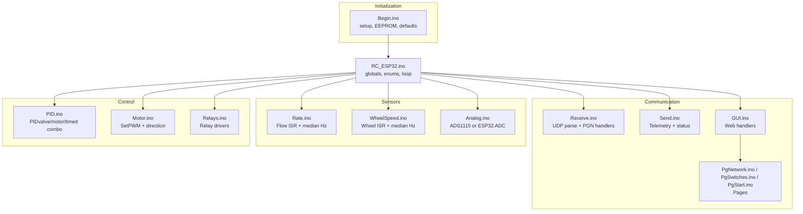
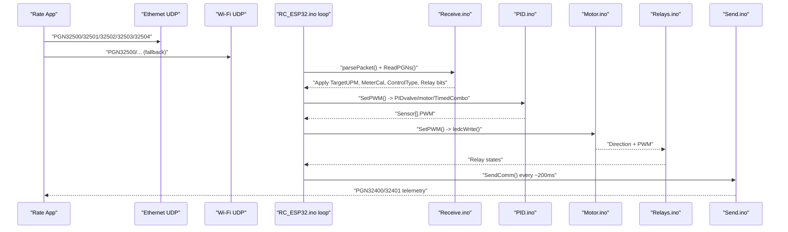
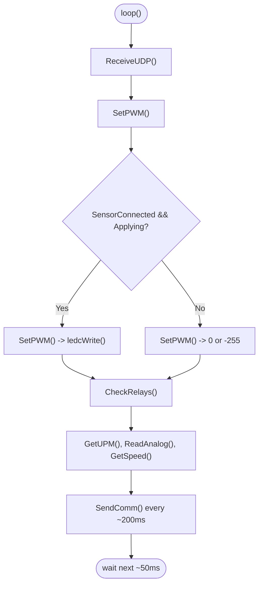
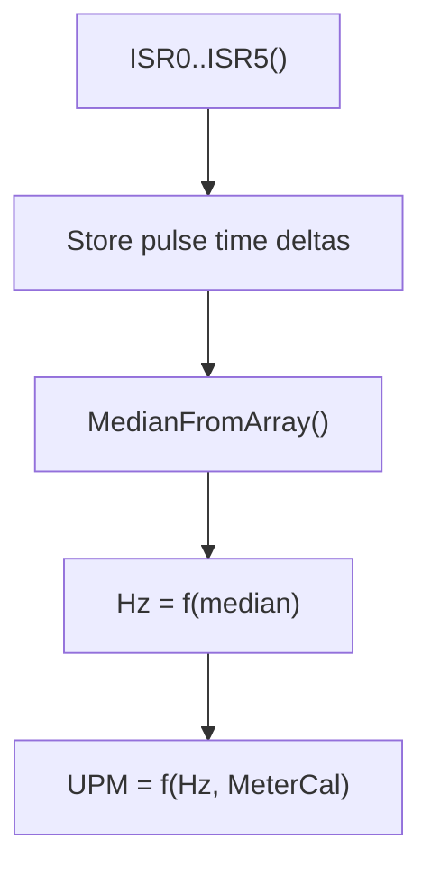
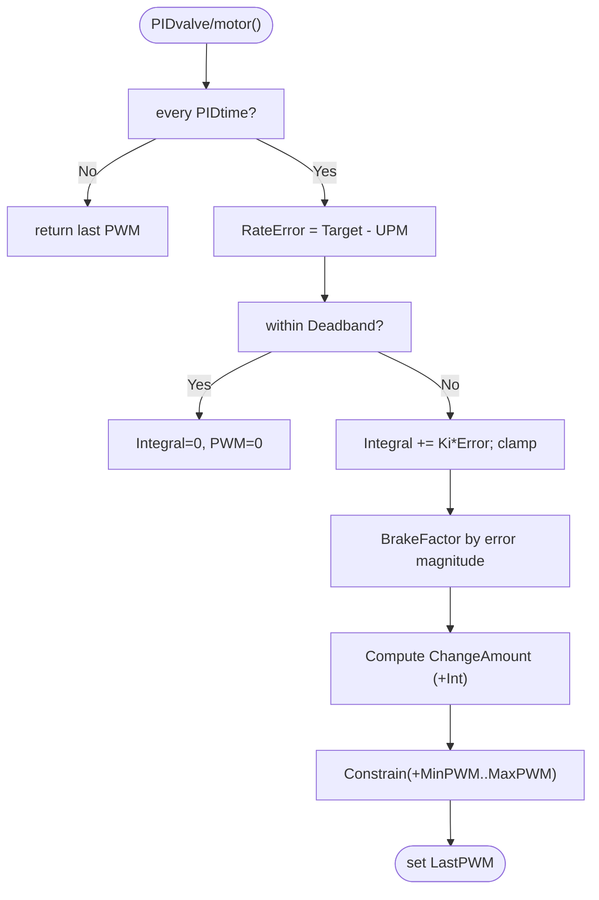
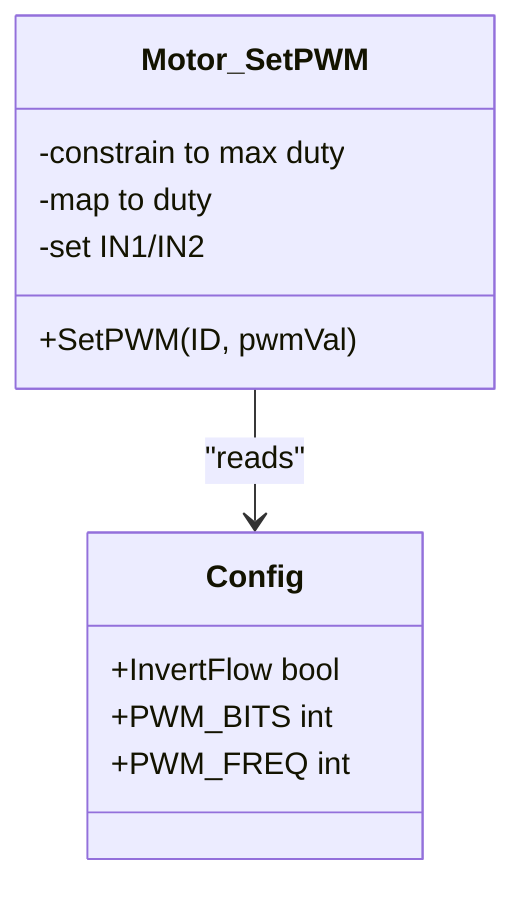
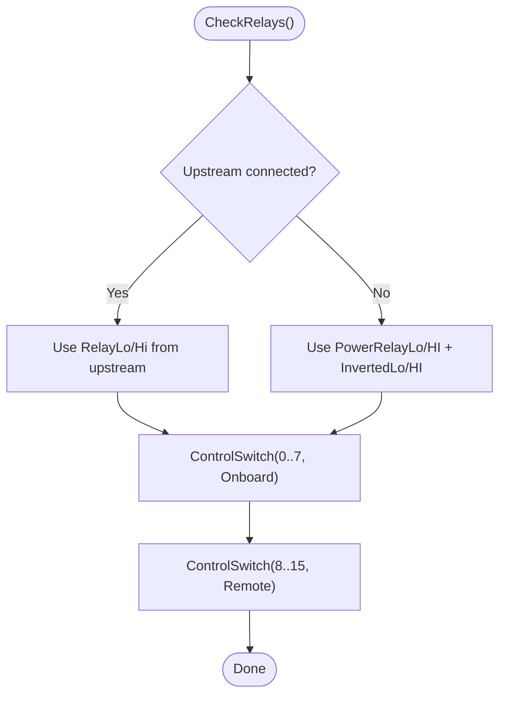
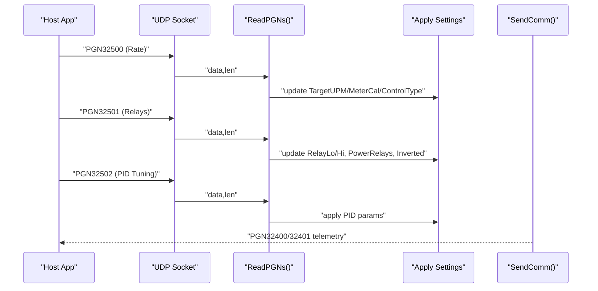
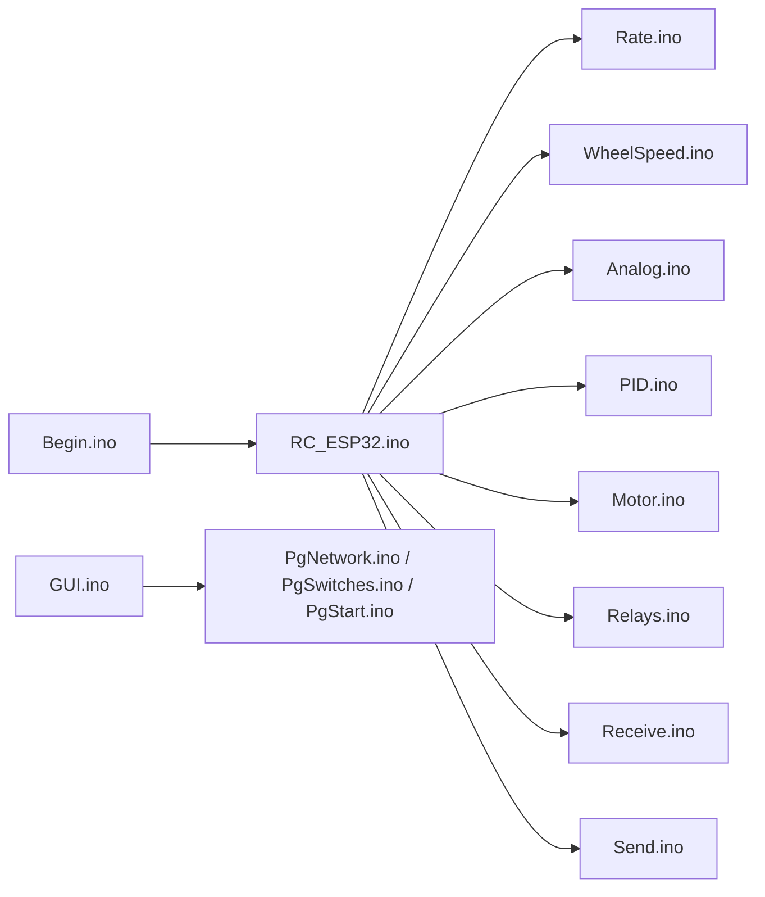

# Troubleshooting and Problem Resolution

<cite>
**Referenced Files in This Document**
- [RC_ESP32.ino](file://RC_ESP32/RC_ESP32.ino)
- [Begin.ino](file://RC_ESP32/Begin.ino)
- [PID.ino](file://RC_ESP32/PID.ino)
- [Motor.ino](file://RC_ESP32/Motor.ino)
- [Analog.ino](file://RC_ESP32/Analog.ino)
- [Rate.ino](file://RC_ESP32/Rate.ino)
- [Receive.ino](file://RC_ESP32/Receive.ino)
- [Send.ino](file://RC_ESP32/Send.ino)
- [WheelSpeed.ino](file://RC_ESP32/WheelSpeed.ino)
- [Relays.ino](file://RC_ESP32/Relays.ino)
- [GUI.ino](file://RC_ESP32/GUI.ino)
- [PgNetwork.ino](file://RC_ESP32/PgNetwork.ino)
- [PgStart.ino](file://RC_ESP32/PgStart.ino)
- [PgSwitches.ino](file://RC_ESP32/PgSwitches.ino)
- [Notes.txt](file://Notes.txt)
</cite>

## Table of Contents
1. [Introduction](#introduction)
2. [Project Structure](#project-structure)
3. [Core Components](#core-components)
4. [Architecture Overview](#architecture-overview)
5. [Detailed Component Analysis](#detailed-component-analysis)
6. [Dependency Analysis](#dependency-analysis)
7. [Performance Considerations](#performance-considerations)
8. [Troubleshooting Guide](#troubleshooting-guide)
9. [Conclusion](#conclusion)
10. [Appendices](#appendices)

## Introduction
This document provides a comprehensive troubleshooting and problem resolution guide for the ESP32 Rate Control system. It covers systematic diagnostics for hardware failures, communication issues, and control system malfunctions. It explains signal tracing techniques (continuity testing, waveform analysis, component isolation), problem isolation strategies, and common failure categories. It also documents diagnostic tools and testing procedures (multimeter, oscilloscope, serial logs), preventive maintenance, and escalation procedures.

## Project Structure
The system is organized around a modular Arduino-style firmware with distinct functional areas:
- Initialization and configuration (setup, EEPROM, defaults)
- Communication (Ethernet/Wi-Fi UDP, web server, OTA)
- Sensor acquisition (flow pulses, wheel speed, analog pressure)
- Control logic (PID, PWM generation, relay control)
- Telemetry and status reporting
- Web UI for configuration and diagnostics

**Diagram sources**
- [Begin.ino:1-769](file://RC_ESP32/Begin.ino#L1-L769)
- [RC_ESP32.ino:1-418](file://RC_ESP32/RC_ESP32.ino#L1-L418)
- [PID.ino:1-232](file://RC_ESP32/PID.ino#L1-L232)
- [Motor.ino:1-76](file://RC_ESP32/Motor.ino#L1-L76)
- [Analog.ino:1-70](file://RC_ESP32/Analog.ino#L1-L70)
- [Rate.ino:1-106](file://RC_ESP32/Rate.ino#L1-L106)
- [WheelSpeed.ino:1-71](file://RC_ESP32/WheelSpeed.ino#L1-L71)
- [Receive.ino:1-346](file://RC_ESP32/Receive.ino#L1-L346)
- [Send.ino:1-195](file://RC_ESP32/Send.ino#L1-L195)
- [GUI.ino:1-104](file://RC_ESP32/GUI.ino#L1-L104)
- [PgNetwork.ino:1-155](file://RC_ESP32/PgNetwork.ino#L1-L155)
- [PgSwitches.ino:1-132](file://RC_ESP32/PgSwitches.ino#L1-L132)
- [PgStart.ino:1-148](file://RC_ESP32/PgStart.ino#L1-L148)

**Section sources**
- [RC_ESP32.ino:250-280](file://RC_ESP32/RC_ESP32.ino#L250-L280)
- [Begin.ino:4-345](file://RC_ESP32/Begin.ino#L4-L345)

## Core Components
- Configuration and state
  - ModuleConfig and SensorConfig structures define runtime parameters and limits.
  - EEPROM-backed persistence for module and sensor settings.
- Communication
  - UDP over Ethernet and Wi-Fi; web server for local configuration pages.
  - PGN handlers process incoming control messages and apply settings.
- Sensing
  - Interrupt-driven pulse counting for flow and wheel speed with median filtering.
  - Optional ADS1115 analog front-end for pressure; fallback to ESP32 ADC.
- Control
  - PIDvalve, PIDmotor, and TimedCombo control strategies.
  - PWM generation via LEDC with configurable frequency/bits; direction control.
  - Relay switching via multiple driver options (GPIO, PCA9555, MCP23017, PCA9685, PCF8574).
- Telemetry
  - Periodic telemetry packets sent via UDP; status flags for connectivity and configuration.

**Section sources**
- [RC_ESP32.ino:76-148](file://RC_ESP32/RC_ESP32.ino#L76-L148)
- [Begin.ino:521-619](file://RC_ESP32/Begin.ino#L521-L619)
- [Receive.ino:29-343](file://RC_ESP32/Receive.ino#L29-L343)
- [Rate.ino:31-74](file://RC_ESP32/Rate.ino#L31-L74)
- [WheelSpeed.ino:31-69](file://RC_ESP32/WheelSpeed.ino#L31-L69)
- [Analog.ino:2-65](file://RC_ESP32/Analog.ino#L2-L65)
- [PID.ino:25-178](file://RC_ESP32/PID.ino#L25-L178)
- [Motor.ino:31-60](file://RC_ESP32/Motor.ino#L31-L60)
- [Relays.ino:11-69](file://RC_ESP32/Relays.ino#L11-L69)
- [Send.ino:1-195](file://RC_ESP32/Send.ino#L1-L195)

## Architecture Overview
The system operates a tight loop that:
- Receives UDP packets and updates control parameters
- Reads sensors and computes rates
- Runs PID control and sets PWM
- Controls relays based on connected state and commands
- Sends telemetry periodically

**Diagram sources**
- [RC_ESP32.ino:255-280](file://RC_ESP32/RC_ESP32.ino#L255-L280)
- [Receive.ino:2-27](file://RC_ESP32/Receive.ino#L2-L27)
- [PID.ino:25-67](file://RC_ESP32/PID.ino#L25-L67)
- [Motor.ino:31-60](file://RC_ESP32/Motor.ino#L31-L60)
- [Relays.ino:11-69](file://RC_ESP32/Relays.ino#L11-L69)
- [Send.ino:1-92](file://RC_ESP32/Send.ino#L1-L92)

## Detailed Component Analysis

### Control Loop and Timing
- Loop timing: ~50 ms; telemetry every ~200 ms.
- SensorConnected flag determines whether PID adjusts; Applying flag gates motor/fan outputs.
- Flow timeout clears rates when no pulses are detected for extended periods.

**Diagram sources**
- [RC_ESP32.ino:255-280](file://RC_ESP32/RC_ESP32.ino#L255-L280)
- [PID.ino:25-67](file://RC_ESP32/PID.ino#L25-L67)
- [Motor.ino:2-29](file://RC_ESP32/Motor.ino#L2-L29)
- [Relays.ino:11-69](file://RC_ESP32/Relays.ino#L11-L69)
- [Send.ino:1-92](file://RC_ESP32/Send.ino#L1-L92)

**Section sources**
- [RC_ESP32.ino:179-182](file://RC_ESP32/RC_ESP32.ino#L179-L182)
- [Rate.ino:62-72](file://RC_ESP32/Rate.ino#L62-L72)

### Sensor Pulse Processing
- ISR captures pulse intervals and stores samples for median calculation.
- Median filtering rejects outliers; Hz smoothed over time; UPM derived from meter calibration.

**Diagram sources**
- [Rate.ino:14-29](file://RC_ESP32/Rate.ino#L14-L29)
- [Rate.ino:31-74](file://RC_ESP32/Rate.ino#L31-L74)
- [RC_ESP32.ino:344-377](file://RC_ESP32/RC_ESP32.ino#L344-L377)

**Section sources**
- [Rate.ino:31-74](file://RC_ESP32/Rate.ino#L31-L74)

### PID Control Strategies
- Valve PID: Deadband, integral anti-windup, brake factor near setpoint.
- Motor/Fan PID: Slew-rate limiting, integral clamp.
- TimedCombo: Alternates adjustment/pause windows; supports manual override.

**Diagram sources**
- [PID.ino:69-126](file://RC_ESP32/PID.ino#L69-L126)
- [PID.ino:128-178](file://RC_ESP32/PID.ino#L128-L178)
- [PID.ino:180-231](file://RC_ESP32/PID.ino#L180-L231)

**Section sources**
- [PID.ino:1-232](file://RC_ESP32/PID.ino#L1-L232)

### PWM Generation and Direction
- PWM mapped from [-255..255] to configured LEDC resolution.
- Direction controlled by IN1/IN2; inversion handled by configuration.
- AVR 8-bit path includes dithering for finer resolution.

**Diagram sources**
- [Motor.ino:31-60](file://RC_ESP32/Motor.ino#L31-L60)
- [RC_ESP32.ino:49-65](file://RC_ESP32/RC_ESP32.ino#L49-L65)

**Section sources**
- [Motor.ino:1-76](file://RC_ESP32/Motor.ino#L1-L76)

### Relay Control Matrix
- Supports onboard and remote relay drivers: GPIO, PCA9555, MCP23017, PCA9685, PCF8574.
- During loss of upstream connection, maintains power/inverted relays to ensure safe valve state.

**Diagram sources**
- [Relays.ino:11-69](file://RC_ESP32/Relays.ino#L11-L69)
- [Relays.ino:71-273](file://RC_ESP32/Relays.ino#L71-L273)

**Section sources**
- [Relays.ino:1-282](file://RC_ESP32/Relays.ino#L1-L282)

### Communication Protocol and Diagnostics
- UDP parsing of PGNs updates TargetUPM, MeterCal, ControlType, Relay masks, and module settings.
- Telemetry includes applied UPM, accumulated quantity, PWM, Hz, and status flags.

**Diagram sources**
- [Receive.ino:29-343](file://RC_ESP32/Receive.ino#L29-L343)
- [Send.ino:25-192](file://RC_ESP32/Send.ino#L25-L192)

**Section sources**
- [Receive.ino:1-346](file://RC_ESP32/Receive.ino#L1-L346)
- [Send.ino:1-195](file://RC_ESP32/Send.ino#L1-L195)

## Dependency Analysis
- Initialization depends on EEPROM for persisted configuration and defaults.
- Control depends on sensor readings and communication state.
- Relays depend on control decisions and driver availability.
- Telemetry depends on control and sensor subsystems.

**Diagram sources**
- [Begin.ino:1-345](file://RC_ESP32/Begin.ino#L1-L345)
- [RC_ESP32.ino:1-418](file://RC_ESP32/RC_ESP32.ino#L1-L418)
- [Rate.ino:1-106](file://RC_ESP32/Rate.ino#L1-L106)
- [WheelSpeed.ino:1-71](file://RC_ESP32/WheelSpeed.ino#L1-L71)
- [Analog.ino:1-70](file://RC_ESP32/Analog.ino#L1-L70)
- [PID.ino:1-232](file://RC_ESP32/PID.ino#L1-L232)
- [Motor.ino:1-76](file://RC_ESP32/Motor.ino#L1-L76)
- [Relays.ino:1-282](file://RC_ESP32/Relays.ino#L1-L282)
- [Receive.ino:1-346](file://RC_ESP32/Receive.ino#L1-L346)
- [Send.ino:1-195](file://RC_ESP32/Send.ino#L1-L195)
- [GUI.ino:1-104](file://RC_ESP32/GUI.ino#L1-L104)
- [PgNetwork.ino:1-155](file://RC_ESP32/PgNetwork.ino#L1-L155)
- [PgSwitches.ino:1-132](file://RC_ESP32/PgSwitches.ino#L1-L132)
- [PgStart.ino:1-148](file://RC_ESP32/PgStart.ino#L1-L148)

**Section sources**
- [RC_ESP32.ino:250-280](file://RC_ESP32/RC_ESP32.ino#L250-L280)

## Performance Considerations
- Loop timing (~50 ms) and telemetry period (~200 ms) are defined constants.
- Median filtering reduces noise but adds memory usage proportional to sample size.
- LEDC PWM frequency/bits are configurable; lower bit depth increases quantization.
- I2C speed increased to 400 kHz to improve peripheral detection/read latency.

[No sources needed since this section provides general guidance]

## Troubleshooting Guide

### Systematic Diagnostic Workflow
1. Verify physical connections
   - Confirm power, ground, and signal integrity for sensors, relays, and peripherals.
2. Check communication
   - Confirm Ethernet link status and Wi-Fi connectivity; verify destination IP and subnet.
3. Inspect control logic
   - Validate TargetUPM, MeterCal, ControlType, and relay masks received via PGNs.
4. Trace signals
   - Use oscilloscope to confirm PWM and direction signals; verify sensor pulses.
5. Isolate faults
   - Disable auto-control and test manual overrides; swap sensor wiring; test relays individually.
6. Review telemetry
   - Monitor applied UPM, Hz, accumulated quantity, and status flags.

### Step-by-Step Procedures

#### Hardware Failures
- Symptom: No sensor pulses, UPM stuck at zero
  - Check flow sensor wiring and pull-ups; verify interrupt pin validity.
  - Replace sensor or shorten cable; ensure proper shielding.
- Symptom: PWM output absent or incorrect direction
  - Verify IN1/IN2 wiring and polarity; confirm InvertFlow setting.
  - Test with known-good load; measure voltage/current at valve terminals.
- Symptom: Relays fail to operate
  - Confirm relay driver presence and initialization; test individual relay channels.
  - Swap driver module or use GPIO pins for diagnosis.

#### Communication Issues
- Symptom: No telemetry or intermittent packets
  - Confirm Ethernet link status; verify subnet and broadcast destination.
  - Validate Wi-Fi credentials and AP availability; check RSSI status in telemetry.
- Symptom: Settings not applying
  - Verify PGN payload length and CRC; ensure Mod/Sen ID matches module ID.
  - Re-send configuration with correct checksum and module ID.

#### Control System Malfunctions
- Symptom: Oscillatory or sluggish response
  - Reduce Kp/Ki or deadband; adjust brake point and PID slow-adjust.
  - Check for integral windup and ensure MaxIntegral limits are appropriate.
- Symptom: PWM drift or saturation
  - Verify Min/Max PWM limits; confirm duty mapping and LEDC resolution.
  - Check for external interference on PWM lines.

#### Signal Tracing Techniques
- Continuity testing
  - Use multimeter to verify continuity between ESP32 pins and relay driver ICs.
  - Check supply voltages at relay driver and sensor power pins.
- Waveform analysis
  - Probe IN1/IN2 and PWM pins with oscilloscope; confirm square waves and correct polarity.
  - Capture flow sensor pulses; verify pulse width and frequency against expected range.
- Component isolation
  - Remove load from valve; test open-loop response; swap sensor wiring to isolate fault.
  - Test relays with known-good signal; verify driver chip presence and I2C address scanning.

#### Problem Isolation Strategies
- Use manual mode to bypass PID; if behavior improves, tune PID parameters.
- Temporarily disable auto-control and apply fixed PWM; observe response.
- Cycle relays individually to identify stuck or shorted channels.
- Validate EEPROM-persisted settings; restore defaults if corrupted.

#### Common Issue Categories
- Sensor problems
  - Faulty pulse generator, noisy wiring, or incorrect meter calibration.
- Actuator failures
  - Stuck solenoid, insufficient current, or wrong wiring polarity.
- Network connectivity issues
  - Incorrect subnet, firewall blocking UDP, or Wi-Fi credentials mismatch.
- Software bugs
  - CRC mismatches, invalid module ID, or uninitialized driver chips.

#### Diagnostic Tools and Testing Procedures
- Multimeter
  - Measure voltage at relay coil and valve terminals; check I2C bus lines (SDA/SCL).
- Oscilloscope
  - Capture PWM, direction, and sensor pulses; compare with expected waveforms.
- Serial logs
  - Enable serial output during setup to review detected peripherals and configuration.
- Web UI
  - Use configuration pages to change Wi-Fi credentials, AP password, and module settings.

#### Preventive Maintenance and Health Checks
- Monthly
  - Inspect cable harnesses and connector tightness; clean relay contacts.
  - Verify EEPROM settings and restore defaults if needed.
- Quarterly
  - Recalibrate sensors; re-check meter calibration and pulse counts.
  - Validate relay operation under both auto and manual modes.
- Annually
  - Replace capacitors near drivers; inspect for thermal stress.
  - Update firmware via OTA if available.

#### Escalation Procedures and Support Resources
- If local diagnostics fail:
  - Collect serial logs and screenshots of web UI pages.
  - Provide PGN capture (telemetry and configuration) for analysis.
  - Document environmental conditions (vibration, temperature, humidity).
- Support resources
  - Refer to module AP subnet guidance and Windows Wi-Fi coexistence tips.
  - Use OTA update page for firmware upgrades.

**Section sources**
- [Begin.ino:54-117](file://RC_ESP32/Begin.ino#L54-L117)
- [Begin.ino:173-255](file://RC_ESP32/Begin.ino#L173-L255)
- [Send.ino:140-168](file://RC_ESP32/Send.ino#L140-L168)
- [Notes.txt:1-8](file://Notes.txt#L1-L8)

## Conclusion
This guide consolidates practical troubleshooting steps, signal tracing techniques, and isolation strategies for the ESP32 Rate Control system. By following the structured workflow—starting with hardware checks, progressing through communication and control diagnostics, and concluding with telemetry verification—you can efficiently identify and resolve most system failures. Regular maintenance and health checks further reduce downtime and improve reliability.

## Appendices

### Quick Reference: Key Telemetry Flags
- Sensor connected: bit 0 in telemetry status
- Ethernet connected: bit 4 in telemetry status
- Good pin configuration: bit 5 in telemetry status
- 3-wire relays: bit 6 in telemetry status

**Section sources**
- [Send.ino:140-168](file://RC_ESP32/Send.ino#L140-L168)