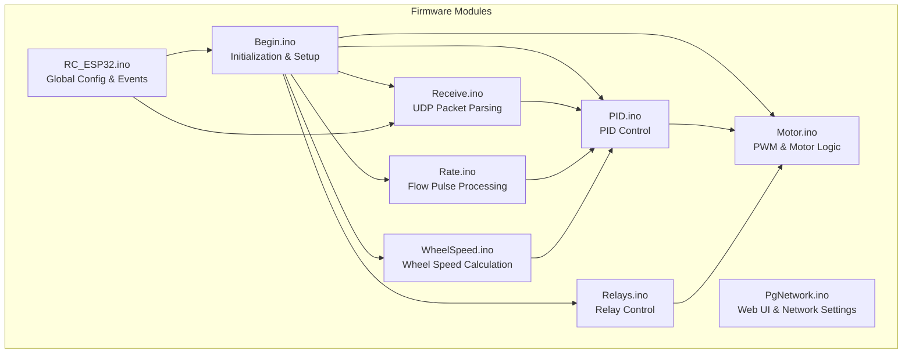
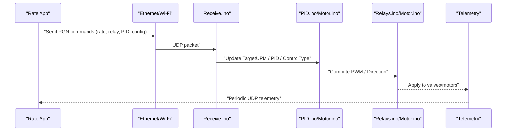
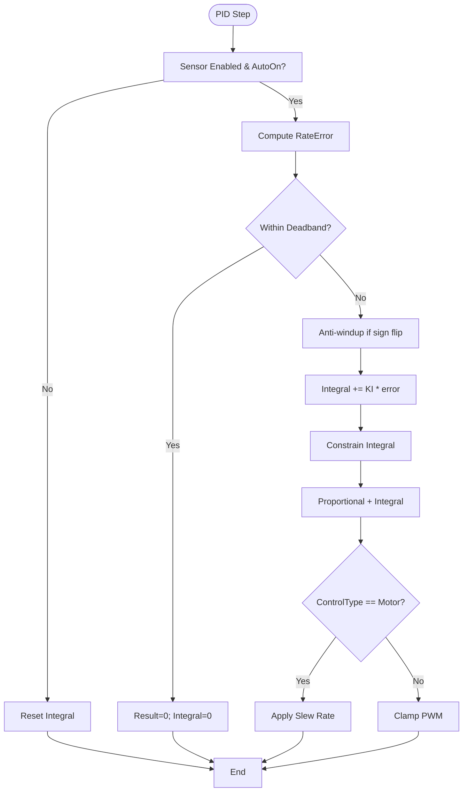
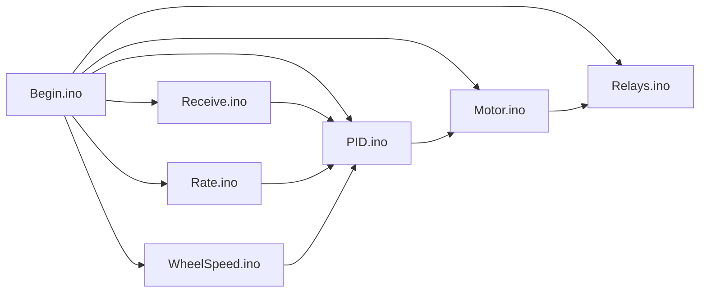

# Troubleshooting and FAQ

<cite>
**Referenced Files in This Document**
- [Notes.txt](file://Notes.txt)
- [FORK_CHANGES.md](file://FORK_CHANGES.md)
- [RC_ESP32.ino](file://RC_ESP32/RC_ESP32.ino)
- [Begin.ino](file://RC_ESP32/Begin.ino)
- [PgNetwork.ino](file://RC_ESP32/PgNetwork.ino)
- [Receive.ino](file://RC_ESP32/Receive.ino)
- [PID.ino](file://RC_ESP32/PID.ino)
- [Motor.ino](file://RC_ESP32/Motor.ino)
- [Rate.ino](file://RC_ESP32/Rate.ino)
- [WheelSpeed.ino](file://RC_ESP32/WheelSpeed.ino)
- [Relays.ino](file://RC_ESP32/Relays.ino)
- [UDPComm.ino (OLD CODE)](file://OLD CODE/RC_ESP32/UDPComm.ino)
- [Begin.ino (OLD CODE)](file://OLD CODE/RC_ESP32/Begin.ino)
- [RC_ESP32.ino (OLD CODE)](file://OLD CODE/RC32/RC_ESP32.ino)
</cite>

## Table of Contents
1. [Introduction](#introduction)
2. [Project Structure](#project-structure)
3. [Core Components](#core-components)
4. [Architecture Overview](#architecture-overview)
5. [Detailed Component Analysis](#detailed-component-analysis)
6. [Dependency Analysis](#dependency-analysis)
7. [Performance Considerations](#performance-considerations)
8. [Troubleshooting Guide](#troubleshooting-guide)
9. [Conclusion](#conclusion)
10. [Appendices](#appendices)

## Introduction
This document provides comprehensive troubleshooting and Frequently Asked Questions for the ESP32 Rate Control project. It focuses on diagnosing and resolving network connectivity issues, hardware connection failures, and control system malfunctions. It also covers systematic diagnostic workflows, error interpretation, performance tuning, and field service procedures including installation, commissioning, maintenance, and emergency recovery.

## Project Structure
The project is organized around a modular firmware architecture for the ESP32 platform controlling rate modules via Ethernet and Wi-Fi. Key modules include:
- Initialization and configuration (Begin.ino)
- Web UI and settings (PgNetwork.ino)
- Control loops (PID.ino, Motor.ino, Rate.ino)
- Communication (Receive.ino, RC_ESP32.ino)
- Relays and actuators (Relays.ino)
- Wheel speed sensing (WheelSpeed.ino)
- Historical notes and changes (Notes.txt, FORK_CHANGES.md)

**Diagram sources**
- [Begin.ino](file://RC_ESP32/Begin.ino)
- [PgNetwork.ino](file://RC_ESP32/PgNetwork.ino)
- [Receive.ino](file://RC_ESP32/Receive.ino)
- [PID.ino](file://RC_ESP32/PID.ino)
- [Motor.ino](file://RC_ESP32/Motor.ino)
- [Rate.ino](file://RC_ESP32/Rate.ino)
- [WheelSpeed.ino](file://RC_ESP32/WheelSpeed.ino)
- [Relays.ino](file://RC_ESP32/Relays.ino)
- [RC_ESP32.ino](file://RC_ESP32/RC_ESP32.ino)

**Section sources**
- [Begin.ino](file://RC_ESP32/Begin.ino)
- [PgNetwork.ino](file://RC_ESP32/PgNetwork.ino)
- [Receive.ino](file://RC_ESP32/Receive.ino)
- [PID.ino](file://RC_ESP32/PID.ino)
- [Motor.ino](file://RC_ESP32/Motor.ino)
- [Rate.ino](file://RC_ESP32/Rate.ino)
- [WheelSpeed.ino](file://RC_ESP32/WheelSpeed.ino)
- [Relays.ino](file://RC_ESP32/Relays.ino)
- [RC_ESP32.ino](file://RC_ESP32/RC_ESP32.ino)

## Core Components
- Initialization and hardware discovery: I2C scanning, Ethernet/Wi-Fi setup, relay drivers, and sensor pin configuration.
- Control loop: PID computation for valves and motors, with configurable deadband, integral anti-windup, and slew limits.
- Actuation: PWM generation and direction control for valves/motors, with relay logic for section control.
- Telemetry and diagnostics: periodic UDP telemetry, web UI, and feature flags for advanced control.
- Communication: UDP parsing for rate settings, relay commands, PID tuning, and configuration updates.

Key implementation references:
- Initialization and setup: [Begin.ino](file://RC_ESP32/Begin.ino)
- Control logic: [PID.ino](file://RC_ESP32/PID.ino), [Motor.ino](file://RC_ESP32/Motor.ino)
- Flow sensing: [Rate.ino](file://RC_ESP32/Rate.ino)
- Wheel speed: [WheelSpeed.ino](file://RC_ESP32/WheelSpeed.ino)
- Relays: [Relays.ino](file://RC_ESP32/Relays.ino)
- Communication: [Receive.ino](file://RC_ESP32/Receive.ino), [RC_ESP32.ino](file://RC_ESP32/RC_ESP32.ino)

**Section sources**
- [Begin.ino](file://RC_ESP32/Begin.ino)
- [PID.ino](file://RC_ESP32/PID.ino)
- [Motor.ino](file://RC_ESP32/Motor.ino)
- [Rate.ino](file://RC_ESP32/Rate.ino)
- [WheelSpeed.ino](file://RC_ESP32/WheelSpeed.ino)
- [Relays.ino](file://RC_ESP32/Relays.ino)
- [Receive.ino](file://RC_ESP32/Receive.ino)
- [RC_ESP32.ino](file://RC_ESP32/RC_ESP32.ino)

## Architecture Overview
The system operates a closed-loop control cycle:
- Sensors capture pulses and wheel speed samples.
- Control computes target PWM using PID logic.
- Actuators apply PWM and relay logic to control valves/motors.
- Telemetry is sent via UDP over Ethernet or Wi-Fi.
- Configuration and commands are received via UDP and applied immediately.

**Diagram sources**
- [Receive.ino](file://RC_ESP32/Receive.ino)
- [PID.ino](file://RC_ESP32/PID.ino)
- [Motor.ino](file://RC_ESP32/Motor.ino)
- [Relays.ino](file://RC_ESP32/Relays.ino)
- [RC_ESP32.ino](file://RC_ESP32/RC_ESP32.ino)

## Detailed Component Analysis

### Network Connectivity (Wi-Fi and Ethernet)
Common symptoms:
- Device not visible on the network
- Intermittent connectivity or timeouts
- Access point not reachable

Diagnostic steps:
- Verify AP subnet and IP assignment: the AP subnet is derived from the module ID and is printed during startup.
- Confirm client mode attempts and fallback to AP mode after repeated disconnections.
- Check link status and destination IP updates for Wi-Fi.

Operational references:
- AP configuration and subnet calculation: [Begin.ino](file://RC_ESP32/Begin.ino)
- Wi-Fi station events and reconnect logic: [RC_ESP32.ino](file://RC_ESP32/RC_ESP32.ino)
- Network settings UI: [PgNetwork.ino](file://RC_ESP32/PgNetwork.ino)
- Legacy notes on AP behavior and subnet: [Notes.txt](file://Notes.txt)

**Section sources**
- [Begin.ino](file://RC_ESP32/Begin.ino)
- [RC_ESP32.ino](file://RC_ESP32/RC_ESP32.ino)
- [PgNetwork.ino](file://RC_ESP32/PgNetwork.ino)
- [Notes.txt](file://Notes.txt)

### Control Loop Stability and PID Tuning
Symptoms:
- Oscillations or slow response
- Integral windup or overshoot
- Deadband preventing fine adjustments

Key mechanisms:
- Anti-windup resets integral when error direction flips
- Deadband zeroing integral inside the band
- Absolute error and direction-based proportional term
- Slew-rate limiting for motors

References:
- PIDvalve and PIDmotor logic: [PID.ino](file://RC_ESP32/PID.ino)
- Motor PWM direction and duty: [Motor.ino](file://RC_ESP32/Motor.ino)

**Diagram sources**
- [PID.ino](file://RC_ESP32/PID.ino)

**Section sources**
- [PID.ino](file://RC_ESP32/PID.ino)
- [Motor.ino](file://RC_ESP32/Motor.ino)

### Flow Sensing and Rate Accuracy
Symptoms:
- No flow readings despite pulses
- Erratic UPM values
- Timeout resetting UPM to zero

Mechanisms:
- Pulse ISR captures intervals and stores samples
- Median filtering reduces noise
- Flow timeout clears readings when idle or no relays active

References:
- Pulse ISR and median filter: [Rate.ino](file://RC_ESP32/Rate.ino)
- Wheel speed ISR and median filter: [WheelSpeed.ino](file://RC_ESP32/WheelSpeed.ino)

**Section sources**
- [Rate.ino](file://RC_ESP32/Rate.ino)
- [WheelSpeed.ino](file://RC_ESP32/WheelSpeed.ino)

### Relay and Actuator Control
Symptoms:
- Relays not switching
- Motors not responding
- Conflicting control modes

Mechanisms:
- Relay control supports multiple drivers (GPIO, PCA9555, MCP23017, PCA9685, PCF8574)
- PCA9685 PWM on/off logic fixed for proper on/off states
- Optional Cytron motor disable via relay and 9th relay feature flag

References:
- Relay control dispatch: [Relays.ino](file://RC_ESP32/Relays.ino)
- PCA9685 PWM fixes and extended support: [FORK_CHANGES.md](file://FORK_CHANGES.md)

**Section sources**
- [Relays.ino](file://RC_ESP32/Relays.ino)
- [FORK_CHANGES.md](file://FORK_CHANGES.md)

### Communication and Configuration Updates
Symptoms:
- Settings not applied
- Telemetry missing
- Configuration changes ignored

Mechanisms:
- UDP parsing for rate, relay, PID, and module configuration
- CRC validation and mod/sensor ID routing
- Dynamic restarts for IP/subnet and wheel pin changes

References:
- UDP receive and parsing: [Receive.ino](file://RC_ESP32/Receive.ino)
- Legacy UDP send/receive and status flags: [UDPComm.ino (OLD CODE)](file://OLD CODE/RC_ESP32/UDPComm.ino)

**Section sources**
- [Receive.ino](file://RC_ESP32/Receive.ino)
- [UDPComm.ino (OLD CODE)](file://OLD CODE/RC_ESP32/UDPComm.ino)

## Dependency Analysis
Inter-module dependencies:
- Begin.ino initializes peripherals and registers web handlers
- Receive.ino updates global state consumed by PID.ino and Motor.ino
- Rate.ino and WheelSpeed.ino feed measurements to PID.ino
- Relays.ino and Motor.ino act on control outputs

**Diagram sources**
- [Begin.ino](file://RC_ESP32/Begin.ino)
- [Receive.ino](file://RC_ESP32/Receive.ino)
- [PID.ino](file://RC_ESP32/PID.ino)
- [Motor.ino](file://RC_ESP32/Motor.ino)
- [Rate.ino](file://RC_ESP32/Rate.ino)
- [WheelSpeed.ino](file://RC_ESP32/WheelSpeed.ino)
- [Relays.ino](file://RC_ESP32/Relays.ino)

**Section sources**
- [Begin.ino](file://RC_ESP32/Begin.ino)
- [Receive.ino](file://RC_ESP32/Receive.ino)
- [PID.ino](file://RC_ESP32/PID.ino)
- [Motor.ino](file://RC_ESP32/Motor.ino)
- [Rate.ino](file://RC_ESP32/Rate.ino)
- [WheelSpeed.ino](file://RC_ESP32/WheelSpeed.ino)
- [Relays.ino](file://RC_ESP32/Relays.ino)

## Performance Considerations
- Loop timing: control runs at a fixed cadence; monitor loop time and adjust sample sizes to balance responsiveness and noise.
- PID tuning: deadband, integral limits, and slew rate prevent oscillations and protect actuators.
- Sensor sampling: median filtering improves robustness; tune PulseSampleSize and thresholds for noise vs. latency.
- Telemetry: ensure UDP transmission occurs when Ethernet is connected; otherwise fallback to Wi-Fi.

[No sources needed since this section provides general guidance]

## Troubleshooting Guide

### Network Connectivity Problems
Symptoms:
- Cannot connect to AP or client network
- Telemetry not received by the app
- Frequent disconnects in client mode

Checklist:
- Confirm AP subnet and IP: the AP subnet is derived from the module ID and printed during startup. See [Begin.ino](file://RC_ESP32/Begin.ino).
- Validate client credentials and SSID/password on the settings page: [PgNetwork.ino](file://RC_ESP32/PgNetwork.ino).
- Review Wi-Fi disconnect handling and automatic fallback to AP mode after repeated failures: [RC_ESP32.ino](file://RC_ESP32/RC_ESP32.ino).
- Verify UDP reception on both Ethernet and Wi-Fi paths: [Receive.ino](file://RC_ESP32/Receive.ino).
- Legacy note on AP subnet pattern and Windows auto-reconnect: [Notes.txt](file://Notes.txt).

Resolution steps:
- Reset network settings via the web UI and restart the module.
- If client mode fails repeatedly, allow the module to fall back to AP mode automatically.

**Section sources**
- [Begin.ino](file://RC_ESP32/Begin.ino)
- [PgNetwork.ino](file://RC_ESP32/PgNetwork.ino)
- [RC_ESP32.ino](file://RC_ESP32/RC_ESP32.ino)
- [Receive.ino](file://RC_ESP32/Receive.ino)
- [Notes.txt](file://Notes.txt)

### Hardware Connection Failures
Symptoms:
- Relays not switching
- Valves or motors not responding
- I2C device not detected

Checklist:
- Verify I2C devices are detected during startup: [Begin.ino](file://RC_ESP32/Begin.ino).
- Confirm relay driver presence and wiring (GPIO, PCA9555, MCP23017, PCA9685, PCF8574): [Relays.ino](file://RC_ESP32/Relays.ino).
- Check PCA9685 PWM on/off logic and extended driver support: [FORK_CHANGES.md](file://FORK_CHANGES.md).
- Validate pin configurations and valid pin lists: [Begin.ino](file://RC_ESP32/Begin.ino).

Resolution steps:
- Reinitialize relays and confirm driver detection.
- Swap relay driver types if mismatched.
- Recompile with corrected pin assignments if invalid.

**Section sources**
- [Begin.ino](file://RC_ESP32/Begin.ino)
- [Relays.ino](file://RC_ESP32/Relays.ino)
- [FORK_CHANGES.md](file://FORK_CHANGES.md)

### Control System Malfunctions
Symptoms:
- Oscillating or unstable control
- No response to PID tuning
- Excessive integral accumulation

Checklist:
- Inspect PID parameters and deadband: [PID.ino](file://RC_ESP32/PID.ino).
- Verify anti-windup and integral reset behavior: [PID.ino](file://RC_ESP32/PID.ino).
- Confirm PWM direction and duty logic: [Motor.ino](file://RC_ESP32/Motor.ino).
- Validate flow sensing and timeout behavior: [Rate.ino](file://RC_ESP32/Rate.ino).

Resolution steps:
- Reduce Ki and tighten deadband.
- Lower MaxIntegral and SlewRate for motors.
- Ensure flow sensor pulses are within configured thresholds.

**Section sources**
- [PID.ino](file://RC_ESP32/PID.ino)
- [Motor.ino](file://RC_ESP32/Motor.ino)
- [Rate.ino](file://RC_ESP32/Rate.ino)

### Communication Delays and Packet Loss
Symptoms:
- Delayed control updates
- Periodic loss of telemetry

Checklist:
- Confirm Ethernet link status and destination IP updates: [Receive.ino](file://RC_ESP32/Receive.ino).
- Ensure UDP send occurs only when Ethernet is connected; otherwise use Wi-Fi: [UDPComm.ino (OLD CODE)](file://OLD CODE/RC_ESP32/UDPComm.ino).
- Validate PGN parsing and CRC checks: [Receive.ino](file://RC_ESP32/Receive.ino).

Resolution steps:
- Prioritize Ethernet for reliable control; Wi-Fi for diagnostics.
- Reapply PID and control settings to refresh control loop.

**Section sources**
- [Receive.ino](file://RC_ESP32/Receive.ino)
- [UDPComm.ino (OLD CODE)](file://OLD CODE/RC_ESP32/UDPComm.ino)

### Diagnostics and Tools
Built-in diagnostics:
- Web Info page: displays loop time, temperature, pulse counts, module config, relay values, current draw, and PID debug info.
- Feature flags: disable motor, disable flow, and 9th relay control via the Info page.

References:
- Info page and feature flags: [FORK_CHANGES.md](file://FORK_CHANGES.md)
- Web server routes and handlers: [Begin.ino](file://RC_ESP32/Begin.ino)

**Section sources**
- [FORK_CHANGES.md](file://FORK_CHANGES.md)
- [Begin.ino](file://RC_ESP32/Begin.ino)

### Field Service Procedures
Installation and commissioning:
- Assign unique module ID and verify AP subnet/IP: [Begin.ino](file://RC_ESP32/Begin.ino).
- Configure SSID/password and subnet via web UI: [PgNetwork.ino](file://RC_ESP32/PgNetwork.ino).
- Apply PID and control settings; verify with Info page: [FORK_CHANGES.md](file://FORK_CHANGES.md).

Maintenance:
- Periodically review I2C device presence and relay driver status: [Begin.ino](file://RC_ESP32/Begin.ino).
- Monitor telemetry connectivity and loop performance: [Receive.ino](file://RC_ESP32/Receive.ino).

Emergency recovery:
- If client mode fails repeatedly, allow fallback to AP mode: [RC_ESP32.ino](file://RC_ESP32/RC_ESP32.ino).
- Reboot module to restore defaults if corrupted EEPROM: [Begin.ino](file://RC_ESP32/Begin.ino).

**Section sources**
- [Begin.ino](file://RC_ESP32/Begin.ino)
- [PgNetwork.ino](file://RC_ESP32/PgNetwork.ino)
- [RC_ESP32.ino](file://RC_ESP32/RC_ESP32.ino)
- [FORK_CHANGES.md](file://FORK_CHANGES.md)

## Conclusion
This guide consolidates practical troubleshooting workflows for the ESP32 Rate Control project. By systematically validating network connectivity, hardware connections, control parameters, and communication paths, most issues can be resolved quickly. Use the built-in Info page and feature flags for rapid diagnostics, and follow the field service procedures for safe commissioning and recovery.

[No sources needed since this section summarizes without analyzing specific files]

## Appendices

### Frequently Asked Questions

Q: How do I connect to the module’s access point?
A: Connect your device to the AP named with the module ID. The AP subnet is derived from the module ID and printed at startup. See [Begin.ino](file://RC_ESP32/Begin.ino) and [Notes.txt](file://Notes.txt).

Q: Why does the module fall back to AP mode after failing to connect to Wi-Fi?
A: After exceeding the disconnect threshold, the module switches to AP-only mode to maintain local access. See [RC_ESP32.ino](file://RC_ESP32/RC_ESP32.ino).

Q: How do I disable the motor or flow when the master relay is off?
A: Enable the “Disable Motor drive” and/or “Disable Flow value” flags on the Info page. See [FORK_CHANGES.md](file://FORK_CHANGES.md).

Q: Can the 9th relay control the front motor?
A: Yes, enable the “9th relay controls F2” flag to route the second sensor’s PWM via relay logic. See [FORK_CHANGES.md](file://FORK_CHANGES.md).

Q: How do I tune the PID for stable control?
A: Start with a small Ki and tighten the deadband. Reduce MaxIntegral and SlewRate for motors. Use the Info page to inspect PID debug values. See [PID.ino](file://RC_ESP32/PID.ino).

Q: Why is my flow reading zero?
A: Flow readings reset to zero when no pulses are detected for the timeout period or when no relays are active. Check sensor wiring and thresholds. See [Rate.ino](file://RC_ESP32/Rate.ino).

Q: How do I change the subnet for the module?
A: Use the “Subnet change” PGN or the web UI to update subnet and restart. See [Receive.ino](file://RC_ESP32/Receive.ino).

Q: How do I enable the extended PCA9685 relay driver?
A: Ensure the second PCA9685 is present on the extended address and initialize relays accordingly. See [Relays.ino](file://RC_ESP32/Relays.ino) and [FORK_CHANGES.md](file://FORK_CHANGES.md).

**Section sources**
- [Begin.ino](file://RC_ESP32/Begin.ino)
- [Notes.txt](file://Notes.txt)
- [RC_ESP32.ino](file://RC_ESP32/RC_ESP32.ino)
- [FORK_CHANGES.md](file://FORK_CHANGES.md)
- [PID.ino](file://RC_ESP32/PID.ino)
- [Rate.ino](file://RC_ESP32/Rate.ino)
- [Receive.ino](file://RC_ESP32/Receive.ino)
- [Relays.ino](file://RC_ESP32/Relays.ino)