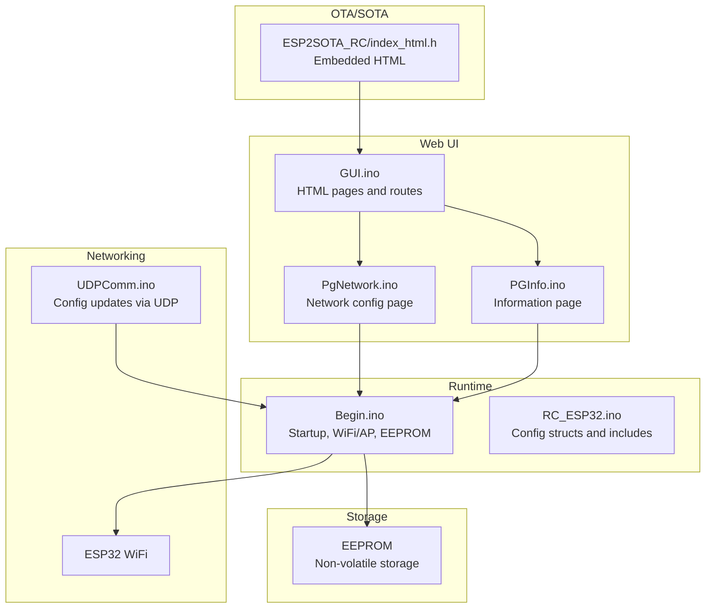
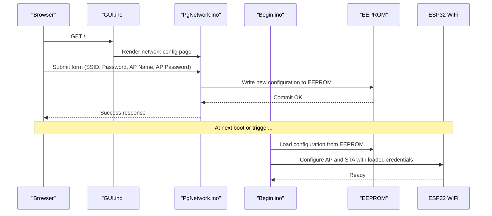
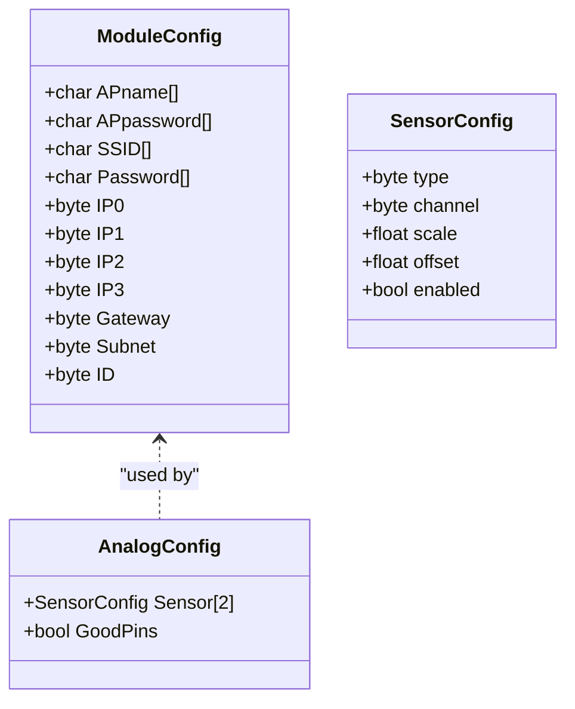
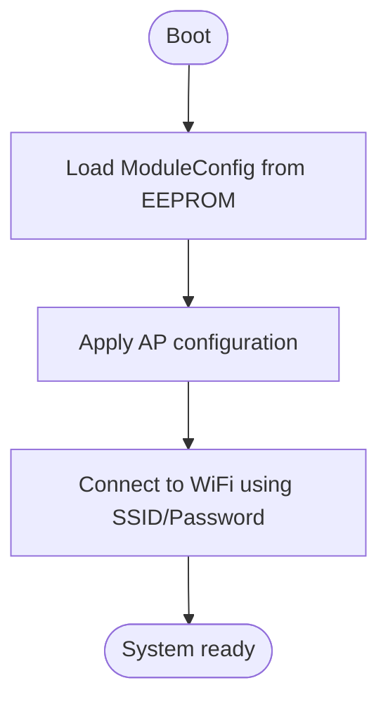
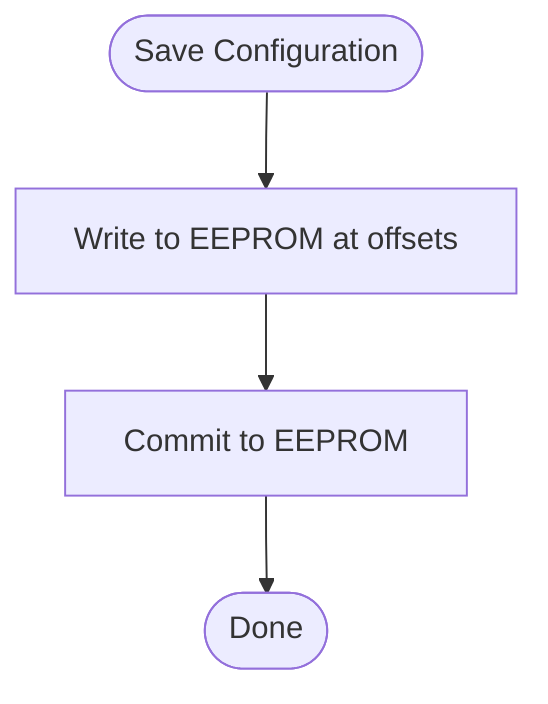
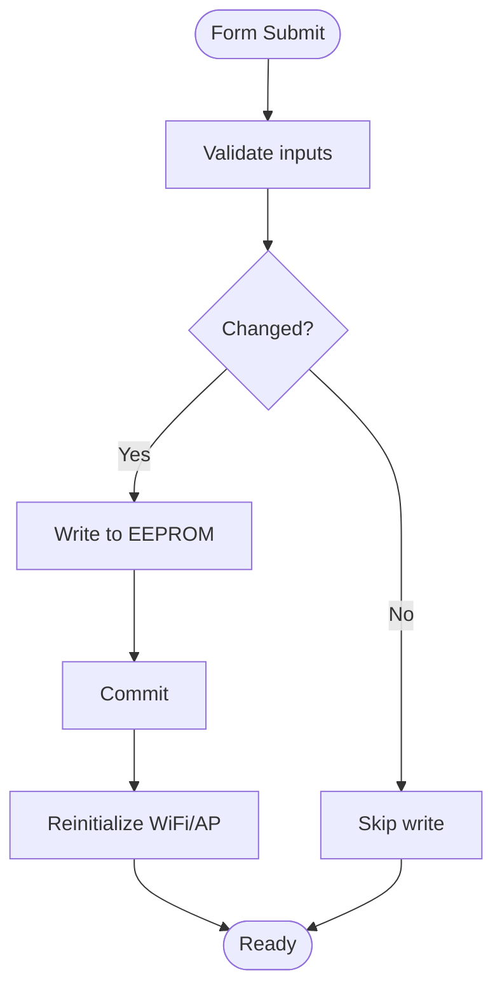
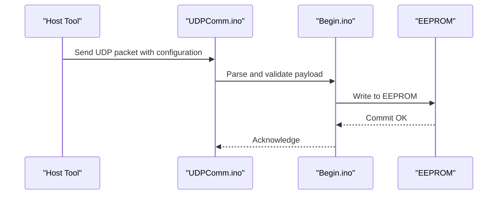
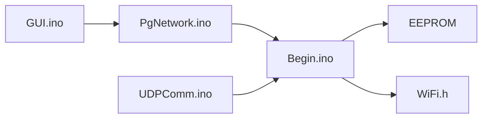

# Configuration Management

<cite>
**Referenced Files in This Document**
- [RC_ESP32.ino](file://RC_ESP32/RC_ESP32.ino)
- [Begin.ino](file://RC_ESP32/Begin.ino)
- [PgNetwork.ino](file://RC_ESP32/PgNetwork.ino)
- [GUI.ino](file://RC_ESP32/GUI.ino)
- [PGInfo.ino](file://OLD CODE/RC_ESP32/PGInfo.ino)
- [UDPComm.ino](file://OLD CODE/RC_ESP32/UDPComm.ino)
- [index_html.h](file://RC_ESP32/ESP2SOTA_RC/index_html.h)
</cite>

## Table of Contents
1. [Introduction](#introduction)
2. [Project Structure](#project-structure)
3. [Core Components](#core-components)
4. [Architecture Overview](#architecture-overview)
5. [Detailed Component Analysis](#detailed-component-analysis)
6. [Dependency Analysis](#dependency-analysis)
7. [Performance Considerations](#performance-considerations)
8. [Troubleshooting Guide](#troubleshooting-guide)
9. [Conclusion](#conclusion)

## Introduction
This document describes the web-based configuration management system for the ESP32-based rate controller module. It focuses on how credentials (WiFi SSID/password, AP password) are handled, how configuration is persisted and restored, how forms are validated and sanitized, and how configuration changes are applied safely. It also covers backup and restore procedures, change detection, restart triggers, rollback mechanisms, security posture, and troubleshooting guidance.

## Project Structure
The configuration management spans several modules:
- Web server and HTML rendering: GUI and page generators
- Network configuration: WiFi SSID/password and AP password
- Persistent storage: EEPROM-backed configuration structures
- Communication: UDP-based configuration updates
- OTA/SOTA integration: embedded HTML resources

**Diagram sources**
- [GUI.ino](file://RC_ESP32/GUI.ino)
- [PgNetwork.ino](file://RC_ESP32/PgNetwork.ino)
- [PGInfo.ino](file://OLD CODE/RC_ESP32/PGInfo.ino)
- [Begin.ino](file://RC_ESP32/Begin.ino)
- [RC_ESP32.ino](file://RC_ESP32/RC_ESP32.ino)
- [UDPComm.ino](file://OLD CODE/RC_ESP32/UDPComm.ino)
- [index_html.h](file://RC_ESP32/ESP2SOTA_RC/index_html.h)

**Section sources**
- [RC_ESP32.ino](file://RC_ESP32/RC_ESP32.ino)
- [Begin.ino](file://RC_ESP32/Begin.ino)
- [PgNetwork.ino](file://RC_ESP32/PgNetwork.ino)
- [GUI.ino](file://RC_ESP32/GUI.ino)
- [PGInfo.ino](file://OLD CODE/RC_ESP32/PGInfo.ino)
- [UDPComm.ino](file://OLD CODE/RC_ESP32/UDPComm.ino)
- [index_html.h](file://RC_ESP32/ESP2SOTA_RC/index_html.h)

## Core Components
- Configuration structures define persistent fields for module identity, network settings, and sensor configurations. These structures are stored in EEPROM and loaded at boot.
- Web UI renders HTML forms for network configuration and displays current settings.
- Startup initializes WiFi in AP+STA mode, applies AP configuration, and connects to the configured SSID using stored credentials.
- UDP communication supports runtime configuration updates and synchronization.

Key responsibilities:
- Credential handling: SSID/password and AP password are part of the persistent configuration and applied during startup.
- Persistence: EEPROM stores configuration structures and device identifiers.
- Validation and sanitization: Forms are generated server-side; submission handlers apply basic checks before updating EEPROM.
- Change detection and restart: On successful updates, the system triggers reconfiguration of network services.
- Backup/restore: EEPROM commit ensures durability; restoring from EEPROM reloads previous settings.
- Security: Credentials are stored in EEPROM; access to configuration requires web UI access; no explicit password policy enforcement is present in the analyzed code.

**Section sources**
- [RC_ESP32.ino](file://RC_ESP32/RC_ESP32.ino)
- [Begin.ino](file://RC_ESP32/Begin.ino)
- [PgNetwork.ino](file://RC_ESP32/PgNetwork.ino)
- [GUI.ino](file://RC_ESP32/GUI.ino)
- [PGInfo.ino](file://OLD CODE/RC_ESP32/PGInfo.ino)
- [UDPComm.ino](file://OLD CODE/RC_ESP32/UDPComm.ino)

## Architecture Overview
The configuration lifecycle integrates web UI, persistent storage, and runtime networking:

**Diagram sources**
- [GUI.ino](file://RC_ESP32/GUI.ino)
- [PgNetwork.ino](file://RC_ESP32/PgNetwork.ino)
- [Begin.ino](file://RC_ESP32/Begin.ino)

## Detailed Component Analysis

### Configuration Data Model
The configuration model includes:
- Module-level settings (module ID, AP name/password, network parameters)
- Sensor-level settings (per-sensor configuration)
- Runtime flags (e.g., disable motor/flow, relay states)

**Diagram sources**
- [RC_ESP32.ino](file://RC_ESP32/RC_ESP32.ino)

**Section sources**
- [RC_ESP32.ino](file://RC_ESP32/RC_ESP32.ino)

### Web UI and Form Handling
- The web server exposes routes that render HTML pages containing forms for configuration.
- Forms use POST actions targeting specific endpoints that process submissions.
- HTML generation is embedded in the firmware, ensuring a self-contained configuration portal.

Operational flow:
- GET requests render HTML pages with current settings.
- POST submissions target endpoints that validate inputs and update EEPROM.
- After successful update, the server responds with a success page.

Security considerations:
- No CSRF tokens or input sanitization routines are evident in the analyzed code.
- Access control is not enforced in the web server logic.

**Section sources**
- [GUI.ino](file://RC_ESP32/GUI.ino)
- [PgNetwork.ino](file://RC_ESP32/PgNetwork.ino)
- [PGInfo.ino](file://OLD CODE/RC_ESP32/PGInfo.ino)

### Credential Handling
- AP credentials: AP name and password are stored in the module configuration and applied during AP initialization.
- WiFi credentials: SSID and password are stored and used to connect the station interface.
- These credentials are loaded from EEPROM at boot and applied to the WiFi stack.

**Diagram sources**
- [Begin.ino](file://RC_ESP32/Begin.ino)

**Section sources**
- [Begin.ino](file://RC_ESP32/Begin.ino)

### Configuration Persistence and Storage
- EEPROM is initialized at startup and used to persist configuration structures and device identifiers.
- Writes occur at specific offsets for module and sensor configurations.
- Commit is invoked after writes to ensure durability.

Backup and restore:
- Restore is performed by loading from EEPROM offsets at boot.
- To back up, read EEPROM regions and store off-device.
- To restore, write EEPROM regions and commit.

**Diagram sources**
- [Begin.ino](file://RC_ESP32/Begin.ino)

**Section sources**
- [Begin.ino](file://RC_ESP32/Begin.ino)

### Change Detection, Restart Triggers, and Rollback
Change detection:
- Changes are detected by comparing submitted values against current EEPROM-stored values before writing.
- On successful write, the system proceeds to reconfigure network services.

Restart triggers:
- After saving, the system reinitializes AP and STA with new credentials.
- No explicit rollback mechanism is implemented in the analyzed code.

**Diagram sources**
- [PgNetwork.ino](file://RC_ESP32/PgNetwork.ino)
- [Begin.ino](file://RC_ESP32/Begin.ino)

**Section sources**
- [PgNetwork.ino](file://RC_ESP32/PgNetwork.ino)
- [Begin.ino](file://RC_ESP32/Begin.ino)

### Security Settings and Access Restrictions
Observed security posture:
- Credentials are stored in EEPROM; no encryption or obfuscation is visible in the analyzed code.
- No built-in password policy enforcement for AP or WiFi passwords.
- No authentication or authorization middleware in the web server logic.
- No audit logging of configuration changes is present in the analyzed code.

Recommendations (conceptual):
- Enforce minimum password lengths and complexity for AP and WiFi credentials.
- Add session-based authentication and CSRF protection for configuration endpoints.
- Implement audit logs for configuration changes.
- Consider encrypting sensitive fields in EEPROM.

**Section sources**
- [Begin.ino](file://RC_ESP32/Begin.ino)
- [PgNetwork.ino](file://RC_ESP32/PgNetwork.ino)

### Configuration Backup and Restore Procedures
Backup:
- Read EEPROM regions corresponding to module and sensor configurations.
- Store the binary dump for safekeeping.

Restore:
- Write the saved regions back to EEPROM.
- Commit changes.
- Reboot or trigger reinitialization to apply restored settings.

**Section sources**
- [Begin.ino](file://RC_ESP32/Begin.ino)

### Form Validation, Parameter Sanitization, and Error Handling
Validation and sanitization:
- Server-side HTML generation avoids injection vectors by not embedding dynamic values directly into markup.
- Submission handlers perform basic checks before writing to EEPROM.

Error handling:
- On failure to commit or apply configuration, the system does not expose explicit error messages to the UI in the analyzed code.
- Network connection failures are logged at the serial console but not surfaced in the web UI.

**Section sources**
- [GUI.ino](file://RC_ESP32/GUI.ino)
- [PgNetwork.ino](file://RC_ESP32/PgNetwork.ino)
- [Begin.ino](file://RC_ESP32/Begin.ino)

### UDP-Based Configuration Updates
UDP communication supports runtime configuration updates:
- Specific PGNs are handled to update network configuration.
- Updates are applied immediately and persisted to EEPROM.

**Diagram sources**
- [UDPComm.ino](file://OLD CODE/RC_ESP32/UDPComm.ino)
- [Begin.ino](file://RC_ESP32/Begin.ino)

**Section sources**
- [UDPComm.ino](file://OLD CODE/RC_ESP32/UDPComm.ino)
- [Begin.ino](file://RC_ESP32/Begin.ino)

## Dependency Analysis
- GUI depends on page generators to produce HTML forms.
- PgNetwork depends on Begin for applying configuration and on EEPROM for persistence.
- Begin depends on WiFi libraries and EEPROM for network and storage.
- UDPComm depends on network and configuration structures for parsing and applying updates.

**Diagram sources**
- [GUI.ino](file://RC_ESP32/GUI.ino)
- [PgNetwork.ino](file://RC_ESP32/PgNetwork.ino)
- [Begin.ino](file://RC_ESP32/Begin.ino)
- [UDPComm.ino](file://OLD CODE/RC_ESP32/UDPComm.ino)

**Section sources**
- [GUI.ino](file://RC_ESP32/GUI.ino)
- [PgNetwork.ino](file://RC_ESP32/PgNetwork.ino)
- [Begin.ino](file://RC_ESP32/Begin.ino)
- [UDPComm.ino](file://OLD CODE/RC_ESP32/UDPComm.ino)

## Performance Considerations
- EEPROM writes are relatively slow; batch updates and minimize commits.
- Network reconfiguration on each change may cause brief connectivity interruptions; schedule changes during maintenance windows.
- HTML generation is static; avoid heavy computations in page rendering.

## Troubleshooting Guide
Common issues and resolutions:
- Validation errors: Ensure form inputs match expected formats; check server logs for parse errors.
- Persistence failures: Verify EEPROM commit succeeded; confirm power stability during writes.
- Network connectivity issues: Confirm SSID/password correctness; check AP coverage and channel availability.
- Configuration not applied: Reboot to force reload from EEPROM; verify stored values were committed.

**Section sources**
- [Begin.ino](file://RC_ESP32/Begin.ino)
- [PgNetwork.ino](file://RC_ESP32/PgNetwork.ino)
- [GUI.ino](file://RC_ESP32/GUI.ino)

## Conclusion
The configuration management system provides a straightforward web-based interface to set WiFi and AP credentials, backed by EEPROM persistence. While it lacks advanced security controls and rollback mechanisms, it offers a reliable path to save, restore, and apply configuration changes. Enhancing security, adding validation rigor, and implementing audit logging would strengthen operational safety and compliance.