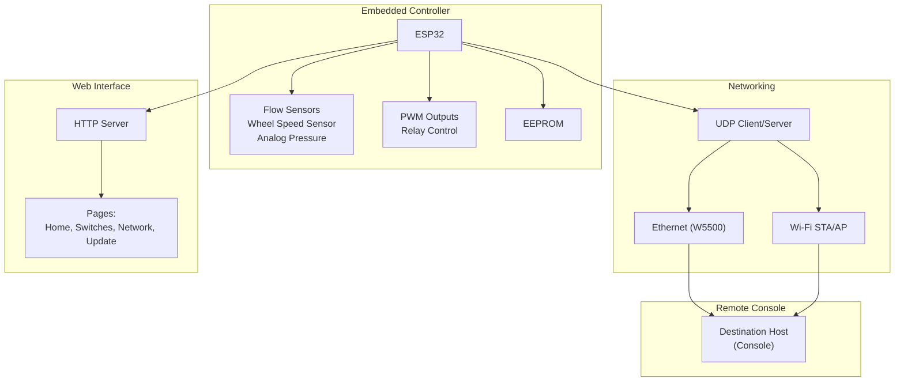
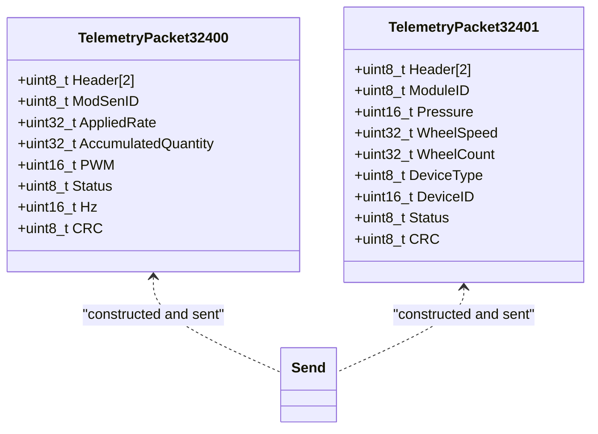
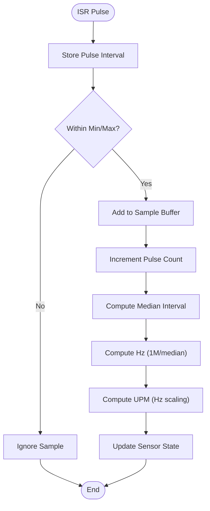
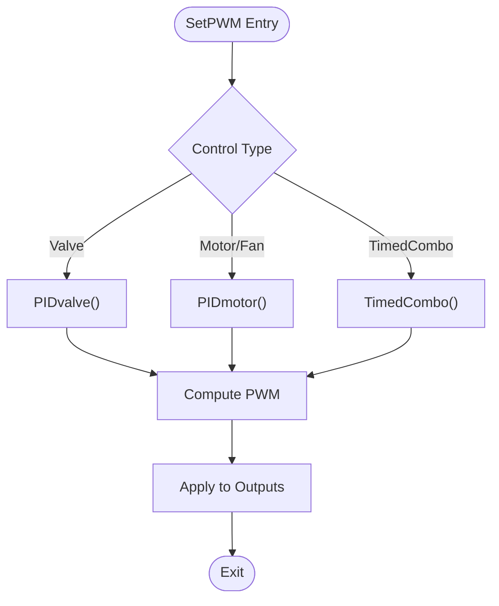
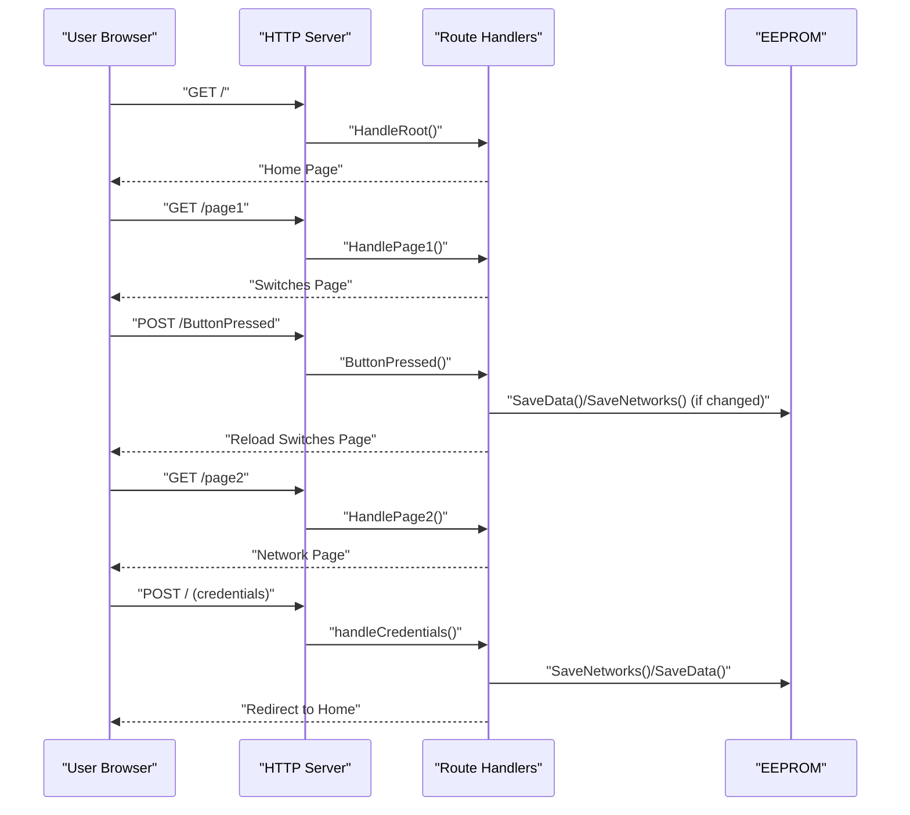
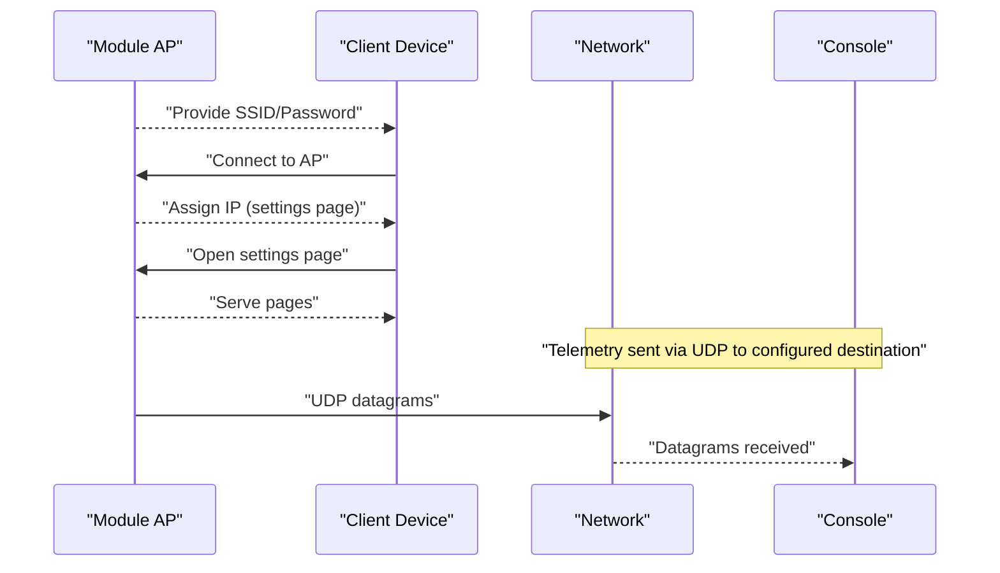
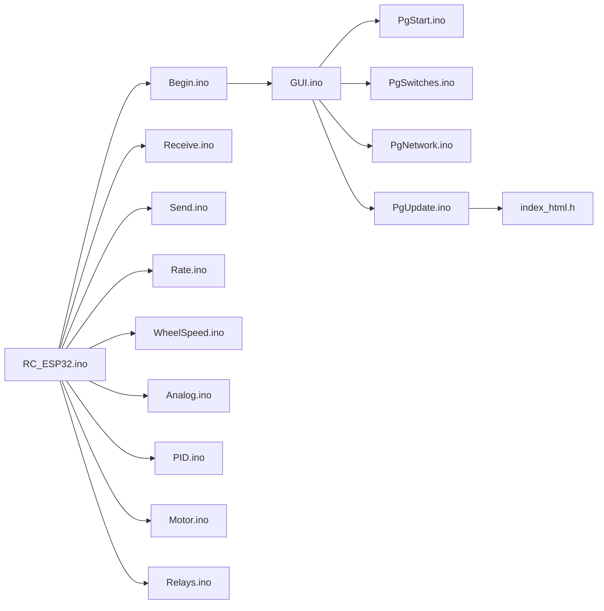

# Remote Monitoring and Telemetry

<cite>
**Referenced Files in This Document**
- [RC_ESP32.ino](file://RC_ESP32/RC_ESP32.ino)
- [Begin.ino](file://RC_ESP32/Begin.ino)
- [Receive.ino](file://RC_ESP32/Receive.ino)
- [Send.ino](file://RC_ESP32/Send.ino)
- [Rate.ino](file://RC_ESP32/Rate.ino)
- [WheelSpeed.ino](file://RC_ESP32/WheelSpeed.ino)
- [Analog.ino](file://RC_ESP32/Analog.ino)
- [PID.ino](file://RC_ESP32/PID.ino)
- [Motor.ino](file://RC_ESP32/Motor.ino)
- [Relays.ino](file://RC_ESP32/Relays.ino)
- [PgStart.ino](file://RC_ESP32/PgStart.ino)
- [PgSwitches.ino](file://RC_ESP32/PgSwitches.ino)
- [PgNetwork.ino](file://RC_ESP32/PgNetwork.ino)
- [GUI.ino](file://RC_ESP32/GUI.ino)
- [PgUpdate.ino](file://RC_ESP32/PgUpdate.ino)
- [index_html.h](file://RC_ESP32/ESP2SOTA_RC/index_html.h)
</cite>

## Table of Contents
1. [Introduction](#introduction)
2. [Project Structure](#project-structure)
3. [Core Components](#core-components)
4. [Architecture Overview](#architecture-overview)
5. [Detailed Component Analysis](#detailed-component-analysis)
6. [Dependency Analysis](#dependency-analysis)
7. [Performance Considerations](#performance-considerations)
8. [Troubleshooting Guide](#troubleshooting-guide)
9. [Conclusion](#conclusion)
10. [Appendices](#appendices)

## Introduction
This document explains the remote monitoring and telemetry capabilities of the ESP32-based rate control module. It covers real-time data display, telemetry collection and presentation, status indicators, trend visualization, alert notifications, remote access and session management, data refresh and bandwidth considerations, and security measures. The system provides a local web interface for configuration and monitoring, while also streaming operational telemetry via UDP to a remote operator console.

## Project Structure
The module is organized around a central control loop that handles sensor data acquisition, control logic, actuator output, and telemetry transmission. A lightweight web server serves configuration pages and firmware update functionality. Network telemetry is transmitted over UDP to a destination IP/port, supporting both Ethernet and Wi-Fi paths.



**Diagram sources**
- [Begin.ino:87-122](file://RC_ESP32/Begin.ino#L87-L122)
- [Begin.ino:173-207](file://RC_ESP32/Begin.ino#L173-L207)
- [Send.ino:1-92](file://RC_ESP32/Send.ino#L1-L92)
- [PgStart.ino:1-148](file://RC_ESP32/PgStart.ino#L1-L148)
- [PgSwitches.ino:1-132](file://RC_ESP32/PgSwitches.ino#L1-L132)
- [PgNetwork.ino:1-155](file://RC_ESP32/PgNetwork.ino#L1-L155)
- [PgUpdate.ino:1-111](file://RC_ESP32/PgUpdate.ino#L1-L111)

**Section sources**
- [Begin.ino:87-122](file://RC_ESP32/Begin.ino#L87-L122)
- [Begin.ino:173-207](file://RC_ESP32/Begin.ino#L173-L207)
- [PgStart.ino:1-148](file://RC_ESP32/PgStart.ino#L1-L148)

## Core Components
- Telemetry data model: Two primary telemetry packets are produced periodically:
  - Packet 32400: Per-sensor telemetry including applied rate, accumulated quantity, PWM, sensor-connected status, and Hz.
  - Packet 32401: Module-wide telemetry including pressure, wheel speed/count, device identity, and status flags.
- Data collection pipeline: Interrupt-driven pulse counting, median filtering, and derived rate computation; optional wheel speed and analog pressure readings.
- Control loop: PID-based control for valves/motors/fans, timed combo logic, and relay switching.
- Web interface: Home page, switches page, network configuration page, and firmware update page served locally.
- Network transport: UDP unicast/multicast to a configured destination IP/port over Ethernet or Wi-Fi.

**Section sources**
- [Send.ino:1-195](file://RC_ESP32/Send.ino#L1-L195)
- [Rate.ino:1-106](file://RC_ESP32/Rate.ino#L1-L106)
- [WheelSpeed.ino:1-71](file://RC_ESP32/WheelSpeed.ino#L1-L71)
- [Analog.ino:1-70](file://RC_ESP32/Analog.ino#L1-L70)
- [PID.ino:1-232](file://RC_ESP32/PID.ino#L1-L232)
- [Motor.ino:1-76](file://RC_ESP32/Motor.ino#L1-L76)
- [Relays.ino:1-282](file://RC_ESP32/Relays.ino#L1-L282)
- [PgStart.ino:1-148](file://RC_ESP32/PgStart.ino#L1-L148)
- [PgSwitches.ino:1-132](file://RC_ESP32/PgSwitches.ino#L1-L132)
- [PgNetwork.ino:1-155](file://RC_ESP32/PgNetwork.ino#L1-L155)
- [PgUpdate.ino:1-111](file://RC_ESP32/PgUpdate.ino#L1-L111)

## Architecture Overview
The embedded controller orchestrates sensor sampling, control logic, actuation, and telemetry. The web server exposes configuration pages and supports firmware updates. Telemetry is broadcast via UDP to a remote console.

```mermaid
sequenceDiagram
participant Loop as "Main Loop"
participant ISR as "Pulse ISRs"
participant Rate as "Rate Computation"
participant PID as "PID Control"
participant Motor as "Actuator Output"
participant Net as "UDP Transport"
participant Dest as "Remote Console"
Loop->>ISR : "Periodic interrupts"
ISR-->>Rate : "Pulse time samples"
Rate-->>PID : "Computed UPM/HZ"
PID-->>Motor : "Target PWM"
Motor-->>Net : "Telemetry Packets (32400/32401)"
Net-->>Dest : "UDP datagrams"
```

**Diagram sources**
- [RC_ESP32.ino:255-280](file://RC_ESP32/RC_ESP32.ino#L255-L280)
- [Rate.ino:14-74](file://RC_ESP32/Rate.ino#L14-L74)
- [PID.ino:25-67](file://RC_ESP32/PID.ino#L25-L67)
- [Motor.ino:2-29](file://RC_ESP32/Motor.ino#L2-L29)
- [Send.ino:1-92](file://RC_ESP32/Send.ino#L1-L92)

## Detailed Component Analysis

### Telemetry Data Model and Transmission
- Packet 32400 (per-sensor):
  - Fields: header, module/sensor ID, applied rate (scaled), accumulated quantity (scaled), PWM, status, Hz (scaled), CRC.
  - Emitted every SendTime interval.
- Packet 32401 (module-wide):
  - Fields: header, module ID, pressure, wheel speed, wheel count, device type/ID, status flags, CRC.
  - Emitted every SendTime interval.
- Transport:
  - Ethernet path preferred if link is up; otherwise Wi-Fi path to a destination IP/port.
  - CRC ensures integrity on both incoming and outgoing packets.



**Diagram sources**
- [Send.ino:7-92](file://RC_ESP32/Send.ino#L7-L92)
- [Send.ino:93-195](file://RC_ESP32/Send.ino#L93-L195)

**Section sources**
- [Send.ino:1-195](file://RC_ESP32/Send.ino#L1-L195)

### Data Collection and Processing
- Pulse counting:
  - Interrupt handlers capture pulse intervals and maintain a sliding window of samples.
  - Median filtering reduces noise; derived Hz and UPM computed with smoothing.
- Wheel speed:
  - Dedicated ISR and sampling for wheel-mounted sensor; median filter and calibration-derived speed.
- Analog pressure:
  - Optional ADS1115 ADC or ESP32 analog pin; continuous conversion scheduling and pending-read handling.



**Diagram sources**
- [Rate.ino:14-74](file://RC_ESP32/Rate.ino#L14-L74)
- [WheelSpeed.ino:15-69](file://RC_ESP32/WheelSpeed.ino#L15-L69)

**Section sources**
- [Rate.ino:1-106](file://RC_ESP32/Rate.ino#L1-L106)
- [WheelSpeed.ino:1-71](file://RC_ESP32/WheelSpeed.ino#L1-L71)
- [Analog.ino:1-70](file://RC_ESP32/Analog.ino#L1-L70)

### Control Logic and Actuation
- Control modes:
  - Valve PID control with deadband, integral limit, brake point, and slew rate.
  - Motor/Fan PID with additional slew limiting.
  - Timed combo control alternating adjustment/pause windows.
- Actuation:
  - PWM generation with direction control; support for multiple actuator architectures.
  - Relay control via onboard/remote I/O expanders or GPIOs.



**Diagram sources**
- [PID.ino:25-67](file://RC_ESP32/PID.ino#L25-L67)
- [PID.ino:69-126](file://RC_ESP32/PID.ino#L69-L126)
- [PID.ino:128-178](file://RC_ESP32/PID.ino#L128-L178)
- [PID.ino:180-231](file://RC_ESP32/PID.ino#L180-L231)
- [Motor.ino:31-60](file://RC_ESP32/Motor.ino#L31-L60)

**Section sources**
- [PID.ino:1-232](file://RC_ESP32/PID.ino#L1-L232)
- [Motor.ino:1-76](file://RC_ESP32/Motor.ino#L1-L76)
- [Relays.ino:1-282](file://RC_ESP32/Relays.ino#L1-L282)

### Web Interface and Session Management
- Pages:
  - Home page links to Switches, Network, and Update pages.
  - Switches page toggles relays and master switch with a timeout.
  - Network page configures Wi-Fi credentials, AP password, and connection mode.
  - Update page supports OTA firmware updates.
- Session management:
  - Short-lived Wi-Fi relay control session (30 seconds) after user interaction.
  - Automatic restart on network or AP changes requiring reconfiguration.



**Diagram sources**
- [PgStart.ino:1-148](file://RC_ESP32/PgStart.ino#L1-L148)
- [PgSwitches.ino:1-132](file://RC_ESP32/PgSwitches.ino#L1-L132)
- [PgNetwork.ino:1-155](file://RC_ESP32/PgNetwork.ino#L1-L155)
- [GUI.ino:1-104](file://RC_ESP32/GUI.ino#L1-L104)
- [PgUpdate.ino:1-111](file://RC_ESP32/PgUpdate.ino#L1-L111)
- [index_html.h:1-34](file://RC_ESP32/ESP2SOTA_RC/index_html.h#L1-L34)

**Section sources**
- [GUI.ino:1-104](file://RC_ESP32/GUI.ino#L1-L104)
- [PgSwitches.ino:1-132](file://RC_ESP32/PgSwitches.ino#L1-L132)
- [PgNetwork.ino:1-155](file://RC_ESP32/PgNetwork.ino#L1-L155)
- [PgUpdate.ino:1-111](file://RC_ESP32/PgUpdate.ino#L1-L111)
- [index_html.h:1-34](file://RC_ESP32/ESP2SOTA_RC/index_html.h#L1-L34)

### Remote Access Procedures and Connection Establishment
- Initial access:
  - Connect to the module’s Access Point with the configured SSID and password.
  - Navigate to the settings page IP shown during boot.
- Station mode:
  - Optionally connect the module to an existing Wi-Fi network; the module attempts reconnection on disconnect.
- Destination configuration:
  - Telemetry is sent to a configured subnet broadcast or specific IP/port; a dedicated packet allows dynamic subnet changes.



**Diagram sources**
- [Begin.ino:173-207](file://RC_ESP32/Begin.ino#L173-L207)
- [Begin.ino:243-254](file://RC_ESP32/Begin.ino#L243-L254)
- [Send.ino:72-91](file://RC_ESP32/Send.ino#L72-L91)
- [Receive.ino:222-244](file://RC_ESP32/Receive.ino#L222-L244)

**Section sources**
- [Begin.ino:173-207](file://RC_ESP32/Begin.ino#L173-L207)
- [Begin.ino:243-254](file://RC_ESP32/Begin.ino#L243-L254)
- [Send.ino:72-91](file://RC_ESP32/Send.ino#L72-L91)
- [Receive.ino:222-244](file://RC_ESP32/Receive.ino#L222-L244)

### Status Indicators and Alert Notifications
- Status flags included in telemetry:
  - Sensor connected, work switch state, Wi-Fi RSSI thresholds, Ethernet link status, pin configuration validity, and 3-wire relay mode.
- Local UI indicators:
  - Buttons reflect relay states with “on”/“off” styles.
  - Network page displays current Wi-Fi connection status.
- Alerts:
  - Wi-Fi disconnection triggers automatic fallback to AP-only mode after repeated failures.
  - Sensor connectivity loss disables control and enables safe relay states.

**Section sources**
- [Send.ino:140-168](file://RC_ESP32/Send.ino#L140-L168)
- [PgSwitches.ino:112-126](file://RC_ESP32/PgSwitches.ino#L112-L126)
- [PgNetwork.ino:124-134](file://RC_ESP32/PgNetwork.ino#L124-L134)
- [RC_ESP32.ino:227-244](file://RC_ESP32/RC_ESP32.ino#L227-L244)
- [Relays.ino:51-57](file://RC_ESP32/Relays.ino#L51-L57)

### Data Refresh Mechanisms, Polling Intervals, and Bandwidth
- Control loop cadence:
  - Main loop runs at approximately 20 Hz (50 ms).
- Telemetry emission:
  - Telemetry packets emitted every 200 ms.
- UDP bandwidth:
  - Each sensor emits ~15 bytes; module-wide packet ~15 bytes; periodic emissions reduce overhead.
- Network selection:
  - Prefer Ethernet when available; otherwise fall back to Wi-Fi.

**Section sources**
- [RC_ESP32.ino:179-182](file://RC_ESP32/RC_ESP32.ino#L179-L182)
- [Send.ino:3-4](file://RC_ESP32/Send.ino#L3-L4)
- [Send.ino:72-91](file://RC_ESP32/Send.ino#L72-L91)

### Monitoring Security
- Authentication and access control:
  - Wi-Fi AP supports WPA2-PSK with a minimum password length; shorter passwords disable encryption.
  - Network credentials are configurable via the web interface.
- Encrypted communications:
  - No TLS/SSL is implemented for telemetry or web interface; use wired Ethernet or secure Wi-Fi networks.
- Operational safeguards:
  - On sensor disconnect, control is disabled and relays revert to safe states.

**Section sources**
- [Begin.ino:194-203](file://RC_ESP32/Begin.ino#L194-L203)
- [PgNetwork.ino:138-144](file://RC_ESP32/PgNetwork.ino#L138-L144)
- [RC_ESP32.ino:227-244](file://RC_ESP32/RC_ESP32.ino#L227-L244)
- [Relays.ino:51-57](file://RC_ESP32/Relays.ino#L51-L57)

## Dependency Analysis
The system exhibits layered dependencies: hardware abstraction (sensors, actuators, networking) and application logic (control, telemetry, web server). The main loop coordinates all subsystems.



**Diagram sources**
- [RC_ESP32.ino:1-418](file://RC_ESP32/RC_ESP32.ino#L1-L418)
- [Begin.ino:1-769](file://RC_ESP32/Begin.ino#L1-L769)
- [GUI.ino:1-104](file://RC_ESP32/GUI.ino#L1-L104)

**Section sources**
- [RC_ESP32.ino:1-418](file://RC_ESP32/RC_ESP32.ino#L1-L418)
- [Begin.ino:1-769](file://RC_ESP32/Begin.ino#L1-L769)
- [GUI.ino:1-104](file://RC_ESP32/GUI.ino#L1-L104)

## Performance Considerations
- Sampling and filtering:
  - Median filtering reduces noise but increases memory usage proportional to sample size; adjust PulseSampleSize judiciously.
- Control stability:
  - Deadband prevents oscillation; integral limit and slew rate protect actuators.
- Network efficiency:
  - UDP avoids handshakes; CRC adds minimal overhead.
- Power and reliability:
  - Safe relay states on disconnect prevent unintended operation.

[No sources needed since this section provides general guidance]

## Troubleshooting Guide
- Connection drops:
  - Wi-Fi disconnects trigger reconnection attempts; if persistent, module falls back to AP-only mode.
  - Verify AP credentials and ensure the AP password meets minimum length requirements.
- Data delays or missing telemetry:
  - Confirm Ethernet link status; if Ethernet is down, telemetry uses Wi-Fi.
  - Check destination IP/port configuration and firewall rules.
- Display problems:
  - Reload the page; ensure the browser is not blocking pop-ups or redirects.
  - Use the “Back” links to navigate between pages.
- Sensor not responding:
  - Confirm pulse wiring and pin assignments; verify sensor connectivity flags in telemetry.
  - Check wheel speed pin uniqueness and calibration.
- Relay control issues:
  - Validate relay driver presence and I2C addresses; confirm inversion settings.

**Section sources**
- [RC_ESP32.ino:227-244](file://RC_ESP32/RC_ESP32.ino#L227-L244)
- [PgNetwork.ino:138-144](file://RC_ESP32/PgNetwork.ino#L138-L144)
- [Send.ino:72-91](file://RC_ESP32/Send.ino#L72-L91)
- [Begin.ino:173-207](file://RC_ESP32/Begin.ino#L173-L207)
- [Begin.ino:513-562](file://RC_ESP32/Begin.ino#L513-L562)

## Conclusion
The ESP32 rate control module provides robust remote monitoring and telemetry through a compact embedded system. Real-time operational parameters are computed and transmitted via UDP, while a local web interface enables configuration and diagnostics. Operational safety is ensured through controlled actuation and fail-safe relay states. For production deployments, secure network placement and appropriate access controls are recommended.

[No sources needed since this section summarizes without analyzing specific files]

## Appendices
- Configuration persistence:
  - Settings are stored in EEPROM with identifiers and validation routines.
- Firmware update:
  - OTA update page integrates with ESP2SOTA library for seamless upgrades.

**Section sources**
- [Begin.ino:513-562](file://RC_ESP32/Begin.ino#L513-L562)
- [PgUpdate.ino:1-111](file://RC_ESP32/PgUpdate.ino#L1-L111)
- [index_html.h:1-34](file://RC_ESP32/ESP2SOTA_RC/index_html.h#L1-L34)