# Web Interface and Configuration

<cite>
**Referenced Files in This Document**
- [RC_ESP32.ino](file://RC_ESP32/RC_ESP32.ino)
- [Begin.ino](file://RC_ESP32/Begin.ino)
- [GUI.ino](file://RC_ESP32/GUI.ino)
- [PgStart.ino](file://RC_ESP32/PgStart.ino)
- [PgSwitches.ino](file://RC_ESP32/PgSwitches.ino)
- [PgNetwork.ino](file://RC_ESP32/PgNetwork.ino)
- [PgUpdate.ino](file://RC_ESP32/PgUpdate.ino)
- [Receive.ino](file://RC_ESP32/Receive.ino)
- [Send.ino](file://RC_ESP32/Send.ino)
- [ESP2SOTA_RC.h](file://RC_ESP32/ESP2SOTA_RC/ESP2SOTA_RC.h)
- [PCA95x5_RC.h](file://RC_ESP32/PCA95x5_RC.h)
</cite>

## Table of Contents
1. [Introduction](#introduction)
2. [Project Structure](#project-structure)
3. [Core Components](#core-components)
4. [Architecture Overview](#architecture-overview)
5. [Detailed Component Analysis](#detailed-component-analysis)
6. [Dependency Analysis](#dependency-analysis)
7. [Performance Considerations](#performance-considerations)
8. [Troubleshooting Guide](#troubleshooting-guide)
9. [Conclusion](#conclusion)
10. [Appendices](#appendices)

## Introduction
This document describes the built-in web interface for the ESP32 Rate Control configuration system. It explains how the ESP32 serves HTML pages, handles HTTP requests, manages user interactions, persists configuration changes, and communicates telemetry back to a remote operator console. It also covers customization options, mobile support, security considerations, and troubleshooting guidance.

## Project Structure
The web interface is implemented within the ESP32 firmware using the Arduino framework and the ESP32 WebServer library. Pages are generated dynamically by functions that assemble HTML strings with embedded CSS and JavaScript. Routing is handled by registering handlers for specific paths, and configuration is persisted to EEPROM.

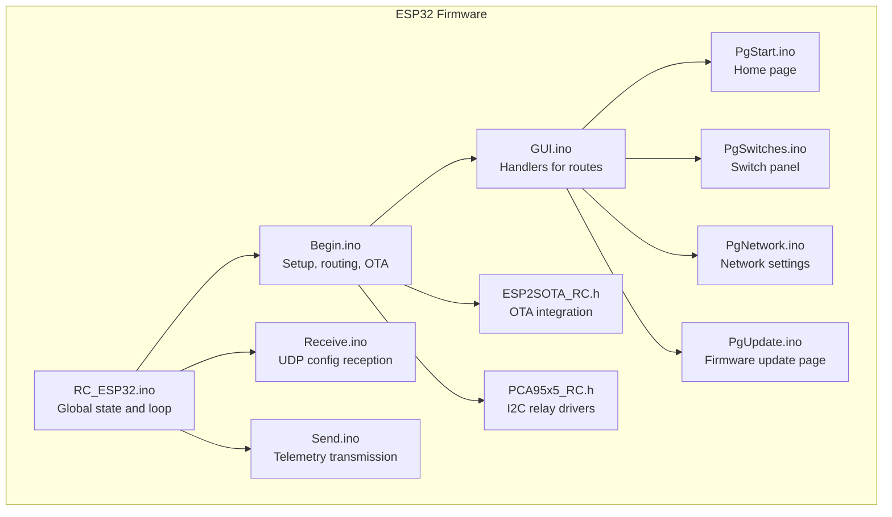

**Diagram sources**
- [RC_ESP32.ino:250-280](file://RC_ESP32/RC_ESP32.ino#L250-L280)
- [Begin.ino:219-239](file://RC_ESP32/Begin.ino#L219-L239)
- [GUI.ino:1-104](file://RC_ESP32/GUI.ino#L1-L104)
- [PgStart.ino:1-148](file://RC_ESP32/PgStart.ino#L1-L148)
- [PgSwitches.ino:1-132](file://RC_ESP32/PgSwitches.ino#L1-L132)
- [PgNetwork.ino:1-155](file://RC_ESP32/PgNetwork.ino#L1-L155)
- [PgUpdate.ino:1-111](file://RC_ESP32/PgUpdate.ino#L1-L111)
- [Receive.ino:1-346](file://RC_ESP32/Receive.ino#L1-L346)
- [Send.ino:1-195](file://RC_ESP32/Send.ino#L1-L195)
- [ESP2SOTA_RC.h:1-34](file://RC_ESP32/ESP2SOTA_RC/ESP2SOTA_RC.h#L1-L34)
- [PCA95x5_RC.h:1-178](file://RC_ESP32/PCA95x5_RC.h#L1-L178)

**Section sources**
- [RC_ESP32.ino:250-280](file://RC_ESP32/RC_ESP32.ino#L250-L280)
- [Begin.ino:219-239](file://RC_ESP32/Begin.ino#L219-L239)

## Core Components
- Built-in Web Server: Initializes the HTTP server, registers routes, and integrates OTA firmware updates.
- Page Generators: Functions that construct HTML pages for Home, Switch Panel, Network Settings, and Firmware Update.
- Request Handlers: Route-specific handlers process form submissions, toggle buttons, and save configuration changes.
- Configuration Persistence: EEPROM-backed storage for module and network settings, validated and restored on boot.
- Telemetry Sender: Periodically transmits operational metrics and status to a remote operator console via UDP.
- Configuration Receiver: Parses incoming UDP packets to apply remote control settings, relay assignments, and module configuration.

**Section sources**
- [Begin.ino:219-239](file://RC_ESP32/Begin.ino#L219-L239)
- [PgStart.ino:1-148](file://RC_ESP32/PgStart.ino#L1-L148)
- [PgSwitches.ino:1-132](file://RC_ESP32/PgSwitches.ino#L1-L132)
- [PgNetwork.ino:1-155](file://RC_ESP32/PgNetwork.ino#L1-L155)
- [PgUpdate.ino:1-111](file://RC_ESP32/PgUpdate.ino#L1-L111)
- [GUI.ino:1-104](file://RC_ESP32/GUI.ino#L1-L104)
- [Receive.ino:29-343](file://RC_ESP32/Receive.ino#L29-L343)
- [Send.ino:1-195](file://RC_ESP32/Send.ino#L1-L195)

## Architecture Overview
The system combines a lightweight HTTP server with embedded HTML/CSS/JS pages and a UDP-based telemetry/control channel. The server exposes four primary routes: home, switches, network, and firmware update. Configuration changes are applied immediately and persisted to EEPROM. Remote operator commands are received via UDP and reflected in the UI state.

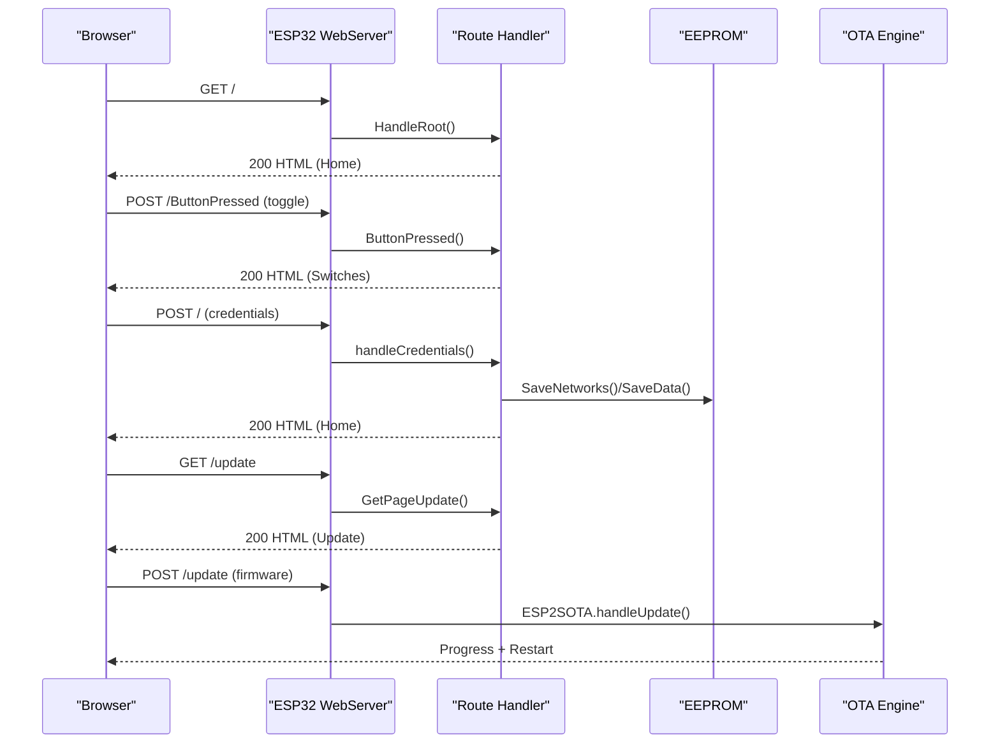

**Diagram sources**
- [Begin.ino:219-239](file://RC_ESP32/Begin.ino#L219-L239)
- [GUI.ino:1-104](file://RC_ESP32/GUI.ino#L1-L104)
- [PgUpdate.ino:1-111](file://RC_ESP32/PgUpdate.ino#L1-L111)
- [Begin.ino:238-239](file://RC_ESP32/Begin.ino#L238-L239)
- [ESP2SOTA_RC.h:15-32](file://RC_ESP32/ESP2SOTA_RC/ESP2SOTA_RC.h#L15-L32)

## Detailed Component Analysis

### Built-in Web Server and Routing
- Initializes the HTTP server on port 80 and registers routes for "/" (home), "/page1" (switches), "/page2" (network), "/ButtonPressed", and OTA update handler.
- Registers captive portal placeholders to aid device connectivity detection.
- Integrates OTA update capability via ESP2SOTA.

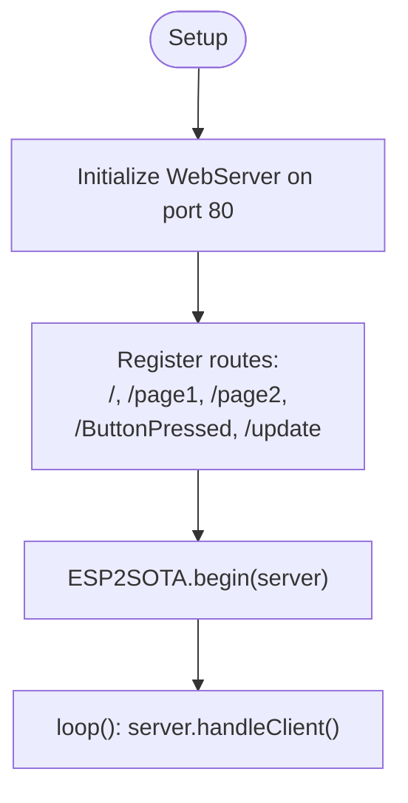

**Diagram sources**
- [Begin.ino:219-239](file://RC_ESP32/Begin.ino#L219-L239)
- [Begin.ino:238-239](file://RC_ESP32/Begin.ino#L238-L239)

**Section sources**
- [Begin.ino:219-239](file://RC_ESP32/Begin.ino#L219-L239)

### Home Page Generation
- Renders the main dashboard with links to Switches, Network, and Firmware Update.
- Includes firmware version derived from compile-time constants.

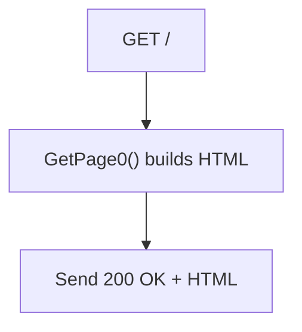

**Diagram sources**
- [PgStart.ino:1-148](file://RC_ESP32/PgStart.ino#L1-L148)

**Section sources**
- [PgStart.ino:1-148](file://RC_ESP32/PgStart.ino#L1-L148)

### Switch Panel Page and Interaction
- Presents a toggle panel with a Master switch and 16 individual section switches.
- Uses styled submit buttons to toggle states and refreshes the page after each click.
- Button state toggles are tracked in memory and reflected in the rendered page.

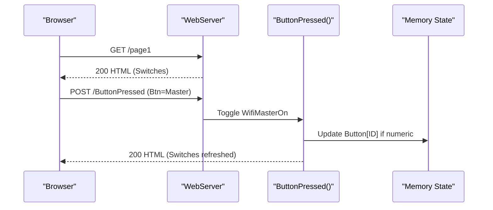

**Diagram sources**
- [PgSwitches.ino:1-132](file://RC_ESP32/PgSwitches.ino#L1-L132)
- [GUI.ino:81-99](file://RC_ESP32/GUI.ino#L81-L99)

**Section sources**
- [PgSwitches.ino:1-132](file://RC_ESP32/PgSwitches.ino#L1-L132)
- [GUI.ino:81-99](file://RC_ESP32/GUI.ino#L81-L99)

### Network Configuration Page and Validation
- Provides fields for SSID, password, and an optional Access Point password.
- Applies constraints to AP password length and trims inputs.
- Persists network settings to EEPROM and restarts if changes are detected.

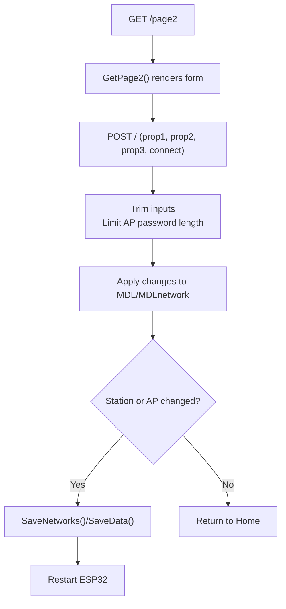

**Diagram sources**
- [PgNetwork.ino:1-155](file://RC_ESP32/PgNetwork.ino#L1-L155)
- [GUI.ino:25-79](file://RC_ESP32/GUI.ino#L25-L79)

**Section sources**
- [PgNetwork.ino:1-155](file://RC_ESP32/PgNetwork.ino#L1-L155)
- [GUI.ino:25-79](file://RC_ESP32/GUI.ino#L25-L79)

### Firmware Update Page and OTA
- Provides a file upload form with progress feedback.
- Integrates ESP2SOTA for over-the-air firmware updates.

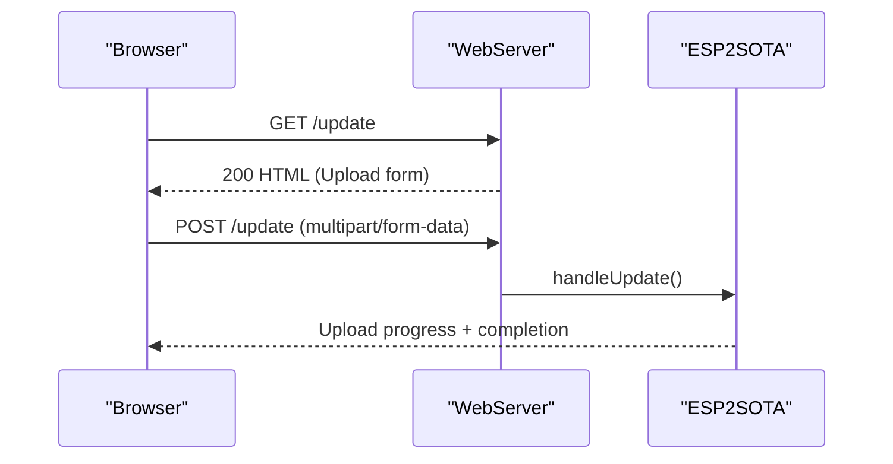

**Diagram sources**
- [PgUpdate.ino:1-111](file://RC_ESP32/PgUpdate.ino#L1-L111)
- [Begin.ino:238-239](file://RC_ESP32/Begin.ino#L238-L239)
- [ESP2SOTA_RC.h:15-32](file://RC_ESP32/ESP2SOTA_RC/ESP2SOTA_RC.h#L15-L32)

**Section sources**
- [PgUpdate.ino:1-111](file://RC_ESP32/PgUpdate.ino#L1-L111)
- [Begin.ino:238-239](file://RC_ESP32/Begin.ino#L238-L239)
- [ESP2SOTA_RC.h:1-34](file://RC_ESP32/ESP2SOTA_RC/ESP2SOTA_RC.h#L1-L34)

### Configuration Management and Persistence
- EEPROM layout stores module configuration, per-sensor settings, and network settings.
- On boot, data is loaded and validated; defaults are applied if invalid.
- Changes from the UI trigger immediate saves to EEPROM.

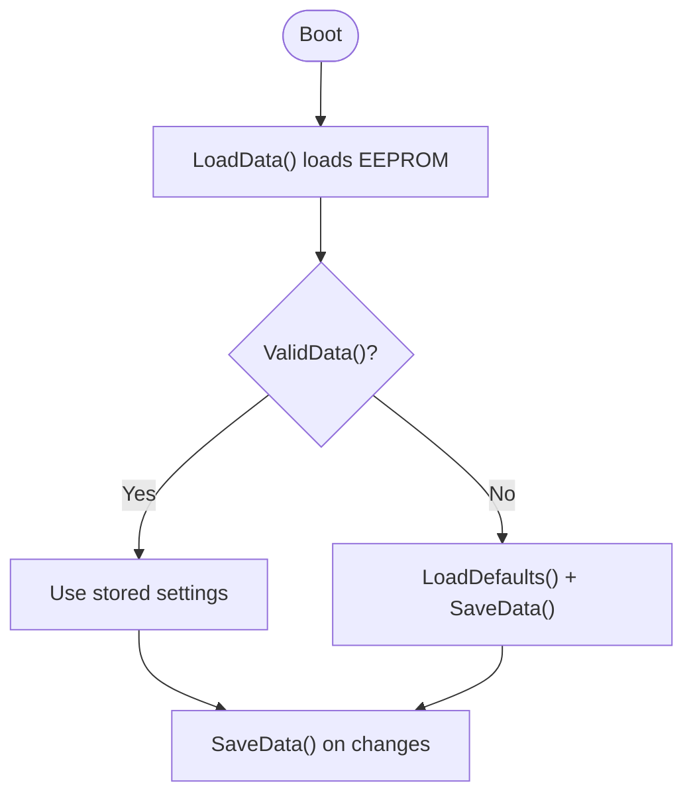

**Diagram sources**
- [Begin.ino:521-562](file://RC_ESP32/Begin.ino#L521-L562)
- [Begin.ino:621-736](file://RC_ESP32/Begin.ino#L621-L736)

**Section sources**
- [Begin.ino:521-562](file://RC_ESP32/Begin.ino#L521-L562)
- [Begin.ino:621-736](file://RC_ESP32/Begin.ino#L621-L736)

### Telemetry and Remote Monitoring
- Periodic telemetry packets are sent via UDP to a destination IP/port.
- Packet 32400 reports applied rate, accumulated quantity, PWM, sensor status, and Hz.
- Packet 32401 reports module ID, pressure, wheel speed/count, firmware info, and status flags.

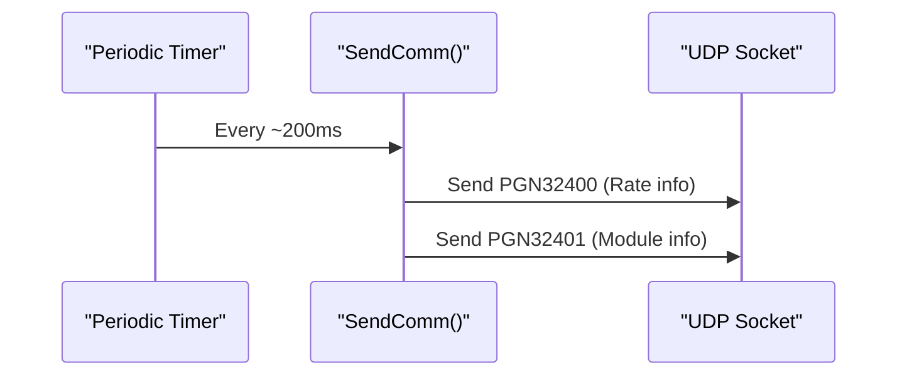

**Diagram sources**
- [Send.ino:1-195](file://RC_ESP32/Send.ino#L1-L195)

**Section sources**
- [Send.ino:1-195](file://RC_ESP32/Send.ino#L1-L195)

### Remote Configuration Application
- Receives UDP packets to adjust rate targets, meter calibration, control modes, and manual adjustments.
- Applies relay assignments, power relay masks, inverted states, and master valve selection.
- Updates control parameters and persists them to EEPROM.

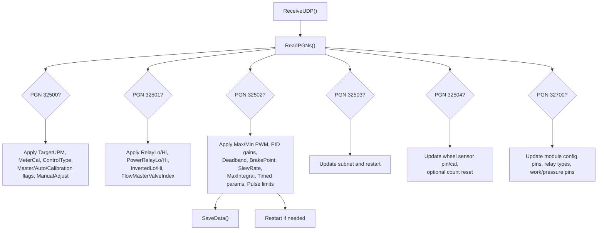

**Diagram sources**
- [Receive.ino:29-343](file://RC_ESP32/Receive.ino#L29-L343)
- [Begin.ino:550-562](file://RC_ESP32/Begin.ino#L550-L562)

**Section sources**
- [Receive.ino:29-343](file://RC_ESP32/Receive.ino#L29-L343)
- [Begin.ino:550-562](file://RC_ESP32/Begin.ino#L550-L562)

### User Interface Elements and Theming
- Responsive design with viewport meta tag and CSS for buttons, inputs, and tables.
- Unified button styles across pages using a consistent class and gradient background.
- Mobile-friendly layouts with percentage widths and flexible containers.

Customization options:
- Modify CSS classes and colors in page generator functions to change themes.
- Adjust input sizes and layout tables to fit different screen sizes.

**Section sources**
- [PgStart.ino:34-115](file://RC_ESP32/PgStart.ino#L34-L115)
- [PgSwitches.ino:12-91](file://RC_ESP32/PgSwitches.ino#L12-L91)
- [PgNetwork.ino:9-95](file://RC_ESP32/PgNetwork.ino#L9-L95)
- [PgUpdate.ino:7-74](file://RC_ESP32/PgUpdate.ino#L7-L74)

### Security and Access Controls
- Access Point password enforced; minimum length requirement ensures stronger security.
- Optional open AP mode by leaving the password field empty (subject to AP password policy).
- No HTTPS/TLS termination in the built-in server; use within trusted networks.
- No built-in authentication for HTTP routes; rely on network isolation and AP credentials.

Recommendations:
- Use a strong AP password (8–10 characters).
- Keep the AP password synchronized with the operator console’s expectations.
- Limit exposure to trusted networks.

**Section sources**
- [PgNetwork.ino:138-144](file://RC_ESP32/PgNetwork.ino#L138-L144)
- [Begin.ino:194-203](file://RC_ESP32/Begin.ino#L194-L203)

## Dependency Analysis
The web interface depends on the ESP32 WebServer, EEPROM, and optional OTA libraries. It interacts with I2C devices for relay control and with UDP sockets for telemetry and configuration.

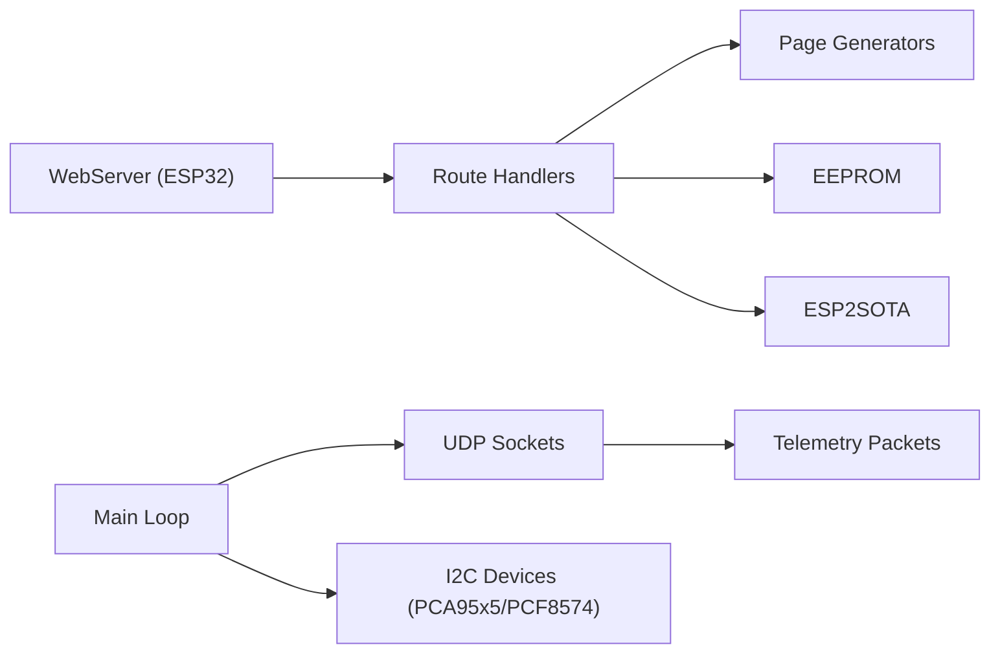

**Diagram sources**
- [Begin.ino:219-239](file://RC_ESP32/Begin.ino#L219-L239)
- [Send.ino:1-195](file://RC_ESP32/Send.ino#L1-L195)
- [PCA95x5_RC.h:55-178](file://RC_ESP32/PCA95x5_RC.h#L55-L178)

**Section sources**
- [Begin.ino:219-239](file://RC_ESP32/Begin.ino#L219-L239)
- [Send.ino:1-195](file://RC_ESP32/Send.ino#L1-L195)
- [PCA95x5_RC.h:55-178](file://RC_ESP32/PCA95x5_RC.h#L55-L178)

## Performance Considerations
- The server runs in the main loop alongside control logic; keep page generation lightweight.
- EEPROM writes occur on configuration changes; batch updates to reduce wear.
- UDP telemetry is periodic (~200 ms) to balance responsiveness and bandwidth.
- I2C bus speed is increased to improve reliability for relay drivers.

## Troubleshooting Guide
Common issues and resolutions:
- Cannot reach the settings page:
  - Ensure the device is connected to the Access Point or configured to join the Wi-Fi network.
  - Confirm the server is started and routes registered during setup.
- Changes not persisting:
  - Verify EEPROM commit succeeds after SaveData().
  - Check for valid data on boot and fallback to defaults if invalid.
- Buttons not toggling:
  - Confirm ButtonPressed handler receives the correct formaction and button value.
  - Ensure the button state array is updated and the page re-rendered.
- Firmware update fails:
  - Ensure the upload form sends multipart data and the OTA engine is initialized.
  - Check upload progress and restart behavior.
- Telemetry not received:
  - Verify UDP destination IP and port are set correctly.
  - Confirm Ethernet/Wi-Fi availability and packet parsing logic.

**Section sources**
- [Begin.ino:219-239](file://RC_ESP32/Begin.ino#L219-L239)
- [GUI.ino:81-99](file://RC_ESP32/GUI.ino#L81-L99)
- [Begin.ino:550-562](file://RC_ESP32/Begin.ino#L550-L562)
- [PgUpdate.ino:88-106](file://RC_ESP32/PgUpdate.ino#L88-L106)
- [Send.ino:72-91](file://RC_ESP32/Send.ino#L72-L91)
- [Receive.ino:29-343](file://RC_ESP32/Receive.ino#L29-L343)

## Conclusion
The ESP32 Rate Control web interface provides a responsive, mobile-friendly configuration and monitoring solution. It supports live control toggles, network configuration, firmware updates, and robust telemetry back to an operator console. With careful attention to persistence, security, and performance, it delivers reliable operation in agricultural environments.

## Appendices

### Browser Compatibility and Mobile Support
- Designed with viewport meta tags and CSS media-friendly layouts.
- Tested on modern browsers and mobile devices; minimal JavaScript used for progress reporting.

### Operator and Technician Guide
- Access the settings page via the Access Point SSID or Wi-Fi network.
- Use the Home page to navigate to Switches, Network, and Firmware Update.
- Toggle section switches to test actuators; Master enables/disables applying control.
- Configure Wi-Fi credentials and AP password; changes take effect after restart.
- Upload firmware updates using the Update page; monitor progress until completion.