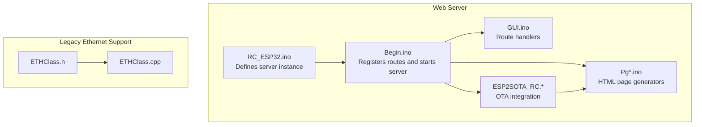
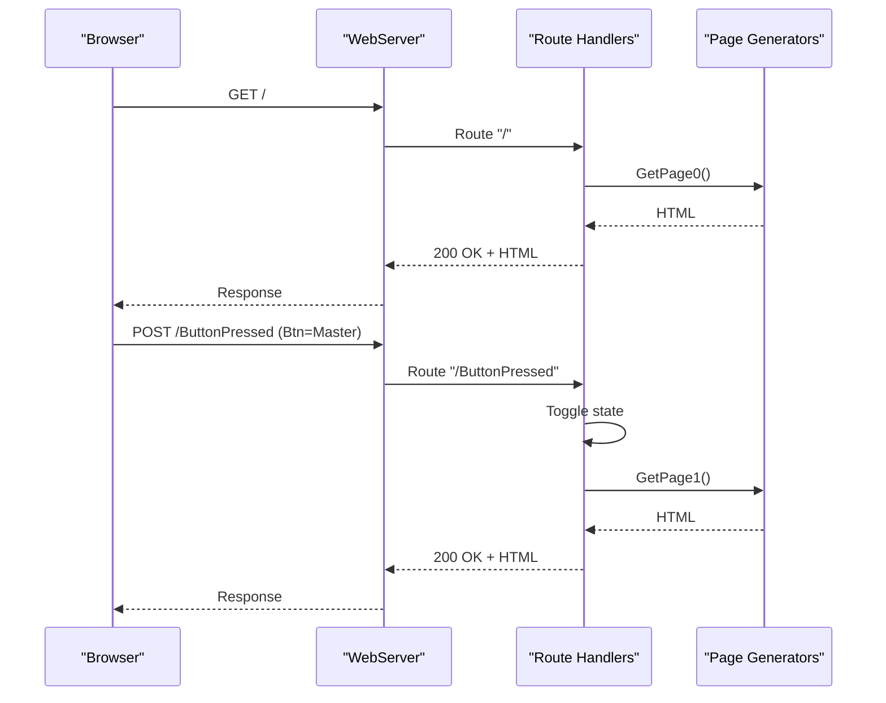
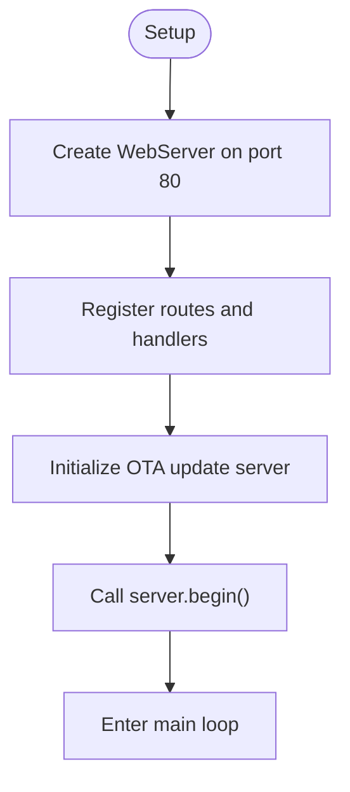
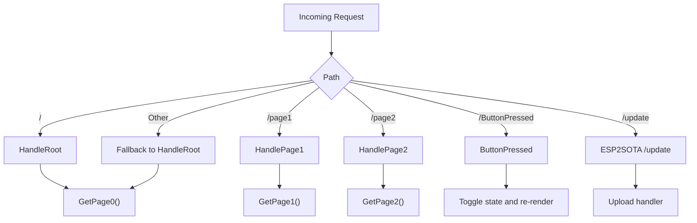
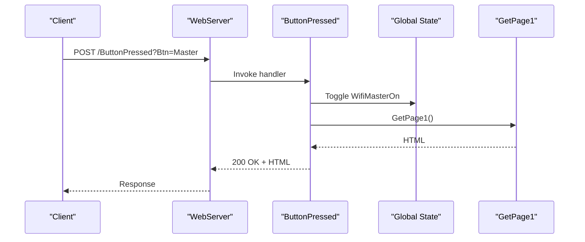
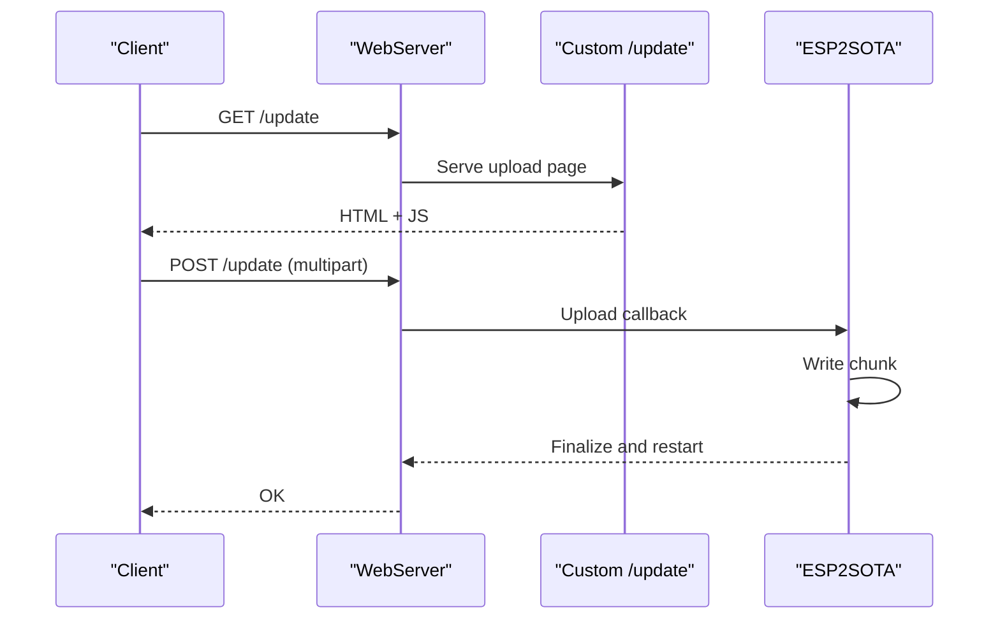
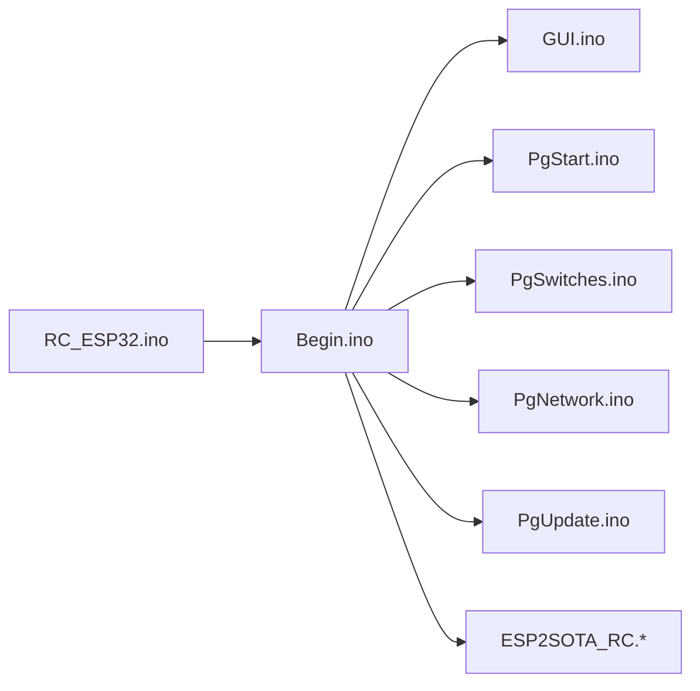

# Web Server Implementation

<cite>
**Referenced Files in This Document**
- [RC_ESP32.ino](file://RC_ESP32/RC_ESP32.ino)
- [Begin.ino](file://RC_ESP32/Begin.ino)
- [GUI.ino](file://RC_ESP32/GUI.ino)
- [PgUpdate.ino](file://RC_ESP32/PgUpdate.ino)
- [PgNetwork.ino](file://RC_ESP32/PgNetwork.ino)
- [PgStart.ino](file://RC_ESP32/PgStart.ino)
- [PgSwitches.ino](file://RC_ESP32/PgSwitches.ino)
- [ESP2SOTA_RC.h](file://RC_ESP32/ESP2SOTA_RC/ESP2SOTA_RC.h)
- [ESP2SOTA_RC.cpp](file://RC_ESP32/ESP2SOTA_RC/ESP2SOTA_RC.cpp)
- [index_html.h](file://RC_ESP32/ESP2SOTA_RC/index_html.h)
- [ETHClass.h](file://OLD CODE/RC_ESP32/ETHClass.h)
- [ETHClass.cpp](file://OLD CODE/RC_ESP32/ETHClass.cpp)
</cite>

## Table of Contents
1. [Introduction](#introduction)
2. [Project Structure](#project-structure)
3. [Core Components](#core-components)
4. [Architecture Overview](#architecture-overview)
5. [Detailed Component Analysis](#detailed-component-analysis)
6. [Dependency Analysis](#dependency-analysis)
7. [Performance Considerations](#performance-considerations)
8. [Security Considerations](#security-considerations)
9. [Troubleshooting Guide](#troubleshooting-guide)
10. [Conclusion](#conclusion)

## Introduction
This document describes the ESP32 built-in web server implementation used in the RC_ESP32 module. It explains how HTTP requests are handled, including route mapping, request parsing, and response generation. It documents server initialization, port configuration, and network binding. It details page routing mechanisms for the main pages and interactive controls, and covers HTTP response formatting, MIME types, and content delivery. It also outlines configuration options, performance characteristics, security considerations, and troubleshooting guidance for common issues.

## Project Structure
The web server implementation is primarily located in the RC_ESP32 directory, with supporting files for OTA updates and legacy Ethernet support in the OLD CODE directory. The key files involved in the web server are:
- Initialization and server wiring: RC_ESP32.ino, Begin.ino
- Route handlers and page rendering: GUI.ino, PgStart.ino, PgSwitches.ino, PgNetwork.ino, PgUpdate.ino
- OTA update integration: ESP2SOTA_RC.h, ESP2SOTA_RC.cpp, index_html.h
- Legacy Ethernet support: ETHClass.h, ETHClass.cpp

**Diagram sources**
- [RC_ESP32.ino](file://RC_ESP32/RC_ESP32.ino)
- [Begin.ino](file://RC_ESP32/Begin.ino)
- [GUI.ino](file://RC_ESP32/GUI.ino)
- [PgStart.ino](file://RC_ESP32/PgStart.ino)
- [PgSwitches.ino](file://RC_ESP32/PgSwitches.ino)
- [PgNetwork.ino](file://RC_ESP32/PgNetwork.ino)
- [PgUpdate.ino](file://RC_ESP32/PgUpdate.ino)
- [ESP2SOTA_RC.h](file://RC_ESP32/ESP2SOTA_RC/ESP2SOTA_RC.h)
- [ESP2SOTA_RC.cpp](file://RC_ESP32/ESP2SOTA_RC/ESP2SOTA_RC.cpp)
- [index_html.h](file://RC_ESP32/ESP2SOTA_RC/index_html.h)
- [ETHClass.h](file://OLD CODE/RC_ESP32/ETHClass.h)
- [ETHClass.cpp](file://OLD CODE/RC_ESP32/ETHClass.cpp)

**Section sources**
- [RC_ESP32.ino](file://RC_ESP32/RC_ESP32.ino)
- [Begin.ino](file://RC_ESP32/Begin.ino)

## Core Components
- WebServer instance: Created with port 80 and stored globally.
- Route registration: Routes for "/", "/page1", "/page2", "/ButtonPressed", and catch-all for unknown paths.
- Handler functions: HandleRoot, HandlePage1, HandlePage2, ButtonPressed.
- Page generators: GetPage0, GetPage1, GetPage2, GetPageUpdate.
- OTA integration: ESP2SOTA registers its own "/update" route and handles firmware uploads.
- Static routes: "/generate_204", "/fwlink", "/hotspot-detect.html", "/ncsi.txt".

Key behaviors:
- Requests to "/" are served by HandleRoot, which optionally processes credentials and serves GetPage0.
- "/page1" serves GetPage1 (switches).
- "/page2" serves GetPage2 (network configuration).
- "/ButtonPressed" toggles master and individual switch states, then re-renders page1.
- Unknown routes fall back to HandleRoot.
- Static routes serve minimal responses for captive portal detection and connectivity checks.

**Section sources**
- [RC_ESP32.ino](file://RC_ESP32/RC_ESP32.ino)
- [Begin.ino](file://RC_ESP32/Begin.ino)
- [GUI.ino](file://RC_ESP32/GUI.ino)
- [PgStart.ino](file://RC_ESP32/PgStart.ino)
- [PgSwitches.ino](file://RC_ESP32/PgSwitches.ino)
- [PgNetwork.ino](file://RC_ESP32/PgNetwork.ino)
- [PgUpdate.ino](file://RC_ESP32/PgUpdate.ino)

## Architecture Overview
The server runs on port 80 and is initialized during setup. Routing is registered to handler functions that render HTML pages or process form submissions. The OTA subsystem registers its own "/update" route and upload handlers, which take precedence because they are registered first.

**Diagram sources**
- [Begin.ino](file://RC_ESP32/Begin.ino)
- [GUI.ino](file://RC_ESP32/GUI.ino)
- [PgStart.ino](file://RC_ESP32/PgStart.ino)
- [PgSwitches.ino](file://RC_ESP32/PgSwitches.ino)

## Detailed Component Analysis

### Server Initialization and Binding
- Port configuration: WebServer is instantiated on port 80.
- Route registration: Routes are registered in Begin.ino, including static routes and OTA update handlers.
- Server start: server.begin() is called after routes are registered.
- Network binding: The device operates as an Access Point with a dedicated local IP and DNS responder for captive portal behavior.

**Diagram sources**
- [RC_ESP32.ino](file://RC_ESP32/RC_ESP32.ino)
- [Begin.ino](file://RC_ESP32/Begin.ino)

**Section sources**
- [RC_ESP32.ino](file://RC_ESP32/RC_ESP32.ino)
- [Begin.ino](file://RC_ESP32/Begin.ino)

### Route Mapping and Request Parsing
- Root route ("/"): Handled by HandleRoot. If credentials are posted, it applies them and restarts if needed; otherwise serves GetPage0.
- Page routes ("/page1", "/page2"): Handled by HandlePage1 and HandlePage2 respectively, serving GetPage1 and GetPage2.
- Button handler ("/ButtonPressed"): Parses "Btn" argument to toggle master or specific switch, updates state, and re-renders page1.
- Static routes: Captive portal and connectivity test endpoints return minimal responses with appropriate MIME types.
- OTA route ("/update"): Registered by ESP2SOTA; serves an HTML upload page and handles multipart firmware uploads.

**Diagram sources**
- [Begin.ino](file://RC_ESP32/Begin.ino)
- [GUI.ino](file://RC_ESP32/GUI.ino)
- [PgStart.ino](file://RC_ESP32/PgStart.ino)
- [PgSwitches.ino](file://RC_ESP32/PgSwitches.ino)
- [PgNetwork.ino](file://RC_ESP32/PgNetwork.ino)
- [ESP2SOTA_RC.cpp](file://RC_ESP32/ESP2SOTA_RC/ESP2SOTA_RC.cpp)

**Section sources**
- [Begin.ino](file://RC_ESP32/Begin.ino)
- [GUI.ino](file://RC_ESP32/GUI.ino)

### Response Generation and MIME Types
- HTML responses: server.send with "text/html" for all rendered pages.
- Plain text responses: "text/plain" for static routes like "/generate_204", "/fwlink", and "/ncsi.txt".
- Captive portal detection: "/hotspot-detect.html" returns "text/html" with a simple HTML body.
- OTA upload page: "text/html" with embedded JavaScript for progress reporting.
- Content encoding: Responses are sent as HTML strings generated by page functions; no explicit compression is used in the shown code.

**Section sources**
- [Begin.ino](file://RC_ESP32/Begin.ino)
- [PgStart.ino](file://RC_ESP32/PgStart.ino)
- [PgSwitches.ino](file://RC_ESP32/PgSwitches.ino)
- [PgNetwork.ino](file://RC_ESP32/PgNetwork.ino)
- [PgUpdate.ino](file://RC_ESP32/PgUpdate.ino)
- [ESP2SOTA_RC.cpp](file://RC_ESP32/ESP2SOTA_RC/ESP2SOTA_RC.cpp)
- [index_html.h](file://RC_ESP32/ESP2SOTA_RC/index_html.h)

### Page Routing Mechanisms
- HandleRoot(): Renders the main menu page (GetPage0) or processes credential updates.
- HandlePage1(): Renders the switches page (GetPage1).
- HandlePage2(): Renders the network configuration page (GetPage2).
- ButtonPressed(): Processes button presses to toggle master and individual switches, then re-renders page1.
- Credentials handling: Extracts "prop1" (SSID), "prop2" (password), optional "prop3" (AP password), and optional "connect" flag to enable station mode.

**Diagram sources**
- [GUI.ino](file://RC_ESP32/GUI.ino)
- [PgSwitches.ino](file://RC_ESP32/PgSwitches.ino)

**Section sources**
- [GUI.ino](file://RC_ESP32/GUI.ino)
- [PgSwitches.ino](file://RC_ESP32/PgSwitches.ino)

### OTA Update Integration
- Registration order: The custom update page is registered before ESP2SOTA so it takes precedence.
- Update page: Returns an HTML form with JavaScript progress reporting.
- Upload handling: Uses multipart upload callbacks to stream firmware data and restart on completion.

**Diagram sources**
- [Begin.ino](file://RC_ESP32/Begin.ino)
- [ESP2SOTA_RC.cpp](file://RC_ESP32/ESP2SOTA_RC/ESP2SOTA_RC.cpp)
- [index_html.h](file://RC_ESP32/ESP2SOTA_RC/index_html.h)

**Section sources**
- [Begin.ino](file://RC_ESP32/Begin.ino)
- [ESP2SOTA_RC.h](file://RC_ESP32/ESP2SOTA_RC/ESP2SOTA_RC.h)
- [ESP2SOTA_RC.cpp](file://RC_ESP32/ESP2SOTA_RC/ESP2SOTA_RC.cpp)
- [index_html.h](file://RC_ESP32/ESP2SOTA_RC/index_html.h)

## Dependency Analysis
- RC_ESP32.ino defines the global WebServer instance and includes required libraries.
- Begin.ino wires routes, starts the server, initializes AP/DNS, and integrates OTA.
- GUI.ino implements route handlers and state toggling.
- Pg*.ino files generate HTML content for each page.
- ESP2SOTA_RC.* integrates OTA update handling and registers its own routes.

**Diagram sources**
- [RC_ESP32.ino](file://RC_ESP32/RC_ESP32.ino)
- [Begin.ino](file://RC_ESP32/Begin.ino)
- [GUI.ino](file://RC_ESP32/GUI.ino)
- [PgStart.ino](file://RC_ESP32/PgStart.ino)
- [PgSwitches.ino](file://RC_ESP32/PgSwitches.ino)
- [PgNetwork.ino](file://RC_ESP32/PgNetwork.ino)
- [PgUpdate.ino](file://RC_ESP32/PgUpdate.ino)
- [ESP2SOTA_RC.h](file://RC_ESP32/ESP2SOTA_RC/ESP2SOTA_RC.h)
- [ESP2SOTA_RC.cpp](file://RC_ESP32/ESP2SOTA_RC/ESP2SOTA_RC.cpp)

**Section sources**
- [RC_ESP32.ino](file://RC_ESP32/RC_ESP32.ino)
- [Begin.ino](file://RC_ESP32/Begin.ino)

## Performance Considerations
- Loop cadence: The server runs alongside periodic loops for control logic; server.handleClient() is called in the main loop.
- Memory usage: HTML pages are generated as concatenated strings; long pages or frequent updates may increase heap usage.
- Concurrency: The built-in server is single-threaded per request; avoid blocking operations in handlers.
- Network throughput: The device acts as an AP; performance depends on AP capabilities and client count.

[No sources needed since this section provides general guidance]

## Security Considerations
- Access control: The device operates as an AP with configurable credentials. The AP password length is validated and truncated to a maximum length.
- Authentication: No session tokens or CSRF protection are implemented in the shown code; all actions are performed via simple forms.
- Input validation: Credentials are trimmed and constrained; AP password length is enforced.
- Recommendations: Consider adding CSRF tokens, HTTPS termination, and stricter input sanitization for production deployments.

**Section sources**
- [GUI.ino](file://RC_ESP32/GUI.ino)

## Troubleshooting Guide
Common issues and remedies:
- Server not reachable:
  - Verify AP is started and IP is assigned.
  - Confirm server.begin() is called after routes are registered.
- Routes not working:
  - Ensure routes are registered before server.begin().
  - Check for conflicting route registrations (custom "/update" vs OTA).
- OTA update fails:
  - Confirm multipart upload is sent to "/update".
  - Verify sufficient free flash space and correct image format.
- Captive portal loops:
  - Static routes "/generate_204", "/fwlink", "/hotspot-detect.html", "/ncsi.txt" must return expected responses.
- Memory issues:
  - Reduce page sizes or simplify HTML generation.
  - Avoid large buffers in handlers.

**Section sources**
- [Begin.ino](file://RC_ESP32/Begin.ino)
- [ESP2SOTA_RC.cpp](file://RC_ESP32/ESP2SOTA_RC/ESP2SOTA_RC.cpp)

## Conclusion
The ESP32 web server implementation provides a lightweight HTTP interface for configuration and control of the RC_ESP32 module. It uses route handlers to render HTML pages and process form submissions, integrates OTA updates, and supports captive portal compatibility. While functional, enhancements such as HTTPS, CSRF protection, and improved input validation would strengthen security and robustness.